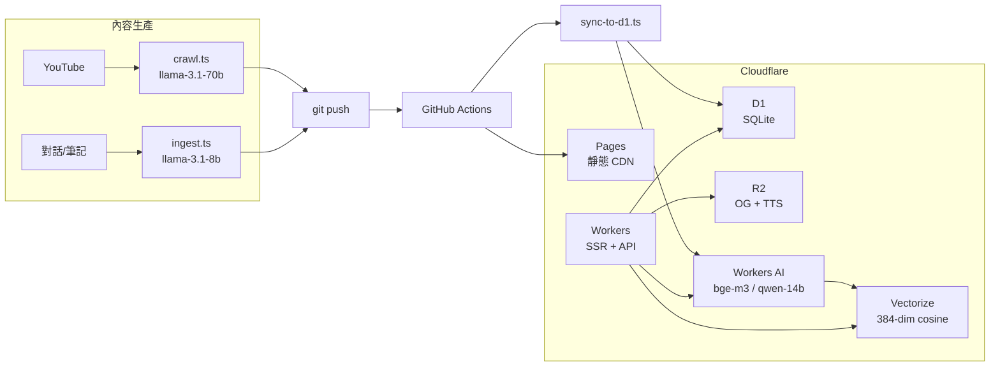

這篇說明 Engineer News 的技術堆疊：為什麼選這些工具、它們怎麼組合在一起、哪些選擇是取捨的結果。

## 整體架構



從 YouTube 或對話出發，到用戶在瀏覽器看到文章並能做語意搜尋，整個流程全部跑在 Cloudflare 生態系內。

## 前端：Astro

Astro 是以「內容優先」為設計哲學的前端框架。預設輸出純靜態 HTML，只在需要互動的元件注入 JavaScript（Island Architecture）。特別適合文章、文件類網站。

Astro 不是 React、不是 Vue，它是一個以「內容」為核心設計的框架。

對部落格來說這個設計很合理：大多數頁面是純閱讀，不需要任何 JS bundle。文章用 Markdown（Content Collections）管理，frontmatter 有 Zod schema 在 build 時驗證，欄位錯了本地就會報錯，不用等到 CI。

i18n 路由也是 Astro 內建的：`zh-TW` 是預設語言，沒有 URL 前綴；英文版走 `/en/*`。

跟 Next.js 比：Next 生態更成熟，但對純內容站來說 bundle size 和設定複雜度都更高。Astro 搭配 Cloudflare adapter 的 `output: 'server'` 模式，讓需要動態的部分（API routes、SSR）走 Workers，靜態的部分走 Pages CDN，自然分工。

## 部署：Cloudflare Pages + Workers

Cloudflare Pages 是靜態資源的 CDN 托管服務，每次 git push 自動部署並產生 Preview URL。Cloudflare Workers 是跑在 V8 isolates 上的邊緣運算平台，負責動態請求（API routes、SSR）。兩者合用，靜態與動態各司其職。

Pages 負責靜態資源（HTML、CSS、JS、圖片）的 CDN 分發，Workers 負責動態請求（API、SSR 頁面）。兩者在同一個 `wrangler.jsonc` 裡管理，部署用同一個 token：

```
git push main
  → GitHub Actions
      → pnpm build
      → wrangler pages deploy dist
```

每次 push 到非 main 的 branch 都會自動產生 Preview URL，方便在合入前確認效果。

## 資料庫：D1（SQLite on the edge）

D1 是 Cloudflare 的 SQLite-compatible 邊緣資料庫。在 Workers 裡直接用 `env.DB.prepare().all()` 查詢，沒有 connection pool、沒有 TCP overhead、沒有跨服務的 IAM 設定。

目前的 table 分工：

| Table | 用途 |
|-------|------|
| `posts` | 文章元資料（標題、日期、tag、語言） |
| `doc_chunks` | 文章切塊文字（用於 RAG） |
| `page_views` | 每篇文章的瀏覽次數 |
| `search_logs` | 搜尋關鍵字記錄 |
| `settings` | 全站設定 key-value |

Migration 檔案放 `migrations/` 目錄，版本號前綴管理：

```sql
-- migrations/0001_init.sql
CREATE TABLE IF NOT EXISTS posts (
  id TEXT PRIMARY KEY,
  title TEXT NOT NULL,
  date TEXT NOT NULL,
  category TEXT NOT NULL,
  lang TEXT NOT NULL DEFAULT 'zh-TW',
  tags TEXT,
  description TEXT,
  tldr TEXT
);

CREATE TABLE IF NOT EXISTS doc_chunks (
  id TEXT PRIMARY KEY,
  post_id TEXT NOT NULL,
  chunk_index INTEGER NOT NULL,
  content TEXT NOT NULL
);
```

```bash
# 本地跑 migration
wrangler d1 execute my-site-db --local --file=migrations/0001_init.sql

# 遠端跑 migration
wrangler d1 execute my-site-db --remote --file=migrations/0001_init.sql
```

D1 的限制：單次查詢 25MB 上限，資料庫大小 10GB 上限。對部落格完全夠用。大型二進位（音訊、圖片）另存 R2。

**為什麼不用 PlanetScale / Supabase？** 外部資料庫意味著額外的連線管理、IAM、費用、跨服務延遲。D1 在 Workers 裡是本地呼叫，延遲幾乎可以忽略。

## 向量搜尋：Vectorize + Workers AI

這是整個堆疊裡最有趣的部分。

文章部署後，`sync-to-d1.ts` 把每篇文章切成 chunks，用 Workers AI 的 `bge-m3` 模型生成 384 維 embedding，存進 Vectorize。用戶搜尋時：

```mermaid
sequenceDiagram
  participant "瀏覽器" as Browser
  participant "Worker" as W
  participant "WorkersAI" as AI
  participant "Vectorize" as V
  participant "Database" as D1
  Browser->>W: POST /api/search {query}
  W->>AI: embed(query) via bge-m3
  AI-->>W: query_vector[384]
  W->>V: similaritySearch(top_k=5)
  V-->>W: [{chunk_id, score}...]
  W->>D1: SELECT chunks WHERE id IN (...)
  D1-->>W: chunks[]
  W->>AI: query-14b stream(query + chunks)
  AI-->>W: 回答
  W->>Browser: 回答
  note right of AI
    回答
```

`sync-to-d1.ts` 核心片段：

```ts
// 呼叫 bge-m3 生成 embedding
const res = await fetch(
  `https://api.cloudflare.com/client/v4/accounts/${ACCOUNT_ID}/ai/run/@cf/baai/bge-m3`,
  {
    method: 'POST',
    headers: { Authorization: `Bearer ${API_TOKEN}` },
    body: JSON.stringify({ text: chunkContent }),
  }
);
const { result } = await res.json();
const vector = result?.data?.[0]; // number[384]

// 寫入 Vectorize（NDJSON 格式批次 insert）
// wrangler vectorize insert engineer-news-index --file=vectors.ndjson
```

這條 RAG 流程全跑在 Workers 裡，沒有外部 API 呼叫，沒有 OpenAI 費用。`qwen-14b` 對繁中技術問答的品質夠用。

**為什麼是 384 維而不是 1536 維？** Vectorize 的費用跟維度正相關。`bge-m3` 的 384 維對中文技術文章的語意搜尋效果已經足夠，不需要為了「看起來更高維」增加成本。

## 物件儲存：R2

R2 是 Cloudflare 的物件儲存服務，API 相容 S3，但沒有流量費用（egress free）。

R2 存兩種東西：

**OG 圖片**：API route 動態生成（satori + 中文字體），第一次生成後快取到 R2；之後直接回傳，不重複跑 satori。這讓社群媒體分享有正確預覽圖，又不需要每次都計算。

```ts
const { OG_IMAGES } = locals.runtime.env;

// 先查 R2 cache
const cached = OG_IMAGES ? await OG_IMAGES.get(cacheKey) : null;
if (cached) {
  return new Response(await cached.arrayBuffer(), {
    headers: { 'Content-Type': 'image/png', 'Cache-Control': 'public, max-age=31536000' },
  });
}

// miss：跑 satori 生成，再寫回 R2
const png = await renderToPng(createShareCardNode({ post }), fontData);
await OG_IMAGES.put(cacheKey, png);
return new Response(png, { headers: { 'Content-Type': 'image/png' } });
```

**TTS 音訊**：每篇文章有對應的 `.wav`，由 `tts-all.ts` 批次生成後上傳，frontmatter 裡記 `audio_url`，前端直接播放。

R2 跟 S3 API 相容，但沒有流量費用（只收儲存和操作），對音訊這種大檔案很友善。

## AI 模型：Workers AI

Workers AI 是 Cloudflare 的推論平台，提供多個開源模型的 serverless 呼叫，直接從 Workers 用 `env.AI.run()` 調用。

| 模型 | 用途 |
|------|------|
| `bge-m3` | 文章 embedding（384 dim，繁中友好） |
| `qwen-14b` | RAG 搜尋回答（串流） |
| `llama-3.1-8b` | ingest 時抽取 metadata（frontmatter） |
| `llama-3.1-70b` | crawl 時生成 zh-TW 摘要 |

在 Workers / API route 裡呼叫的範例：

```ts
const { AI } = locals.runtime.env;

// embedding（用於向量搜尋）
const { data } = await AI.run('@cf/baai/bge-m3', { text: [query] });
const queryVector = data[0]; // number[384]

// RAG 回答（串流）
const stream = await AI.run('@cf/qwen/qwen1.5-14b-chat-awq', {
  stream: true,
  messages: [
    { role: 'system', content: systemPrompt },
    { role: 'user', content: userQuery },
  ],
});
return new Response(stream, { headers: { 'Content-Type': 'text/event-stream' } });
```

全部走 Workers AI，不需要管 API key rotation，也沒有外部服務的延遲跳點。對中文文章來說，`qwen-14b` 的理解和生成品質比同量級的英文偏向模型好很多。

**為什麼不用 OpenAI？** Workers AI 對這個場景夠用，且整個 AI pipeline 跟基礎設施用同一組 credentials，不需要另外管 OpenAI 帳單和 rate limit。

## 內容自動化：crawl + ingest

**crawl.ts**：每天 UTC 02:00（台灣時間上午 10 點）透過 GitHub Actions 跑，爬取 9 個 YouTube 頻道，用 `llama-3.1-70b` 生成繁中摘要，自動 commit + push，不需要手動操作。

**ingest.ts**：把對話或筆記檔案丟進去，自動偵測並遮蔽敏感資訊（token、key、內部 URL），然後用 `llama-3.1-8b` 生成 title、tags、tldr、description，輸出完整 Markdown 文章。

這兩個 script 加上 Claude Code 的 `post` skill，讓每天的工程決策都能低摩擦地變成文章。

## 全文搜尋：Pagefind

除了 RAG（向量語意搜尋），站上還有 Pagefind 做靜態全文索引。`pnpm build` 跑完後，Pagefind 掃 `dist/` 目錄產生索引，讓精確關鍵字搜尋不需要後端，直接在瀏覽器跑。

RAG 和 Pagefind 的分工：RAG 回答開放性問題，Pagefind 找精確詞彙。

## 開發工具

**TypeScript**：所有 scripts 和 API routes 都用 TypeScript，搭配嚴格的 content schema，build 時早期發現問題。

**pnpm**：比 npm 快，node_modules 共享機制省空間，適合這種有多個 scripts 的設定。

**GitHub Actions**：三個 workflow：
- `deploy.yml`：push 到 main 就自動部署
- `crawl.yml`：每天定時跑 YouTube 爬取
- `fix-mermaid.yml`：手動觸發，修復文章裡壞掉的 Mermaid 圖

## 參考資料

- [Astro 官方文件](https://docs.astro.build/)
- [Cloudflare Pages 文件](https://developers.cloudflare.com/pages/)
- [Cloudflare D1 文件](https://developers.cloudflare.com/d1/)
- [Cloudflare Vectorize 文件](https://developers.cloudflare.com/vectorize/)
- [Cloudflare Workers AI 文件](https://developers.cloudflare.com/workers-ai/)
- [Cloudflare R2 文件](https://developers.cloudflare.com/r2/)
- [Pagefind](https://pagefind.app/)
- [bge-m3（Hugging Face）](https://huggingface.co/BAAI/bge-m3)
