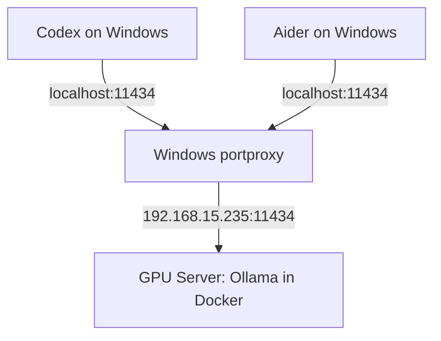

# 🚀 Docker GPU Ollama + Codex Client: Full Architecture Guide

This guide shows how to deploy Ollama on a GPU machine (via Docker) and use netsh portproxy on Windows to forward `localhost:11434` to the remote Ollama, so that Codex (on Windows) calls the remote GPU as if it were a local service. It fills in the architecture setup, fixes common typos, and walks through the usual gotchas, so you can paste or publish it directly.

---

## 1. Server (GPU machine) — Building Ollama with Docker Compose

I recommend managing the Ollama container with docker compose. Example:

```yaml
services:
  ollama:
    image: ollama/ollama:latest
    container_name: ollama
    ports:
      - "11434:11434"
    volumes:
      - ./ollama_models:/root/.ollama
    deploy:
      resources:
        reservations:
          devices:
            - capabilities: [gpu]
    runtime: nvidia
    environment:
      - NVIDIA_VISIBLE_DEVICES=all
    healthcheck:
      test: ["CMD", "ollama", "list"]
      interval: 30s
      timeout: 10s
      retries: 3
      start_period: 30s
```

Key points:
- Don't mangle the volume path into a typo like `./ollama_models:/root/.ollamaentrypoint script`; the correct value is `./ollama_models:/root/.ollama`, which stores models and data.
- If you use the NVIDIA Container Toolkit, `runtime: nvidia` and `NVIDIA_VISIBLE_DEVICES` make the GPU visible to the container.
- The healthcheck helps Docker determine whether the service is ready.

Start it:

```bash
docker compose up -d
```

Once it's up, confirm that Ollama can run a model on the GPU (using `gemma4:e4b` as an example):

```bash
ollama run gemma4:e4b
```

Or list the available models:

```bash
curl http://localhost:11434/v1/models
```

Remember to open port 11434 (or whichever port you configured) in the server firewall.

---

## 2. Client (Windows) — Codex Configuration

On Windows, configure Codex to call the local endpoint (`localhost`), then use portproxy to forward the local connection to the remote GPU machine. Example Codex config:

```toml
model = "gemma4:e4b"
model_provider = "ollama"
base_url = "http://localhost:11434"

sandbox = "elevated"
```

Important concepts:
- Codex only connects to `localhost`: this avoids the Ollama adapter's fallback bug, prevents the remote IP from being ignored, and keeps Codex's behavior predictable.
- Windows forwards the local connection to the remote Ollama (via portproxy), transparently to Codex.

---

## 3. Client (Windows) — Aider Configuration

The same portproxy architecture works for [aider](https://github.com/paul-gauthier/aider) too. Just point aider at `localhost:11434`, and portproxy will automatically forward to the remote GPU.

Via the command line:

```bash
aider --model ollama/gemma4:e4b --openai-api-base http://localhost:11434/v1
```

Or create a `.aider.conf.yml` config file in your project directory:

```yaml
model: ollama/gemma4:e4b
openai-api-base: http://localhost:11434/v1
```

Key points:
- aider talks to Ollama through an OpenAI-compatible interface, so `--openai-api-base` needs the `/v1` path.
- The model name follows the `ollama/<model_name>` format, which tells aider to use the Ollama provider.
- Just like Codex, aider only connects to `localhost`, and portproxy handles the forwarding — no remote configuration changes required.

---

## 4. Windows portproxy (the critical step)

On Windows, open PowerShell as Administrator and add a portproxy rule:

```powershell
netsh interface portproxy add v4tov4 `
  listenaddress=127.0.0.1 `
  listenport=11434 `
  connectaddress=192.168.15.235 `
  connectport=11434
```

Replace `192.168.15.235` with your GPU server's IP.

Verify:

```powershell
netsh interface portproxy show all
```

You should see something like:

```
Listen on IPv4:             Connect to IPv4:
Address         Port        Address         Port
--------------- ----------  --------------- ----------
127.0.0.1       11434       192.168.15.235  11434
```

Then test from the Windows machine itself:

```powershell
curl http://localhost:11434/v1/models
```

If it returns the model list, the forwarding works and the Ollama API is responding correctly.

---

## 5. Common Issues and Troubleshooting (don't skip this)

1. Codex can't connect to localhost, or there's no response
   - Check whether the Windows IP Helper service is enabled (portproxy depends on `iphlpsvc`):
     ```powershell
     Get-Service iphlpsvc
     ```
   - Confirm the firewall isn't blocking local loopback (usually it isn't), and that no other service is occupying 11434.

2. portproxy isn't taking effect
   - Confirm the rule was added: `netsh interface portproxy show all`
   - If you hit IPv6 issues, you may need to add a `v6tov4` rule as well, or make sure the application binds to IPv4.

3. The GPU server isn't responding, or Ollama won't start
   - Confirm the container can see the GPU (check `nvidia-smi` both on the host and inside the container).
   - If you need Ollama to bind to `0.0.0.0` (externally accessible), use:
     ```bash
     OLLAMA_HOST=0.0.0.0 ollama serve
     ```
   - Check the Docker logs: `docker logs ollama`

4. Model fails to load, or out of memory
   - Use a smaller model, or confirm you have enough GPU memory (VRAM); if necessary, use swap, or spread load across multiple smaller models.

---

## 6. Full Architecture Diagram



---

## 7. The Core Value (what you want readers to take away)

This workflow solves three real problems:
- A GPU server is easy to deploy reliably on Linux (containerized with Docker).
- Windows clients (Codex) often only want to connect to `localhost`; portproxy lets you use a remote GPU without modifying Codex.
- It avoids standing up an extra reverse proxy or jump host, reducing both latency and operational complexity.

---

## References

- [Ollama official Docker image](https://hub.docker.com/r/ollama/ollama)
- [NVIDIA Container Toolkit installation guide](https://docs.nvidia.com/datacenter/cloud-native/container-toolkit/install-guide.html)
- [netsh interface portproxy — Microsoft Docs](https://learn.microsoft.com/en-us/windows-server/networking/technologies/netsh/netsh-interface-portproxy)
- [OpenAI Codex CLI — GitHub](https://github.com/openai/codex)
- [Ollama API documentation](https://github.com/ollama/ollama/blob/main/docs/api.md)
