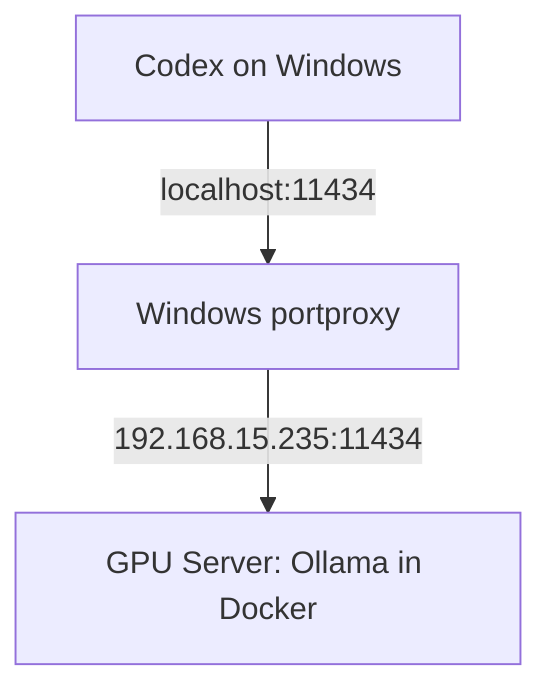

# 🚀 Docker GPU Ollama + Codex Client 完整架構教學

這篇教學展示如何把 Ollama 部署在 GPU 機（Docker）上，並在 Windows 上用 netsh portproxy 將 localhost:11434 轉發到遠端 Ollama，使 Codex（Windows）像呼叫本機服務一樣使用遠端 GPU。文中補齊架構設定、修正常見 typo 與排除常見坑，方便直接貼上或發佈。

---

## 一、Server（GPU machine） — Docker Compose 建置 Ollama

推薦使用 docker compose 管理 Ollama container，範例：

```yaml
services:
  ollama:
    image: ollama/ollama:latest
    container_name: ollama
    ports:
      - "11434:11434"
    volumes:
      - ./ollama_models:/root/.ollama
    deploy:
      resources:
        reservations:
          devices:
            - capabilities: [gpu]
    runtime: nvidia
    environment:
      - NVIDIA_VISIBLE_DEVICES=all
    healthcheck:
      test: ["CMD", "ollama", "list"]
      interval: 30s
      timeout: 10s
      retries: 3
      start_period: 30s
```

重點說明：
- volumes 的路徑不能寫成 `./ollama_models:/root/.ollamaentrypoint script` 之類的 typo；正確為 `./ollama_models:/root/.ollama`，用來存放模型與資料。
- 若使用 NVIDIA Container Toolkit，runtime: nvidia 與 NVIDIA_VISIBLE_DEVICES 會讓 container 可見 GPU。
- healthcheck 能幫助 docker 判斷服務是否就緒。

啟動：

```bash
docker compose up -d
```

啟動後可用以下指令確認 Ollama 能用 GPU 跑模型（以 gemma4:e4b 為例）：

```bash
ollama run gemma4:e4b
```

或查看模型清單：

```bash
curl http://localhost:11434/v1/models
```

記得在 server firewall 開放 11434（或你設定的 port）。

---

## 二、Client（Windows） — Codex 設定

在 Windows 上的 Codex config 設為呼叫本地端（localhost），然後用 portproxy 把本地連線轉到遠端 GPU 機器。Codex 設定範例：

```toml
model = "gemma4:e4b"
model_provider = "ollama"
base_url = "http://localhost:11434"

sandbox = "elevated"
```

重要觀念：
- Codex 只連 localhost：避免 Ollama adapter 的 fallback bug、避免 remote IP 被忽略、也能讓 Codex 行為可預期。
- Windows 會把本地連線轉發到遠端 Ollama（portproxy），對 Codex 透明。

---

## 三、Windows portproxy（關鍵步驟）

在 Windows 上以管理員權限開 PowerShell，新增 portproxy 規則：

```powershell
netsh interface portproxy add v4tov4 `
  listenaddress=127.0.0.1 `
  listenport=11434 `
  connectaddress=192.168.15.235 `
  connectport=11434
```

把 192.168.15.235 換成你的 GPU server IP。

驗證：

```powershell
netsh interface portproxy show all
```

會看到類似：

```
Listen on IPv4:             Connect to IPv4:
Address         Port        Address         Port
--------------- ----------  --------------- ----------
127.0.0.1       11434       192.168.15.235  11434
```

之後在 Windows 本機測試：

```powershell
curl http://localhost:11434/v1/models
```

若可以返回模型清單，表示轉發成功且 Ollama API 回應正常。

---

## 四、常見問題與排查（必寫）

1. Codex 連 localhost 失敗或無回應
   - 檢查 Windows IP Helper 服務是否啟用（portproxy 依賴 iphlpsvc）：
     ```powershell
     Get-Service iphlpsvc
     ```
   - 確認防火牆沒有阻擋本機 loopback（通常不會），以及沒有其他服務占用 11434。

2. portproxy 未生效
   - 確認已新增規則：`netsh interface portproxy show all`
   - 若有 IPv6 問題，可能需同時設定 v6tov4 規則或確保應用綁定 IPv4。

3. GPU server 沒回應或 Ollama 無法啟動
   - 確認 container 有 GPU 可見（nvidia-smi 在主機與 container 中檢查）
   - 若需要讓 Ollama 綁定 0.0.0.0（外部可存取），可用：
     ```bash
     OLLAMA_HOST=0.0.0.0 ollama serve
     ```
   - 檢查 Docker 日誌：`docker logs ollama`

4. 模型載入失敗或記憶體不足
   - 使用較小模型或確認 GPU 記憶體（VRAM）是否足夠；必要時使用 swap、或多個小模型分流。

---

## 五、完整架構圖



---

## 六、核心價值（你要讓讀者知道）

這個流程在解決三個真實問題：
- GPU server 容易在 Linux 上穩定部署（Docker 化）
- Windows 客戶端（Codex）通常只願意連 localhost，使用 portproxy 能不改 Codex 的情況下使用遠端 GPU
- 避免額外建立反向代理或跳板伺服器，減少延遲與運維複雜度

---

## 參考資料

- [Ollama Docker 官方映像檔](https://hub.docker.com/r/ollama/ollama)
- [NVIDIA Container Toolkit 安裝指南](https://docs.nvidia.com/datacenter/cloud-native/container-toolkit/install-guide.html)
- [netsh interface portproxy — Microsoft Docs](https://learn.microsoft.com/en-us/windows-server/networking/technologies/netsh/netsh-interface-portproxy)
- [OpenAI Codex CLI — GitHub](https://github.com/openai/codex)
- [Ollama API 文件](https://github.com/ollama/ollama/blob/main/docs/api.md)