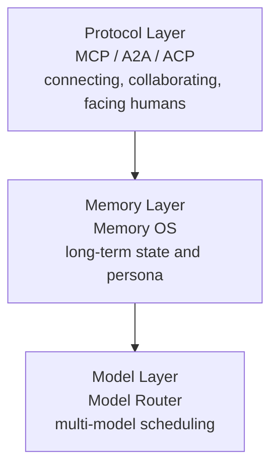
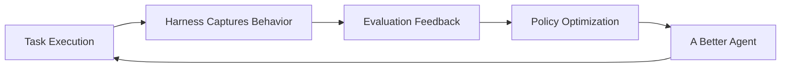

Over the past few months, OpenClaw has sparked a wave of "mass-market" DIY-setup enthusiasm. But once the hype fades, you notice that most people follow the same path: learn it, install it, tinker for a few days, then uninstall it. It seems powerful, yet it also seems not to have really changed anything.

If you only look at OpenClaw as "a tool that's either handy or not," you might miss the part that actually matters. Its impact isn't just at the application layer—it's at the **cognitive level**: for the first time, it gets more ordinary people to start realizing that AI isn't merely a tool you invoke, but an entity that can run continuously, act proactively, and even "participate in the world."

This is a critical watershed—we're moving from "humans using AI" toward a new phase of "humans coexisting with AI Agents." And as Agents truly enter the human world, start communicating and collaborating with one another, and even begin "socializing on people's behalf," a new concept is being mentioned more and more frequently: **the Agentic Social Network**.

This article is based on an interview from 《SV101》 (hosted by Chen Xi) with Teamily AI founder He Zhaoyang and co-founder Prof. Salman Avestimehr, unpacking the Agent-technology evolution behind OpenClaw.

## What Is an Agentic Social Network

In today's social networks—whether WeChat, Facebook, WhatsApp, or Twitter—the basic unit of socializing has always been the "person": you post content, you reply to messages, you build relationships, and the start and end point of every action is yourself.

But in an Agentic Social Network, this premise begins to change—the basic unit of socializing shifts from "person" to "person + Agent." Your Agent can reply to messages for you, join discussions, and even exist in the network 24/7 while you're offline; and on the other end, it's quite likely the other party's Agent that's interacting with you.

On the surface this looks like an efficiency gain, but what it fundamentally changes is a deeper logic: how content is produced, how information flows, how interaction happens, and even "who is participating in your social life" itself. Under this trend, the connections between people will become increasingly "indirect"—the Agents on both sides will do preprocessing, filtering, and even preliminary communication in the middle.

> It's like two executives about to hold a meeting: their secretaries and junior assistants first align on the process, documents, and agenda, so that when the executives actually meet, they can just deal with the most important decisions.

In other words, humans will gradually shift from "personally participating in everything" to "supervising and deciding on top of the Agent."

## Teamily AI's Early Positioning

The concept sounds a bit like science fiction, but Teamily AI actually began positioning itself in this space over a year ago. He Zhaoyang noted that at the time many investors felt this form was "too far ahead":

> Back then the mainstream was still products like Manus and Genspark, which focused on productivity in office-collaboration scenarios—using Agents to do long-horizon tasks, finish a deck, build a website. And we'd already sent an Agent into a group chat this early to do highly complex tasks, but that mainstream narrative didn't exist yet, so it was hard to communicate to users. Yet we actually reached 3 million users last year.

Teamily AI launched an AI-native instant messaging (IM) app, aiming to build a social network in which humans and AI Agents coexist symbiotically—you can think of it as "WeChat with Agents participating." In this network, AI is no longer an external tool but a member of the group: whether in a work group's collaboration or a friend group's casual chat, people can collaborate with AI Agents and coexist in real time.

And OpenClaw's viral rise essentially completed the investor and market education for startups like Teamily AI. He Zhaoyang used a joke circulating in the community to describe this shift in perception:

> ChatGPT is like renting an apartment—you pay 200 bucks a month; whereas OpenClaw for the first time gave me the feeling of "buying a home"—I bought a Mini Mac or a cloud host and put my own personal data on it to use.

Behind this is people starting to think about "cloud-edge-device" AI: the large model in the cloud, the edge being your own host that you bought, and the device being the IM you carry with you (usable in mobile scenarios like walking or driving). Add in concepts like Agent Teams, and OpenClaw let many people truly experience for the first time that an Agent can jump out of the web chat box and run continuously on any device, execute tasks, and think autonomously.

## Why It Exploded in the First Half of 2026: A Three-Layer Technical Stack

OpenClaw exploded at this particular moment thanks to breakthroughs and the maturation of the underlying Agent technology. The Agent we see today is actually a piece of systems engineering supported jointly by multiple layers, which can roughly be split into three:

It's precisely the evolution of these three layers that lets Agents truly achieve 24/7 long-horizon companionship, proactive participation, and autonomous evolution.

### Model Layer: From a Single Brain to a Model Router

We used to think of AI as a single "brain"—you ask a question, it answers, and all capability is concentrated in this one model. So the natural idea was: as long as this brain is strong enough, the problem can be solved in one shot.

But in Agent systems, this logic begins to change. More and more teams no longer rely on a single large model, but simultaneously invoke and schedule a large number of models of different types—that is, a **Model Router**. Prof. Salman Avestimehr explained two reasons:

- **Division of capability**: Different models excel at different things. For example, Claude is very strong at coding, while some models are better suited to generating images or video. Through a routing system, you find the best-matched model for each task.
- **Cost and efficiency**: Large models are big, expensive, and slow to respond; lightweight models are cheaper, and some can even run directly locally (including on phones). Being able to flexibly schedule between large and small models can significantly reduce cost while improving overall efficiency.

Take Teamily AI as an example: they use a Semantic Model Router, orchestrating over **200 models** internally, and have built a **12-dimensional task classification system** (across dimensions such as effectiveness, cost, speed, safety, privacy, compliance, and user preference) to make routing decisions in a very short time.

But while the principle sounds simple, doing it well is hard. He Zhaoyang pointed out that a Model Router is, on the surface, "selecting a model," but under the hood it's closer to a **real-time scheduling system**:

> When should you call the stronger but more expensive large model, when should you use a lightweight model to finish quickly, and when should you just solve it locally—you have to constantly weigh effectiveness, cost, speed, and privacy/safety. The challenge is that you need to collect a large number of prompts before routing becomes accurate. So right now it's still mostly rule-based routing—building a small model to classify based on scenario and task—but that isn't fine-grained enough.

He also mentioned the business math isn't easy: pricing might be $20, but if the average user's usage far exceeds $20, there's no profit. And current traffic in the Agent space hasn't reached the hundreds-of-millions user scale of the traditional internet; once it does, it will necessarily be a system-level trade-off balancing efficiency, high concurrency, model effectiveness, and privacy/safety all at once.

### Memory Layer: From RAG to Memory OS

If the model layer solves "how the Agent thinks," the memory layer solves something even more critical: **the Agent's memory**.

Many people assume it's enough for AI to be smart, but in an Agent system, "smart" is just the baseline. Once an Agent begins to exist long-term and continuously interact with you, without memory every conversation would start from scratch—it would never know who you are, what you've done, and couldn't understand your preferences and habits. No matter how strong such an Agent is, it's just a more advanced tool.

So Memory has gradually evolved from a functional module into an independent infrastructure direction: **Memory OS**. It continuously records, organizes, and updates a complete set of state about "you"—preferences, behavioral traces, historical decisions, context across different scenarios. Essentially it's constantly constructing and revising a long-term model of the user; you could call it the Agent's "persona system." He Zhaoyang described this evolutionary path:

> At first, Memory was just RAG—a vector database, retrieving relevant context and stuffing it into the LLM, a very simple paradigm. Later many Memory OS startups appeared (like MemO), introducing models for structured storage: dividing Memory into fragments and facts (for example your Profile: you're media, I'm a scientist), and possibly Foresight (prediction, e.g., predicting you'll be very busy at GTC next week). OpenClaw gave a great example—it does hybrid retrieval locally, with both a vector database and traditional structured storage.

When Memory begins to carry a user's long-term behavior and preferences, it becomes the most core and most sensitive layer, and the problems it must solve become more complex: performing "storage tiering" across massive interactions (what's worth remembering long-term versus what's just short-term noise), continuous updating and reconstruction (rather than simple accumulation, which risks making judgments based on stale information), and compressing ultra-long memory and calling it precisely and safely without losing semantics. Fundamentally it's about resolving **the contradiction between a limited context window and a large volume of stored data**.

Some approaches the industry has explored include:

- **Progressive Disclosure**: releasing information in tiers and step by step according to the current task's needs—give the most core context first, and expand into finer memory only when needed.
- **HiMem**: introducing a hierarchical memory structure and, through a continuous "memory reorganization" mechanism, letting the system self-evolve over long-term interaction.
- **EverMemOS**: proposing a memory architecture with a complete lifecycle, distilling scattered experiences into a stable user model, and at inference time dynamically generating the needed context via "reconstruction" rather than simply retrieving historical fragments.

Teamily AI, for its part, is exploring **Social Brain**, attempting to correlate your memory with others' to form a memory network with social structure:

> Social Brain can understand your memory across various groups, the memory of both humans and AI, and summarize it into a social graph, including your profile. WeChat has been around for 15 years; you might have thousands of contacts, many people you've added and forgotten. If an AI could help you quickly categorize them—this one is media, that one is a founder, an engineer, a scientist—organizing becomes very easy, and it might even strengthen our connections.

From this angle, Memory is evolving from a "personal storage system" into something closer to a "cognitive network": it not only records you but understands your relationships with others and how those relationships influence future behavior.

### Protocol Layer: MCP, A2A, and ACP

When everyone's Agent has memory and can persist continuously, the next key question is: how do they collaborate? The answer is **Protocol**.

Once Agents enter real applications, they rarely work alone—an Agent needs to call tools, connect to services, and even exchange information and coordinate tasks with other Agents. Without a unified "language" and set of rules, the system becomes very chaotic. The protocol layer currently has three typical directions, each solving one problem:

- **MCP (Model Context Protocol) — how an Agent connects to the external world**: it's the standard interface for an Agent to call various tools and services, such as web search, calling APIs, and accessing databases—capabilities the IM itself doesn't have but can plug in. And **Skill** is a further encapsulation of these capabilities, predefining common operation flows so the Agent can call them directly without starting from scratch each time. In one line: MCP solves "can it connect," Skill solves "does it know how to use it."
- **A2A (Agent to Agent) — how Agents collaborate with each other**: when a task requires multiple Agents to divide the work, you need a mechanism for them to exchange information, allocate tasks, and sync state. This layer doesn't yet have a fully unified standard—different companies and different scenarios each have their own implementations, and its form differs in an IM environment centered on "message flow."
- **ACP (Agent Client Protocol) — how an Agent faces humans**: in reality, people's work interfaces are highly fragmented (IM, email, various SaaS). ACP tries to let you access the same Agent through the same protocol no matter which interface you're in. For example, in an IDE you can have it write code for you, and you can also directly ask it to do a Code Review in a chat box. The Agent is no longer bound to a single entry point, but appears as a "service" across all interfaces.

He Zhaoyang believes that MCP, A2A, and ACP already essentially form a complete protocol framework—respectively solving "humans talking to services," "an Agent talking to another Agent," and "humans talking to an Agent"—a relatively complete combination, the "last piece of the puzzle." Once these three pieces form a complete picture, innovation on the Agentic Internet will erupt in large numbers.

## Three Structural Shifts in Agent Capabilities

Once the underlying technology matures, Agent capabilities themselves are also undergoing a structural upgrade, mainly manifesting along three dimensions.

### Time: From Use-and-Go to Long-Horizon Companionship

The AI tools we're familiar with are basically "use-and-go"—you ask something, it answers, and once the conversation ends, everything ends. But as Memory and system capabilities improve, AI is starting to have "temporal continuity."

OpenClaw has a While Loop mechanism: at regular intervals it checks whether there are new tasks or information that needs handling, then records the results or proactively pushes them to you. Once this loop exists, the Agent is no longer "it only acts when you use it," but a persistently online presence. He Zhaoyang believes that in the future this "long-horizon capability" will further move from scheduled tasks to "running alongside you":

> It's no longer just a fixed-cadence Loop (sending a daily report every hour, every day), but through environmental awareness—changes in your phone's geolocation (so I know whether you're off work, whether you're moving fast), ambient sound and voiceprint (you send a voice message, and I can roughly guess you're very tired today), changes in group-chat messages (some messages you don't have time to read, so I quickly summarize them for you). This is a "companion state," a Long Horizon paradigm; combined with wearables and changes in the physical world, there will be many scenarios to explore.

### Behavior: From Passive Response to Proactive Action

Another clear trend is that Agents are starting to possess **proactivity**—no longer just waiting for your commands, and even able to "schedule" you. For example, on Moltbook, there was a phenomenon of an Agent directly posting to "recruit humans" to complete offline tasks. He Zhaoyang believes this represents a shift in the Agent's role—it is gradually breaking away from being a "tool" and becoming a new kind of member of human society:

> In the Agent era, we should even replace the notion of "prompts," because a prompt treats it as a tool. The current paradigm should treat it as a First class member in a human group—like a member of my family, a nanny who helps check my health and reminds me to take medicine morning and night. AI is starting to have anthropomorphic, warm aspects. In the future, what matters isn't only "who asks good questions," but "who can share more context with the AI"—treating it as your partner, your coworker, so you can hand off the repetitive, labor-like work and focus more on creativity, imagination, and decision-making.

### Self-Evolution: Skill and Harness Engineering

As Agents increasingly do things for you proactively, combined with Memory and long-term operation, they begin to accumulate experience across tasks and distill a stable capability structure—that is, "self-evolution."

This evolution has a concrete carrier: **Skill**. You can think of it as a "reusable capability" the Agent abstracts out from repeatedly executing tasks (for example, doing industry research, compiling meeting minutes, giving decision advice in specific scenarios). These capabilities don't disappear when a single task ends—they're distilled and continuously reused; and when existing capabilities can't meet the goal, the Agent will generate new Skills and distill the exploration process into Experience. He Zhaoyang used the analogy of playing games and navigating a maze—once you find the trick to a level or the shortest path, you save that experience—and pointed out its relationship to reinforcement learning:

> Self Evolving is actually very similar to Self Reinforce in Reinforcement Learning: you update the weights of the Policy Model based on the Reward from user feedback. But right now people aren't very willing to train models, because Agentic AI's models are actually in the hands of big companies (like Anthropic), and you can't tune them. So what do you do? All you can do is self-evolve—next time a problem comes, directly find and reuse it in the Skill Hub or experience library.

That said, different teams' implementation paths vary widely. Many Agent systems stay at the "experience layer": recording historical operations, reusing successful paths, expanding the Skill library—essentially static experience accumulation, where capability improvement relies heavily on manual curation and is hard to keep leaping forward (OpenClaw currently leans toward this static mode). Others try to turn self-evolution into a continuously running closed system loop, such as the recently surging open-source project **Hermes**, and Teamily AI.

Here we should mention a term that's hot in Silicon Valley lately: **Harness Engineering**. Harness literally means the tack for a horse—no matter how excellent a horse is, without a saddle, reins, and stirrups it's hard to ride; the same goes for AI models: their capability is strong, but you have to give them a set of "gear" for them to really get work done. A harness includes system prompts, tools, file systems, sandboxes, orchestration logic, various checking mechanisms, and so on.

In Teamily AI's system, the key mechanism of the Harness is the systematic capture and evaluation of Agent behavior: the process of each task execution (task decomposition, tool calls, decision paths) is fully recorded, then further evaluated for which paths are more efficient and which strategies are better. These annotated trajectories are converted into training signals and, through methods like DPO (Direct Preference Optimization) or reinforcement learning, continuously optimize the Agent's behavioral policy:

This gives the Agent's capabilities a clear **compounding effect—the more it's used, the faster it evolves**. He Zhaoyang also mentioned that in this process the Agent even develops a certain "style" and "personality":

> It's like a person who, when they first join a company, has sharp edges and all kinds of opinions, and gradually gets smoothed out, becoming seasoned and mature. An Agent in a human collaboration network is the same—it becomes more and more warm and human, no longer a cold tool; its evolution also includes the personality dimension.

## Product Forms: Browser Use and Computer Use

When these capabilities land in products, the most intuitive divergence is: where exactly does the Agent "work"? Currently there are roughly two paths:

- **Browser use**: the Agent runs in the browser environment, helping you open web pages, search for information, and organize content. Like using ChatGPT to look things up, summarize articles, compare product prices, or plan a trip—essentially, on top of the existing internet, helping you more efficiently "browse" and "process information."
- **Computer use**: one step deeper, not just helping you "look at web pages" but directly helping you "use the computer"—operating local software, opening documents, organizing files, editing spreadsheets, and even completing an entire workflow across different applications. For example, you just say "help me compile this week's meeting minutes and send them to the team," and it can extract content from your inbox, generate a document, and then send it out via IM.

From "humans using AI" to "humans coexisting with Agents," the core of this evolution isn't whether some tool is handy, but that Agents are beginning to persist long-term, act proactively, and continuously self-evolve through use. As the three layers of model, memory, and protocol gradually mature, the real explosion of AI socializing and the Agentic Internet may only just be beginning.

## References

- [Original video: 《SV101》 Agentic Social Network feature](https://www.youtube.com/watch?v=JGiguIv6m8s)
