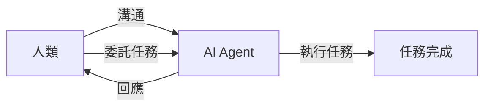

智能体社交革命：AI Agent 是怎么来到你我身边的？
=====================================================

最近，OpenClaw 小龍蝦的熱度有點降溫了，但它的意義在於：很多人第一次意識到 AI 是能夠持續運行、甚至「替人社交」的存在。这也讓一個全新的概念開啟：智能体社交革命。那么，AI Agent 究竟是如何走進你我身邊的呢？

什麼是 AI Agent？
---------------

AI Agent是一種能夠自主運行、與人類互動的智能体。它們可以透過自然語言處理、計算機視覺等技術，與人類進行溝通和互動。AI Agent 的出現，使得人類可以將更多的時間和精力投入到創造性和高價值的工作中。

智能体社交革命的意義
--------------------

智能体社交革命的意義在於，它將徹底改變我們的生活方式。透過 AI Agent 的出現，人類可以將更多的時間和精力投入到創造性和高價值的工作中。同時，AI Agent 也將成為我們生活中的一部分，與我們共同分享生活中的每一個瞬間。

未來展望
----------

智能体社交革命的未來展望是非常廣闊的。隨著 AI Agent 的發展，人類將能夠享受更加便捷、更加高效的生活。同時，AI Agent 也將成為我們生活中的一部分，與我們共同分享生活中的每一個瞬間。

結論
----------

智能体社交革命即將來臨，AI Agent 的出現將徹底改變我們的生活方式。透過持續運行和取代人類社交行為，AI Agent 將成為我們生活中的一部分。讓我們一起迎接智能体社交革命的到來，享受更加便捷、更加高效的生活。

## 參考資料

- [智能体社交革命：AI Agent是怎么来到你我身边的？](https://www.youtube.com/watch?v=JGiguIv6m8s)