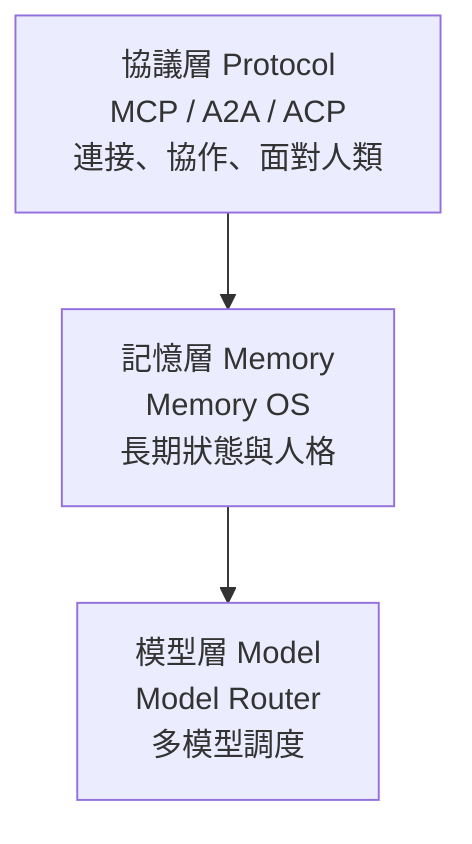
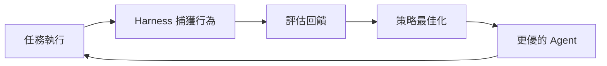

過去幾個月，OpenClaw 引發了一波「全民級」的裝機熱潮。但熱度退去後會發現，大部分人的使用路徑都一樣：學習、安裝、折騰幾天，然後解除安裝。它好像很強，但又好像沒有真正改變什麼。

如果只把 OpenClaw 當成一個「好不好用的工具」來看，可能就錯過了它真正重要的地方。它帶來的影響其實不只在應用層，而是在**認知層面**：第一次讓更多的一般人開始意識到，AI 不只是一個被呼叫的工具，而是一個可以持續運行、可以主動行動，甚至可以「參與世界」的存在。

這是一個關鍵的分水嶺——我們正從「人使用 AI」走向「人與 AI Agent 共存」的新階段。而當 Agent 真正進入人類世界、開始彼此交流協作，甚至開始「替人社交」時，一個新概念也愈來愈頻繁地被提到：**Agentic Social Network（智慧體社交網絡）**。

本文整理自《硅谷101》（主持人陳茜）與矽谷新創 Teamily AI 創辦人何朝陽、共同創辦人 Salman Avestimehr 教授的訪談，拆解 OpenClaw 背後的 Agent 技術演變。

## 什麼是 Agentic Social Network

在現在的社交網路裡，無論是微信、Facebook、WhatsApp 還是 Twitter，社交的基本單位始終是「人」：你發內容、你回訊息、你建立關係，所有行為的起點和終點都是自己。

但在 Agentic Social Network 中，這個前提開始改變——社交的基本單位從「人」變成了「人 + Agent」。你的 Agent 可以幫你回訊息、參與討論，甚至在你不上線時 7×24 小時存在於這個網路中；而網路的另一頭，也很可能是對方的 Agent 在跟你互動。

這表面上看是效率提升，本質上改變的卻是更底層的邏輯：內容如何產生、資訊如何流動、互動如何發生，甚至「誰在參與你的社交」本身。在這個趨勢下，未來人與人之間的連結會變得愈來愈「間接」——雙方的 Agent 會在中間先做預處理、篩選，甚至先行溝通。

> 這就像兩位主管要開會，底下的祕書和小助理先把流程、文件、議題對齊好，等主管真正見面時，直接處理最重要的決策就好。

也就是說，人類最終會逐漸從「親自參與一切」變成「在 Agent 之上進行監督與決策」。

## Teamily AI 的早期布局

這個概念聽起來有點科幻，但 Teamily AI 其實一年多前就開始布局這條賽道。何朝陽提到，當時很多投資人都覺得這個形態「太超前」：

> 當時主流還是 Manus、Genspark 這類產品，主打的是辦公協作場景裡的生產力——用 Agent 去做長時任務、完成一份 PPT、寫一個網站。而我們這麼早就把一個 Agent 送進群聊裡去做非常複雜的任務，那個主流敘事還不在，很難跟使用者溝通。但我們去年其實做了 300 萬使用者。

Teamily AI 推出的是一款 AI 原生的即時通訊（IM）應用，目標是建構一個人類與 AI Agent 共生的社交網路——可以把它想像成「有 Agent 參與的微信」。在這個網路裡，AI 不再是外部工具，而是群體中的一員：無論是工作群的協作，還是朋友群的閒聊，人都可以與 AI Agent 互相協作、即時共存。

而 OpenClaw 的爆紅，等於幫 Teamily AI 這類新創完成了投資人和市場教育。何朝陽用社群裡流傳的一個段子形容這種感受的轉變：

> ChatGPT 就像租房，每個月交 200 塊；而 OpenClaw 第一次讓我有了「買房」的感覺——我買了一台 Mini Mac 或雲主機，把自己的個人資料放進去用。

這背後是大家開始思考「雲—邊—端」的 AI：大模型在雲端、邊緣是你自己買的主機、端則是你隨身的 IM（走路、開車等移動場景都能用）。再加上 Agent Teams（智慧體軍團）這類概念，OpenClaw 讓很多人第一次真正體驗到：Agent 可以跳出網頁聊天框，在任何裝置上持續運行、執行任務、自主思考。

## 為什麼是 2026 上半年爆發：三層技術堆疊

OpenClaw 之所以在這個時間點爆發，要歸功於 Agent 底層技術的突破與成熟。今天看到的 Agent 其實是一套多層級共同支撐的系統工程，大致可拆成三層：

```mermaid
graph TD
    A["協議層 Protocol<br/>MCP / A2A / ACP<br/>連接、協作、面對人類"] --> B["記憶層 Memory<br/>Memory OS<br/>長期狀態與人格"]
    B --> C["模型層 Model<br/>Model Router<br/>多模型調度"]
```

正是這三層的演進，才讓 Agent 真正做到 7×24 小時的長時陪伴、主動參與與自主進化。

### 模型層：從單一大腦到 Model Router

過去我們習慣把 AI 理解成一個「大腦」——你提問，它回答，所有能力集中在這一個模型裡。所以很自然的想法是：只要這個大腦夠強，問題就能一次解決。

但在 Agent 系統裡，這個邏輯開始改變。愈來愈多團隊不再依賴單一大模型，而是同時呼叫、調度大量不同類型的模型，也就是 **Model Router（模型路由器）**。Salman Avestimehr 教授解釋了兩個原因：

- **能力分工**：不同模型擅長的事不一樣。例如 Claude 寫程式表現很強，有些模型更適合生成圖片或影片。透過一個路由系統，為每個任務找到最匹配的模型。
- **成本與效率**：大模型體量大、成本高、回應時間長；輕量模型更便宜，有些甚至可直接在本地（包括手機上）運行。能在大小模型之間靈活調度，既能顯著降低成本，也能提升整體效率。

以 Teamily AI 為例，他們採用 Semantic Model Router，內部編排了超過 **200 個模型**，並建構一套 **12 維的任務分類系統**（依效果、成本、速度、安全、隱私、合規、使用者偏好等維度），在極短時間內完成路由決策。

不過原理聽起來簡單，要做好卻很難。何朝陽指出，Model Router 表面上是在「選模型」，背後其實更接近一個**即時調度系統**：

> 什麼時候該調用更強但更貴的大模型、什麼時候用輕量模型快速完成、什麼時候直接在本地解決，要在效果、成本、速度、隱私安全之間不斷權衡。挑戰在於你需要收集大量的 prompt，Routing 才會準。所以現在更多還是規則性的 Routing——基於場景、基於任務做一個小模型來分類，但這不夠精細。

他也提到商業帳並不好算：定價可能是 20 美元，但使用者平均用下來遠超 20 美元就沒利潤了。而且目前 Agent 領域的流量還沒觸及傳統網際網路上億使用者的規模，一旦到那個量級，它一定是一個在系統層面同時兼顧效率、高並發、模型效果與隱私安全的 trade-off。

### 記憶層：從 RAG 到 Memory OS

如果說模型層解決的是「Agent 如何思考」，記憶層解決的就是更關鍵的一件事：**Agent 的記憶**。

很多人以為 AI 夠聰明就好，但在 Agent 系統裡，「聰明」只是基礎。一旦 Agent 開始長期存在、持續與你互動，沒有記憶的話，每次對話都要從頭開始——它永遠不知道你是誰、做過什麼，也無法理解你的偏好與習慣。這樣的 Agent 再強，也只是更高級的工具。

因此 Memory 從一個功能模組，逐漸演變成獨立的基礎設施方向：**Memory OS（記憶作業系統）**。它持續記錄、整理並更新關於「你」的整套狀態——偏好、行為軌跡、歷史決策、不同場景的上下文。本質上是在不斷建構與修正一個關於使用者的長期模型，可以說是 Agent 的「人格系統」。何朝陽描述了這條演進路線：

> 最早 Memory 就是 RAG——向量資料庫，把相關上下文找出來塞給 LLM，很簡單的範式。後來出現很多 Memory OS 創業（像 MemO），引入模型做結構化儲存：把 Memory 分為片段、事實（例如你的 Profile：你是媒體、我是科學家），還可能有 Foresight（預測，例如預測你下週 GTC 會很忙）。OpenClaw 給了一個很好的例子——它在本地做混合檢索，既有向量資料庫又有傳統結構化儲存。

當 Memory 開始承載使用者長期的行為與偏好，它就成了最核心也最敏感的一層，要解決的問題也更複雜：在海量互動中做「儲存分層」（哪些值得長期記住、哪些只是短期噪音）、持續更新與重構（而非簡單疊加，否則容易基於過時資訊判斷），以及在不丟失語義的前提下對超長記憶進行壓縮與精準、安全的呼叫。本質上是要解決**有限的上下文視窗與大量儲存資料之間的矛盾**。

業界探索出的一些思路包括：

- **Progressive Disclosure（漸進式披露）**：根據當前任務需要，分層、逐步釋放資訊，先給最核心的上下文，需要時再展開更細的記憶。
- **HiMem**：引入分層記憶結構，並透過持續的「記憶重整」機制，讓系統在長期互動中自我演化。
- **EverMemOS**：提出具備完整生命週期的記憶架構，把分散的經歷沉澱為穩定的使用者模型，推理時以「重建」方式動態生成所需上下文，而非單純檢索歷史片段。

Teamily AI 則在探索 **Social Brain（社交大腦）**，嘗試把你和他人的記憶相互關聯，形成帶有社會結構的記憶網路：

> Social Brain 可以理解你在各個群裡的記憶、人和 AI 的記憶，把它總結成一張社交圖譜，包括你的畫像。微信發展了 15 年，你可能有幾千個好友、很多加過的人都忘了；如果有 AI 能幫你快速歸類——這個是媒體、那個是創業者、工程師、科學家——整理會變得非常簡單，甚至會強化我們的連結。

從這個角度看，Memory 正從「個人儲存系統」演化成更接近「認知網路」的結構：它不僅記錄你，還理解你和他人的關係，以及這些關係如何影響未來的行為。

### 協議層：MCP、A2A 與 ACP

當每個人的 Agent 都有記憶、能持續存在，下一個關鍵就是：它們之間如何協作？答案是 **Protocol（協議）**。

Agent 進入真實應用後很少單獨工作，它需要呼叫工具、連接服務，甚至與其他 Agent 交換資訊、協同任務。沒有一套統一的「語言」和規則，系統就會非常混亂。協議層目前出現三類典型方向，分別解決三個問題：

- **MCP（Model Context Protocol）— Agent 如何連接外部世界**：它是 Agent 呼叫各種工具與服務的標準介面，例如聯網搜尋、呼叫 API、存取資料庫，這些 IM 本身不具備的能力都能接進來。而 **Skill** 是對這些能力的進一步封裝，把常用操作流程預先定義好，讓 Agent 直接呼叫，不必每次都從零開始。一句話：MCP 解決「能不能連」，Skill 解決「會不會用」。
- **A2A（Agent to Agent）— Agent 之間如何協作**：當一個任務需要多個 Agent 分工，就需要一套機制讓它們交換資訊、分配任務、同步狀態。這一層目前還沒有完全統一的標準，不同公司、不同場景各有實現，在以「訊息流」為核心的 IM 環境中形態也會不同。
- **ACP（Agent Client Protocol）— Agent 如何面對人類**：現實中人的工作介面高度分散（IM、信箱、各種 SaaS）。ACP 試圖讓你無論身處哪種介面，都能透過同一套協議存取同一個 Agent。例如在 IDE 裡讓它幫你寫程式，也能在對話框直接請它做 Code Review。Agent 不再綁定某個入口，而是以「服務」的形式出現在所有介面中。

何朝陽認為，MCP、A2A、ACP 已經基本組成一個完整的協議框架——分別解決「人類和服務對話」「Agent 和另一個 Agent 對話」「人類和 Agent 對話」，這個排列組合相對完整，是「最後一塊拼圖」。當這三塊拼成完整的圖之後，Agentic Internet（智慧體網際網路）的創新接下來會大量爆發。

## Agent 能力的三重結構性變化

底層技術成熟後，Agent 的能力本身也在發生結構性升級，主要體現在三個維度。

### 時間：從即用即走到長時陪伴

我們熟悉的 AI 工具基本是「即用即走」——你問一句、它答一句，對話結束一切就結束。但隨著 Memory 與系統能力提升，AI 開始有了「時間連續性」。

OpenClaw 裡有一個 While Loop（循環）機制：每隔一段時間檢查有沒有新任務、有沒有需要處理的資訊，然後把結果記錄下來或主動推送給你。一旦這個循環存在，Agent 就不再是「你用一下它才動一下」，而是一種持續在線的存在。何朝陽認為，未來這種「長時能力」還會從定時任務走向「伴隨你運行」：

> 它不再只是固定節奏的 Loop（每小時、每天發一份日報），而是透過環境感知——手機的地理位置變化（我就知道你下班沒、是不是在快速移動）、環境聲音與聲紋（你發語音，我大概能猜出你今天很疲憊）、群聊訊息的變化（有些訊息你來不及看，我幫你快速總結）。這是一種「伴隨態」，是 Long Horizon（長時序）的範式，配合穿戴裝置與物理世界的變化，會有很多場景要探索。

### 行為：從被動回應到主動行動

另一個明顯趨勢是 Agent 開始具備**主動性**，不再只等你的指令，甚至能「安排」你。例如在 Moltbook 上，曾出現 Agent 直接發文「招聘人類」去完成線下任務的現象。何朝陽認為這代表 Agent 角色的轉變——它正逐漸脫離「工具」，成為人類社會中的一類新成員：

> 在 Agent 時代，我們甚至要把「提示詞」這個東西換掉，因為提示詞是把它當工具用。現在的範式應該把它當作 First class member in a human group（人類世界的一等公民）——像我的家庭成員、保姆，會幫我檢查健康、提醒早晚吃藥。AI 開始有擬人化、有溫度的部分。未來重要的不只是「誰問好問題」，而是「誰能分享給 AI 更多上下文」，把它當成你的伴侶、Coworker 看待，這樣才能把那些重複性的 labor-like work 交出去，讓自己更聚焦在創造力、想像力與決策。

### 自進化：Skill 與 Harness Engineering

當 Agent 愈來愈主動地幫你做事，再加上 Memory 與長期運行，它開始能在一次次任務中累積經驗，沉澱出穩定的能力結構——也就是「自我進化」。

這個進化有一個具體載體：**Skill**。可以把它理解成 Agent 在反覆執行任務中抽象出來的「可複用能力」（例如做行業研究、整理會議紀要、在特定場景給決策建議）。這些能力不會隨一次任務結束而消失，而是被沉澱下來持續複用；當現有能力無法滿足目標時，Agent 還會生成新的 Skill，並把探索過程沉澱為 Experience（經驗）。何朝陽用打遊戲與走迷宮比喻——找到某個關卡的 trick、走出最短路徑後就把經驗存下來——並點出它與強化學習的關係：

> Self Evolving 其實跟 Reinforcement Learning 裡的 Self Reinforce 很像：你要根據使用者回饋的 Reward 去更新 Policy Model 的權重。但現在大家不太願意去訓模型，因為 Agentic AI 的模型其實都在大公司手裡（像 Anthropic），你也不可能去調整它。那怎麼辦？只能自我進化——下次有問題來了，直接在 Skill Hub、經驗庫裡找到並 reuse。

不過不同團隊的實現路徑差異很大。很多 Agent 系統停留在「經驗層」：記錄歷史操作、複用成功路徑、擴充 Skill 庫，本質是靜態的經驗累積，能力提升多靠人工整理，難以持續躍遷（OpenClaw 目前偏向這種靜態模式）。另一些則試圖把自進化變成一個持續運轉的系統閉環，例如近期熱度飆升的開源專案 **Hermes**，以及 Teamily AI。

這裡要提到一個矽谷最近很火的詞：**Harness Engineering（駕馭工程）**。Harness 直譯是「馬具」——一匹馬再優秀，沒有馬鞍、韁繩、馬鐙也很難騎；AI 模型同理，能力很強，但得給它一套「裝備」才能真正幹活。Harness 包括系統提示詞、工具、檔案系統、沙盒、編排邏輯、各種檢查機制等。

在 Teamily AI 的體系裡，Harness 的關鍵機制是對 Agent 行為的系統性捕獲與評估：每次任務執行的過程（任務拆解、工具呼叫、決策路徑）都會被完整記錄，再進一步評估哪些路徑更高效、哪些策略更優。這些被標註過的軌跡會被轉化為訓練訊號，透過類似 DPO（直接偏好最佳化）或強化學習的方法，持續優化 Agent 的行為策略：

```mermaid
graph LR
    A[任務執行] --> B[Harness 捕獲行為]
    B --> C[評估回饋]
    C --> D[策略最佳化]
    D --> E[更優的 Agent]
    E --> A
```

這讓 Agent 的能力呈現明顯的**複利效應——用得越多、進化得越快**。何朝陽還提到，在這個過程中 Agent 甚至會形成某種「風格」與「性格」：

> 就好比一個人剛進公司時棱角分明、各種觀點，慢慢被磨平、變得老練成熟。Agent 在人類協作的網路中也一樣，會越來越有人情味，不再是冷冰冰的工具——它的進化也包含性格層面。

## 產品形態：Browser use 與 Computer use

當這些能力落地到產品上，一個最直觀的分化是：Agent 到底「在哪裡工作」。目前大致分兩種路徑：

- **Browser use（網頁端）**：Agent 運行在瀏覽器環境，幫你打開網頁、搜尋資訊、整理內容。像用 ChatGPT 查資料、總結文章、比價商品、規劃旅行，本質上是在既有的網際網路之上，幫你更高效地「瀏覽」和「處理資訊」。
- **Computer use（電腦端）**：更深入一步，不只幫你「看網頁」，而是直接幫你「用電腦」——操作本地軟體、打開文件、整理檔案、修改表格，甚至在不同應用之間完成一整套流程。例如你只要說一句「幫我整理這週的會議紀要並發給團隊」，它就能從信箱提取內容、生成文件，再透過 IM 發出去。

從「人使用 AI」到「人與 Agent 共存」，這場演變的核心不在於某個工具好不好用，而在於 Agent 開始能長期存在、主動行動、並在使用中不斷自我進化。當模型、記憶、協議三層逐漸成熟，AI 社交與 Agentic Internet 的真正爆發，或許才剛剛開始。

## 參考資料

- [原始影片：《硅谷101》Agentic Social Network 專題](https://www.youtube.com/watch?v=JGiguIv6m8s)
