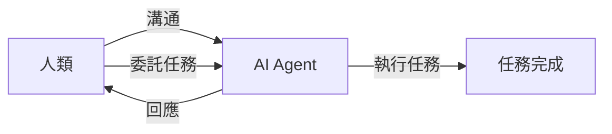

智能体社交革命：AI Agent 如何走進你我身邊

## TL;DR
AI Agent 是一種能夠自主運行、與人類互動的智能体，透過自然語言處理、計算機視覺等技術，與人類進行溝通和互動，徹底改變我們的生活方式。

## 是什麼，為什麼現在才出現
智能体社交革命是近年來興起的一個概念，主要是因為 AI 技術的進步，尤其是自然語言處理和計算機視覺技術的突破，使得 AI Agent 能夠與人類進行更加自然和流暢的溝通和互動。之前的 AI 技術主要是圍繞著特定的任務和應用，缺乏與人類的互動能力。現在，AI Agent 的出現使得人類可以將更多的時間和精力投入到創造性和高價值的工作中。

## 怎麼運作
AI Agent 的運作原理主要是透過自然語言處理和計算機視覺技術，與人類進行溝通和互動。以下是 AI Agent 的運作流程：

```mermaid
graph LR
    A[人類] -->|"溝通"| B[AI Agent]
    B -->|"回應"| A
    A -->|"委託任務"| B
    B -->|"執行任務"| C[任務完成]
```
AI Agent 可以透過自然語言處理技術，理解人類的語言和意圖，然後進行回應和執行任務。

## 跟 Chatbot 的差別
AI Agent 與 Chatbot 的主要差別在於，Chatbot 是一種特定的應用，主要是用於 customer service 和客戶支援，缺乏自主運行和與人類互動的能力。AI Agent 則是一種更加通用的智能体，可以與人類進行更加自然和流暢的溝通和互動。

## 實際用起來怎麼樣
AI Agent 的優點包括：

* 可以與人類進行更加自然和流暢的溝通和互動
* 可以自主運行和執行任務
* 可以減少人類的工作量和提高效率

但是，AI Agent 也有一些限制和挑戰，例如：

* 目前仍然需要大量的訓練數據和算力
* 可能會出現理解和溝通的誤差
* 需要解決與人類的信任和安全問題

總的來說，AI Agent 是一種具有潛力的技術，能夠徹底改變我們的生活方式。但是，仍然需要繼續研究和發展，才能真正實現智能体社交革命的願景。

## 參考資料

- [原始影片](https://www.youtube.com/watch?v=JGiguIv6m8s)