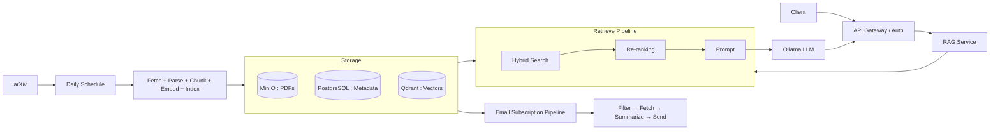

There are too many arXiv papers for researchers to keep up with every day. Manual retrieval is inefficient, and it's hard to quickly ask questions and compare across papers. That's exactly what **arXiv Knowledge Assistant** aims to solve: building a complete pipeline that spans data ingestion, vector retrieval, LLM Q&A, and visualization dashboards, so users can query paper abstracts, PDFs, and Q&A history directly in natural language, while developers can configure the ingestion flow, manage the vector index, and monitor model performance.

The whole system orchestrates multiple microservices with **Docker Compose**, aiming for "one-command reproducibility" — once you've prepared your `.env` and Firebase key, `make build && make up` brings up the complete environment.

## The Problems the Platform Solves

The core feature scope listed in the project's README includes:

- Automatically fetching arXiv paper metadata, PDFs, and abstracts daily
- Support for Chinese/English translation and Q&A
- RAG Q&A that pairs vector-database retrieval with an LLM
- Customizable prompt templates
- A dashboard of query history
- Email push subscriptions

CI/CD, unit tests, and integration tests are on the roadmap — items that are still WIP / planned.

## System Architecture

The platform is split into several single-responsibility microservices (`arxivservice`, `noteservice`, `emailservice`, `apiGateway`, and so on, with `imageservice` and `speechservice` reserved for future expansion), all deployed together via Docker Compose. Overall, it breaks down into three data flows:

1. **Daily ingestion**: scheduled arXiv crawling → PDFs/metadata stored in MinIO and PostgreSQL → text embeddings written to Qdrant.
2. **RAG Q&A**: after retrieval + re-ranking, the context is handed to the LLM to generate an answer, returned to the front-end dashboard.
3. **Email subscriptions**: each day it pulls papers from Qdrant → generates summaries → sends subscription emails.

## The Ingestion Pipeline

A daily schedule triggers the arXiv ingestion flow via **Prefect 3**, running the fetched papers through a chain of Fetch → Parse → Chunk → Embed → Index:

- **PDFs** are stored in **MinIO** (object storage, e.g. a bucket named `note-md`)
- **Paper metadata** is stored in **PostgreSQL**
- **Text embeddings** are written to the **Qdrant** vector database

Because the source, storage, and index are each independent, ingestion and querying can operate in a decoupled way, making later swaps or extensions easy.

## Retrieval and Q&A

The Q&A path is the core RAG flow of this platform, and the README's checklist maps clearly onto its implementation:

- **Query rewriting**: the user's question is rewritten first (including Chinese/English translation), corresponding to the `rewrite_query` method (LangChain client).
- **Hybrid Search**: retrieval on Qdrant that leverages both dense and sparse signals simultaneously.
- **Document re-ranking**: recalled documents are re-ranked to improve relevance (the `rerank` service).
- **LLM generation**: a local LLM driven by **Ollama** produces the answer, with support for evaluating multiple prompt templates.
- The Q&A strategy pairs RAG with agent reflection.

Prompt traces throughout the process are recorded by **Langfuse**, making it easy to trace and evaluate Q&A quality.

## Login, Subscriptions, and Observability

- **Authentication**: uses **Firebase Authentication (Google Login)**; you need to place `serviceAccountKey.json` into `apiGateway/` and `email/`. Without the key, login and Firebase-related features won't work.
- **Caching**: **Redis** serves as the caching layer.
- **Email subscriptions**: daily summary emails are sent via SMTP (a Gmail App Password).
- **Monitoring**: **Prometheus + Grafana** (Grafana defaults to `http://localhost:3002`) handles metrics and dashboards, and can be paired with Alertmanager to configure alerts.

The front-end offers two interfaces: **React + Vite** (`http://localhost:5173`), and **Gradio** (`http://localhost:7861`), which works without depending on Firebase — the latter suits cases where you don't want to wire up a Firebase project.

## Tech Stack at a Glance

| Category | Tools |
| --- | --- |
| Cloud / Infra | Docker Compose, MinIO, PostgreSQL, Qdrant |
| Backend / API | FastAPI, Prefect 3 |
| Frontend | React + Vite, Gradio |
| Monitoring | Prometheus + Grafana, Logging |
| CI/CD | GitHub Actions (planned) |
| Testing | pytest (unit + integration, WIP) |
| IaC | Docker Compose (Terraform optional) |

## Current Status and What's Next

The platform can already run the end-to-end flow of "daily ingestion → vector retrieval → bilingual RAG Q&A → dashboard + email subscriptions," with observability from Grafana and Langfuse. Items still to be filled in on the roadmap include: GitHub Actions CI/CD, unit and integration tests, multiple LLM backends (OpenAI, Anthropic, etc.), and personalized recommendations / subscriptions. The project is licensed under the MIT License.

## References

- Project source code: <https://github.com/a920604a/llm-assistant>
- [Firebase Authentication](https://firebase.google.com/docs/auth)
- [Qdrant Documentation](https://qdrant.tech/documentation/)
- [Prefect 3](https://docs.prefect.io/)
- [Grafana](https://grafana.com/)
- [Langfuse](https://langfuse.com/)
