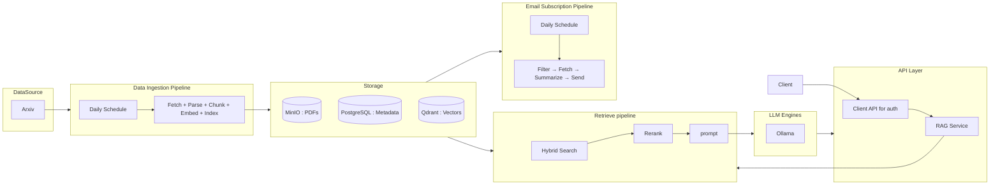
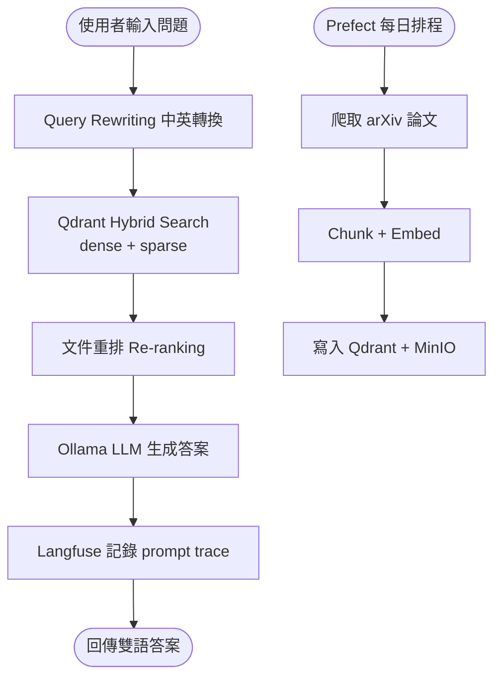

LLM Assistant 是一個 arXiv 學術論文知識平台，每日自動爬取論文並建立向量索引，使用者可用中英文提問，系統以混合搜尋 + 文件重排後由 Ollama LLM 回答，並支援 Email 訂閱與 Grafana 監控。

## 背景

研究人員需追蹤大量 arXiv 論文，手動搜尋效率低且缺乏雙語 Q&A 支援。這個專案目標是打造一條全自動的學術知識管線，讓使用者透過自然語言查詢特定領域的最新研究，並透過 Email 訂閱定期接收摘要。

## 挑戰

需在同一 Docker Compose 環境中協調多個異質服務：Prefect 定時爬蟲、Qdrant 向量資料庫、Ollama LLM 推理、Langfuse prompt 追蹤與 Prometheus 監控，同時讓混合搜尋（dense + sparse）在重排後維持答案品質，並支援中英雙語 query rewriting。

## 解法

採用微服務架構，各服務職責單一，以 Docker Compose 統一部署：

- 以 **Prefect 3** 建置每日 arXiv 論文爬取排程，儲存 metadata 與 PDF 至 **MinIO**
- 以 **Qdrant** 建置向量資料庫，實作 hybrid search（dense + sparse）與文件重排（re-ranking）
- 以 **FastAPI** 建置 API Gateway，整合 RAG 流程、query rewriting 與雙語 Q&A
- 以 **Ollama** 驅動本地 LLM 推理，搭配 **Langfuse** 追蹤 prompt 品質
- 以 **Prometheus + Grafana** 建置系統監控看板，React + Gradio 提供雙前端介面

## 架構圖

## 流程圖

## 成果

完成端到端 RAG 學術知識平台，支援每日自動論文更新、中英雙語 Q&A 與 Email 訂閱通知，Grafana + Langfuse 提供完整可觀測性，React 與 Gradio 雙介面可同時運行。
