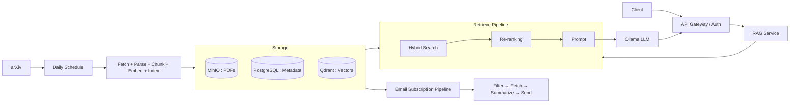

研究人員每天要追蹤的 arXiv 論文太多，手動檢索效率低、也很難快速問答比較。**arXiv Knowledge Assistant** 想解決的就是這件事：建立一條從資料攝取、向量檢索、LLM 問答到視覺化儀表板的完整管線，讓使用者能直接以自然語言查詢論文摘要、PDF 與問答歷史，開發者則能設定攝取流程、管理向量索引並監控模型表現。

整個系統以 **Docker Compose** 編排多個微服務，目標是「一鍵可重現」——準備好 `.env` 與 Firebase 金鑰後，`make build && make up` 就能拉起完整環境。

## 平台想解決的問題

專案在 README 中列出的核心功能範圍包括：

- 每日自動抓取 arXiv 論文的 metadata、PDF 與摘要
- 支援中英雙語翻譯與問答
- 以向量資料庫檢索搭配 LLM 完成 RAG 問答
- 可自訂的 prompt 模板
- 查詢歷史的儀表板
- Email 推播訂閱

CI/CD、單元與整合測試則列在 roadmap，屬於尚未完成（WIP / planned）的項目。

## 系統架構

平台拆成數個職責單一的微服務（`arxivservice`、`noteservice`、`emailservice`、`apiGateway` 等，另有 `imageservice`、`speechservice` 作為未來擴充），統一由 Docker Compose 部署。整體可分成三條資料流：

1. **每日攝取**：定時爬取 arXiv → PDF/metadata 存入 MinIO 與 PostgreSQL → 文字 embedding 寫進 Qdrant。
2. **RAG 問答**：檢索 + 重排後交給 LLM 生成答案，回傳前端儀表板。
3. **Email 訂閱**：每日從 Qdrant 撈出論文 → 產生摘要 → 寄送訂閱信。

```mermaid
flowchart LR
  Client --> FastAPI[API Gateway / Auth]
  FastAPI --> NoteServer[RAG Service]

  Arxiv[arXiv] --> Scheduler[Daily Schedule]
  Scheduler --> IngestFlow[Fetch + Parse + Chunk + Embed + Index]
  IngestFlow --> Storage

  NoteServer --> Retrieve
  Storage --> Retrieve

  subgraph Retrieve[Retrieve Pipeline]
    Search[Hybrid Search] --> Rerank[Re-ranking]
    Rerank --> Prompt
  end

  Prompt --> Ollama[Ollama LLM]
  Ollama --> FastAPI

  subgraph Storage[Storage]
    MinIO[(MinIO : PDFs)]
    PostgreSQL[(PostgreSQL : Metadata)]
    Qdrant[(Qdrant : Vectors)]
  end

  Storage --> Subscription[Email Subscription Pipeline]
  Subscription --> SubFlow[Filter → Fetch → Summarize → Send]
```

## 攝取管線

每日排程透過 **Prefect 3** 觸發 arXiv 攝取流程，把抓回來的論文做 Fetch → Parse → Chunk → Embed → Index 一連串處理：

- **PDF** 存進 **MinIO**（物件儲存，bucket 例如 `note-md`）
- **論文 metadata** 存進 **PostgreSQL**
- **文字 embedding** 寫進 **Qdrant** 向量資料庫

由於來源、儲存與索引各自獨立，攝取與查詢可以解耦運作，方便之後替換或擴充。

## 檢索與問答

問答路徑就是這個平台的核心 RAG 流程，README 的 checklist 明確對應到實作位置：

- **Query rewriting**：先把使用者問題改寫（含中英轉換），對應 `rewrite_query` 方法（LangChain client）。
- **Hybrid Search**：在 Qdrant 上同時利用 dense 與 sparse 訊號檢索。
- **Document re-ranking**：對召回文件重排，提升相關度（`rerank` service）。
- **LLM 生成**：由 **Ollama** 驅動的本地 LLM 產生答案，並支援多組 prompt 模板評估。
- 問答策略採 RAG 搭配 agent reflection。

過程中的 prompt trace 由 **Langfuse** 記錄，方便追蹤與評估問答品質。

## 登入、訂閱與可觀測性

- **身分驗證**：使用 **Firebase Authentication（Google Login）**，需把 `serviceAccountKey.json` 放進 `apiGateway/` 與 `email/`；少了金鑰，登入與 Firebase 相關功能就無法運作。
- **快取**：以 **Redis** 作為快取層。
- **Email 訂閱**：透過 SMTP（Gmail App Password）寄送每日摘要信。
- **監控**：**Prometheus + Grafana**（Grafana 預設 `http://localhost:3002`）負責指標與看板，並可搭配 Alertmanager 設定告警。

前端提供兩種介面：**React + Vite**（`http://localhost:5173`），以及不依賴 Firebase 也能用的 **Gradio**（`http://localhost:7861`），後者適合不想串接 Firebase 專案的情境。

## 技術棧一覽

| 類別 | 工具 |
| --- | --- |
| Cloud / Infra | Docker Compose、MinIO、PostgreSQL、Qdrant |
| Backend / API | FastAPI、Prefect 3 |
| Frontend | React + Vite、Gradio |
| Monitoring | Prometheus + Grafana、Logging |
| CI/CD | GitHub Actions（規劃中） |
| Testing | pytest（單元 + 整合，WIP） |
| IaC | Docker Compose（Terraform 為選用） |

## 現況與後續

平台目前已能跑通「每日攝取 → 向量檢索 → 雙語 RAG 問答 → 儀表板 + Email 訂閱」的端到端流程，並具備 Grafana 與 Langfuse 的可觀測性。Roadmap 上仍待補的項目包括：GitHub Actions CI/CD、單元與整合測試、多 LLM 後端（OpenAI、Anthropic 等）以及個人化推薦／訂閱。授權為 MIT License。

## 參考資料

- 專案原始碼：<https://github.com/a920604a/llm-assistant>
- [Firebase Authentication](https://firebase.google.com/docs/auth)
- [Qdrant Documentation](https://qdrant.tech/documentation/)
- [Prefect 3](https://docs.prefect.io/)
- [Grafana](https://grafana.com/)
- [Langfuse](https://langfuse.com/)
