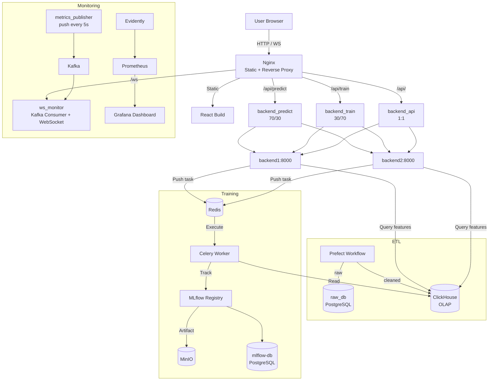

Models trained in a machine learning course usually stay stuck in a Jupyter Notebook, lacking version control, scheduled retraining, and monitoring. **Stock MLOps** is a course project that uses "stock price prediction" as its vehicle, with a clear goal: put everything learned in the course to use and build an end-to-end ML system with a complete MLOps workflow.

The system is meant to be a **sustainable, maintainable** stock price prediction service, covering the full lifecycle from data collection, feature engineering, model training, experiment tracking, and real-time inference to deployment and monitoring. Users can query predicted stock prices and historical trend charts through a web interface; developers can periodically retrain models, track experiments, monitor performance and data drift, and trigger automatic retraining.

## Technology Choices

The entire system is orchestrated on a single machine with Docker Compose (extensible to EC2), with cleanly separated responsibilities across layers:

| Category | Tools |
| --- | --- |
| Cloud / Infra | Docker Compose, MinIO, PostgreSQL, ClickHouse |
| ML Pipeline | FastAPI, Scikit-learn, Pandas, MLflow |
| Workflow Orchestration | Prefect 2 |
| Monitoring | Evidently + Prometheus + Grafana |
| CI/CD | GitHub Actions |
| Testing | pytest (unit + integration) |
| Formatting / Hooks | black, pre-commit, flake8 |
| IaC | Docker Compose + Volume + Network (extensible to Terraform) |

The frontend is Vite + React, the backend is several FastAPI containers, and Nginx sits in front to serve static files and act as a reverse proxy.

## Data Layering: PostgreSQL Raw Store + ClickHouse OLAP

This project applies clear layering at the data tier, rather than cramming everything into a single database:

- **raw_db (PostgreSQL)**: stores the raw data pulled in by ETL
- **ClickHouse**: stores the cleaned data, serving as the OLAP query layer — both inference and training read features from here

The data source is historical Taiwan/US stock data from Yahoo Finance (e.g. `2330.TW`, `AAPL`, `TSM`), which after ETL transformation is landed in **Parquet** format (`workflows/parquet/`).

## Model Lifecycle

The entire model lifecycle is strung together by Prefect:

1. The ETL and training pipelines are triggered periodically by **Prefect 2**
2. Training results are logged to **MLflow** and registered as versioned models
3. **FastAPI** provides the `/predict` and `/train` APIs (backed by Celery for async tasks)
4. **Evidently** exports model drift metrics to Prometheus
5. **Grafana** dashboards visualize prediction accuracy, drift metrics, and system metrics

MLflow here itself uses multiple database roles: mlflow-db (PostgreSQL) stores model metadata, there's a separate internal MLflow DB, and model artifacts are stored in **MinIO**.

## System Architecture

Nginx is more than a plain reverse proxy — it splits traffic to different upstream pools based on routing and performs weighted load balancing:

- `backend_predict`: 70% to backend1, 30% to backend2
- `backend_train`: 30% to backend1, 70% to backend2
- `backend_api`: backend1 and backend2 evenly (1:1)
- `/ws`: routed to the WebSocket monitoring service



## Real-Time Pushing: Kafka + WebSocket

Monitoring isn't just an offline dashboard. The system uses Kafka for real-time data streaming, paired with two dedicated services:

- **metrics_publisher**: fetches metrics every 5 seconds and sends them to Kafka's metrics topic
- **ws_monitor**: acts as a Kafka consumer, and at the same time uses WebSocket to push predictions from the prediction topic and metrics from the metrics topic to the frontend in real time

This lets both "prediction results" and "system/model metrics" reflect on the interface in near real time, without polling.

## Engineering Practices and CI/CD

This project rounds out reproducibility and engineering discipline quite thoroughly:

- **Testing**: pytest covers both unit tests (`test_train.py`, `test_predict.py`) and integration tests (predict / train APIs)
- **Formatting and hooks**: black, flake8, paired with a pre-commit config
- **Automation**: a Makefile (`make dev-setup`, `make train`, `make workflow`) keeps the environment and workflow consistent
- **CI/CD**: GitHub Actions runs CI (`ci-tests.yml`) and CD deployment (`cd-deploy.yml`), and sends Discord notifications via webhook

Getting it up and running is also straightforward:

```bash
python -m venv .venv
source .venv/bin/activate
pip install -r backend/requirements.txt

docker compose up --build

make train      # one-off training
make workflow   # run the Prefect workflow
```

## Conclusion

The value of Stock MLOps lies not in the accuracy of the stock price prediction itself, but in how it wires up a genuinely maintainable ML pipeline from end to end: data layering (PostgreSQL raw_db → ClickHouse OLAP), Prefect scheduling, MLflow version management, FastAPI + Celery servitization, Evidently/Prometheus/Grafana monitoring, and finally Kafka/WebSocket real-time pushing and GitHub Actions CI/CD. For anyone looking to turn a "model in a Notebook" into a "production-grade system," this is a clearly structured reference skeleton.

## References

- [Stock Price Prediction with MLOps (GitHub)](https://github.com/a920604a/stock-mlops)
- [MLflow Documentation](https://mlflow.org/)
- [Evidently AI Docs](https://docs.evidentlyai.com/)
- [Prefect 2 Docs](https://docs.prefect.io/)
- [Grafana Dashboards](https://grafana.com/grafana/dashboards)
