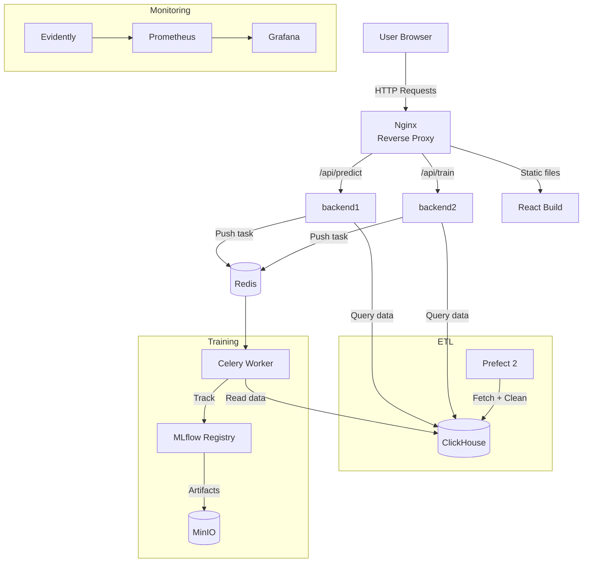
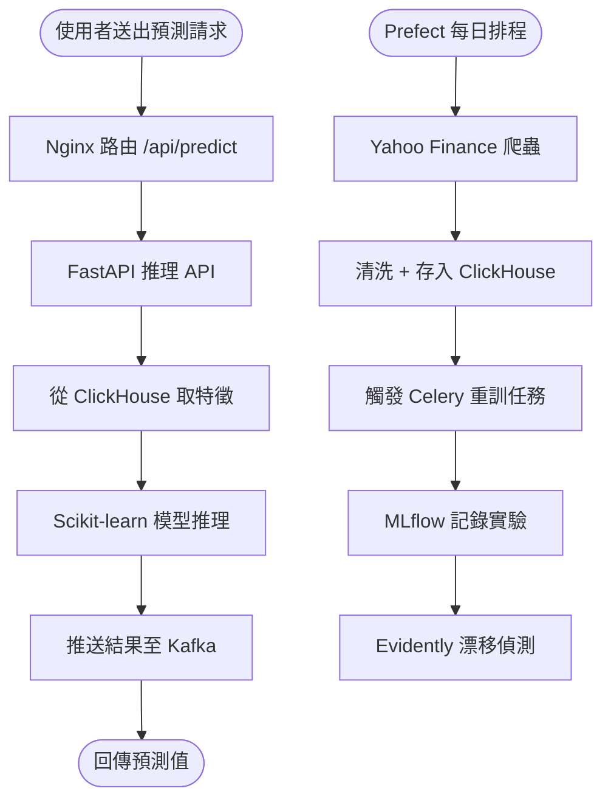

Stock MLOps 以台股與美股歷史資料為基礎，實作完整的端到端 ML 系統，涵蓋 ETL 排程、模型訓練、版本管理、即時推理、漂移監控與 CI/CD，讓模型從訓練到部署全程可追蹤。

## 背景

機器學習課程中的模型往往停留在 Jupyter Notebook，缺乏生產化所需的版本管理、排程重訓與監控機制。這個專案以股價預測為主題，實作完整 MLOps 工作流，練習將實驗性代碼轉化為可維護的 ML 系統。

## 挑戰

需在單機 Docker Compose 環境中協調多個異質元件——Prefect 排程、Celery 非同步任務、Kafka 事件流、MLflow 模型版本管理、Evidently 漂移偵測與 Nginx 負載均衡——確保各元件在資料管線中正確串接，且推理與訓練請求能分流至不同後端。

## 解法

以 Docker Compose 統一部署，Nginx 負責路由分流，各元件職責單一：

- 以 **MLflow** 追蹤每次訓練實驗，管理模型版本與 artifact（存放於 MinIO）
- 以 **Prefect 2** 建置 ETL 排程，從 Yahoo Finance 爬取台股/美股資料並存入 ClickHouse
- 以 **FastAPI + Scikit-learn** 建置容器化推理 API，Nginx 依路由分流至預測/訓練後端
- 以 **Celery + Redis** 處理非同步訓練任務，Kafka 串接即時預測結果推送
- 以 **Evidently + Prometheus + Grafana** 建置資料漂移偵測與模型效能監控看板
- 以 **GitHub Actions** 建置 CI/CD，整合 pytest、Black、flake8 與 Discord 通知

## 架構圖

## 流程圖

## 成果

完成端到端 MLOps 工作流，涵蓋資料爬取、實驗追蹤、模型部署、漂移監控與 CI/CD，以台股（2330.TW）與美股（AAPL、TSM）為資料集驗證完整管線。
