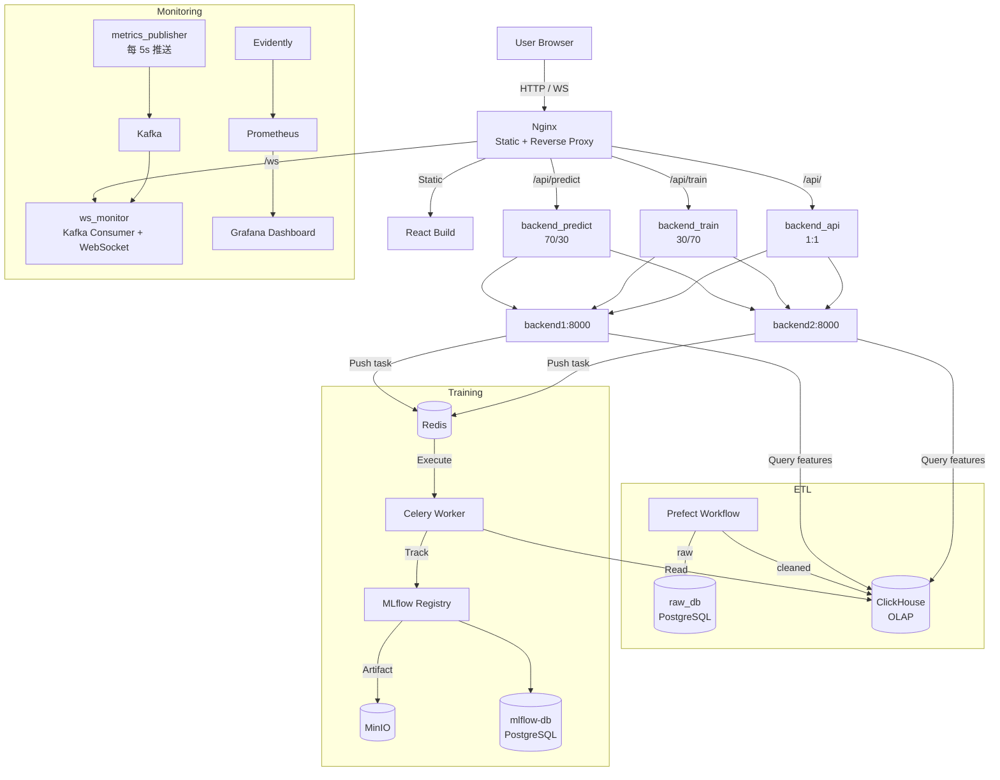

機器學習課程裡訓練好的模型，多半停在 Jupyter Notebook，缺乏版本管理、排程重訓與監控。**Stock MLOps** 這個課程專案把「股價預測」當成載體，目標很明確：把課程學到的東西全部用上，做出一套帶完整 MLOps 工作流的端到端 ML 系統。

系統要做的是一個**可持續、可維護**的股價預測服務，涵蓋資料蒐集、特徵工程、模型訓練、實驗追蹤、即時推理、部署到監控的完整 lifecycle。使用者可以透過 web 介面查詢預測股價與歷史走勢圖；開發者則能定期重訓模型、追蹤實驗、監控效能與資料漂移，並觸發自動重訓。

## 技術選型

整套系統用 Docker Compose 在單機編排（可延伸到 EC2），各層職責切得很乾淨：

| 類別 | 工具 |
| --- | --- |
| Cloud / Infra | Docker Compose、MinIO、PostgreSQL、ClickHouse |
| ML Pipeline | FastAPI、Scikit-learn、Pandas、MLflow |
| Workflow Orchestration | Prefect 2 |
| Monitoring | Evidently + Prometheus + Grafana |
| CI/CD | GitHub Actions |
| Testing | pytest（unit + integration） |
| Formatting / Hooks | black、pre-commit、flake8 |
| IaC | Docker Compose + Volume + Network（可延伸到 Terraform） |

前端是 Vite + React，後端是多個 FastAPI 容器，前面再掛 Nginx 做靜態檔案服務與反向代理。

## 資料分層：PostgreSQL 原始庫 + ClickHouse OLAP

這個專案在資料層做了明確分層，而不是把所有東西塞進同一個資料庫：

- **raw_db（PostgreSQL）**：存放 ETL 抓進來的原始資料
- **ClickHouse**：存放清洗後的資料，作為 OLAP 查詢層，推理與訓練都從這裡讀特徵

資料來源是 Yahoo Finance 的台股／美股歷史資料（例如 `2330.TW`、`AAPL`、`TSM`），經 ETL 轉換後以 **Parquet** 格式落地（`workflows/parquet/`）。

## 模型生命週期

整個模型 lifecycle 由 Prefect 串起來：

1. ETL 與訓練 pipeline 由 **Prefect 2** 定期觸發
2. 訓練結果記錄到 **MLflow**，並註冊成有版本的模型
3. **FastAPI** 提供 `/predict` 與 `/train` API（背後由 Celery 支援非同步任務）
4. **Evidently** 把模型漂移指標輸出到 Prometheus
5. **Grafana** dashboard 視覺化預測準確度、漂移指標與系統指標

MLflow 這邊本身就用了多個資料庫角色：mlflow-db（PostgreSQL）存模型 metadata、另有 MLflow 內部 DB，而模型 artifact 則存進 **MinIO**。

## 系統架構

Nginx 不只是單純反向代理，它依路由把流量分流到不同的 upstream pool，且帶權重做負載均衡：

- `backend_predict`：70% 給 backend1、30% 給 backend2
- `backend_train`：30% 給 backend1、70% 給 backend2
- `backend_api`：backend1、backend2 各半（1:1）
- `/ws`：導向 WebSocket 監控服務


```mermaid
graph TD
  U[User Browser] -->|HTTP / WS| NG[Nginx<br>Static + Reverse Proxy]

  NG -->|/api/predict| UP1[backend_predict<br>70/30]
  NG -->|/api/train| UP2[backend_train<br>30/70]
  NG -->|/api/| UP3[backend_api<br>1:1]
  NG -->|/ws| W[ws_monitor<br>Kafka Consumer + WebSocket]
  NG -->|Static| Static[React Build]

  UP1 --> B1[backend1:8000]
  UP1 --> B2[backend2:8000]
  UP2 --> B1
  UP2 --> B2
  UP3 --> B1
  UP3 --> B2

  subgraph ETL
    P[Prefect Workflow] -->|raw| D1[(raw_db<br>PostgreSQL)]
    P -->|cleaned| D2[("ClickHouse<br>OLAP")]
  end

  B1 & B2 -->|Query features| D2
  B1 & B2 -->|Push task| E[(Redis)]

  subgraph Training
    E -->|Execute| L[Celery Worker]
    L -->|Read| D2
    L -->|Track| H[MLflow Registry]
    H -->|Artifact| S[(MinIO)]
    H --> D3[(mlflow-db<br>PostgreSQL)]
  end

  subgraph Monitoring
    M[Evidently] --> J[Prometheus]
    J --> K[Grafana Dashboard]
    Q[metrics_publisher<br>每 5s 推送] --> KAF[Kafka]
    KAF --> W
  end
```

## 即時推送：Kafka + WebSocket

監控不只是離線看板。系統用 Kafka 做即時資料流，搭配兩個專門的服務：

- **metrics_publisher**：每 5 秒抓取指標並發送到 Kafka 的 metrics topic
- **ws_monitor**：作為 Kafka consumer，同時透過 WebSocket 把 prediction topic 的預測結果與 metrics topic 的指標即時推送到前端

這讓「預測結果」與「系統／模型指標」都能近即時地反映在介面上，而不必輪詢。

## 工程實踐與 CI/CD

這個專案在可重現性與工程紀律上補得相當完整：

- **測試**：pytest 同時涵蓋 unit test（`test_train.py`、`test_predict.py`）與 integration test（predict / train API）
- **格式與 hooks**：black、flake8，搭配 pre-commit 設定
- **自動化**：Makefile（`make dev-setup`、`make train`、`make workflow`）讓環境與流程一致
- **CI/CD**：GitHub Actions 跑 CI（`ci-tests.yml`）與 CD 部署（`cd-deploy.yml`），並透過 webhook 發送 Discord 通知

啟動方式也很單純：

```bash
python -m venv .venv
source .venv/bin/activate
pip install -r backend/requirements.txt

docker compose up --build

make train      # 一次性訓練
make workflow   # 執行 Prefect workflow
```

## 結語

Stock MLOps 的價值不在於股價預測本身的精度，而在於它把一條真正可維護的 ML pipeline 從頭到尾串了起來：資料分層（PostgreSQL raw_db → ClickHouse OLAP）、Prefect 排程、MLflow 版本管理、FastAPI + Celery 服務化、Evidently/Prometheus/Grafana 監控，再到 Kafka/WebSocket 即時推送與 GitHub Actions CI/CD。對想把「Notebook 裡的模型」變成「生產級系統」的人來說，這是一份結構清楚的參考骨架。

## 參考資料

- [Stock Price Prediction with MLOps（GitHub）](https://github.com/a920604a/stock-mlops)
- [MLflow Documentation](https://mlflow.org/)
- [Evidently AI Docs](https://docs.evidentlyai.com/)
- [Prefect 2 Docs](https://docs.prefect.io/)
- [Grafana Dashboards](https://grafana.com/grafana/dashboards)
