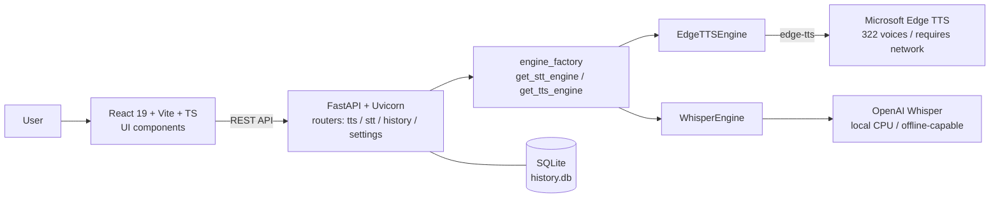

STT-TTS Unified is a self-hosted platform that integrates **speech synthesis (TTS)** and **speech recognition (STT)** into a single web interface. Its design orientation is clear: TTS borrows Microsoft Edge TTS's free neural voices, while STT runs OpenAI Whisper **entirely offline on the local CPU** — the whole system needs no GPU and no API key of any kind.

## Why It's Designed This Way

Doing speech synthesis and recognition together usually means cobbling several tools together, and commercial APIs often come with usage-based billing and key management. This project folds both tasks into a single interface and deliberately drives the cost down to zero:

- **Edge TTS** calls Microsoft's free speech synthesis service directly, offering 322 multilingual voices and automatically filtering available voices based on the input language.
- **Whisper** is an open-source model that runs entirely locally and works offline.

The tradeoffs are cleanly split: TTS requires an internet connection (calling Microsoft's service), while STT is fully local and can run offline. Neither requires a key.

## It Runs on Pure CPU Too

The project is explicitly designed on the premise of "running on pure CPU" — no graphics card needed:

| Resource | Minimum | Recommended |
|---|---|---|
| CPU | Any modern CPU | Multi-core CPU |
| RAM | 4 GB | 8 GB+ (for medium/large models) |
| Disk | 5 GB | 10 GB (including Docker image) |
| GPU | Not needed | — |

Whisper uses the `base` model by default, completing a segment of speech recognition in roughly **10–30 seconds** on a typical laptop CPU. If you need higher accuracy, you can switch to `small` or `medium` in `config.yaml` without any hardware upgrade.

## Architecture: Abstracting Engines into Swappable Components

The most noteworthy piece of the backend design is abstracting the STT/TTS engines using **Protocol interfaces plus factory functions**. `services/protocols.py` defines two Protocols, `STTEngine` and `TTSEngine`; `WhisperEngine` in `whisper_service.py` and `EdgeTTSEngine` in `tts_service.py` each implement the corresponding interface; and `engine_factory.py` returns the actual engine based on configuration via `get_stt_engine()` / `get_tts_engine()`. In other words, swapping out Whisper or Edge TTS in the future only requires adding a new class that implements the relevant Protocol — the call sites don't need to change.



The frontend is React 19 + Vite + TypeScript, with a UI built on Apple HIG semantic color system and support for a Dark Mode that automatically follows the system preference. All synthesis and recognition results are written to SQLite (via `aiosqlite`), so audio files can be played back and downloaded from the history log.

## STT's Non-Blocking Flow

Speech recognition is a time-consuming task, so STT uses **background transcription**: after an audio file is uploaded, Whisper inference runs in the background, real-time progress is pushed via **SSE (Server-Sent Events)**, and a browser notification alerts the user upon completion. This means users don't have to stare at the screen waiting, and other operations aren't blocked.


## Configuration and Deployment

Configuration is centralized in `config.yaml` at the root, using a hierarchical structure that lets you tune the STT engine (model, device, language) and the TTS engine (default voice, retry count) separately:

```yaml
stt:
  engine: whisper
  whisper:
    model: base        # tiny | base | small | medium | large
    device: cpu        # cpu | cuda | mps
    language: auto

tts:
  engine: edge-tts
  edge_tts:
    default_voice: zh-TW-HsiaoChenNeural
    retry_count: 3
```

Settings can be overridden by environment variables, with a precedence of `env var > .env > config.yaml`. The naming convention is `SECTION__SUBSECTION__KEY`, e.g. `STT__WHISPER__MODEL=small`. The backend reads this hierarchy uniformly via Pydantic nested settings (`config.py`).

Deployment uses a Docker Compose multi-stage build for a one-command launch:

```bash
git clone <repo>
cd stt-tts-unified
make up
# → http://localhost:8008
```

For local development, use `make install` (creates a Python venv + installs npm dependencies) and `make dev` (starts both backend:8000 and frontend:5173 simultaneously).

## Wrap-Up

STT-TTS Unified uses a pragmatic combination to fold speech synthesis and recognition into a single self-hosted interface: TTS borrows Microsoft Edge TTS's free voices, STT uses local Whisper for pure-CPU inference, and the engines are made into swappable components via the Protocol + factory pattern. The whole thing is GPU-free, API-key-free, and launches with a single Docker command — a lightweight starting point for anyone who wants to self-host voice tools without paying cloud fees.

## References

- [STT-TTS Unified — GitHub](https://github.com/a920604a/stt-tts-unified)
