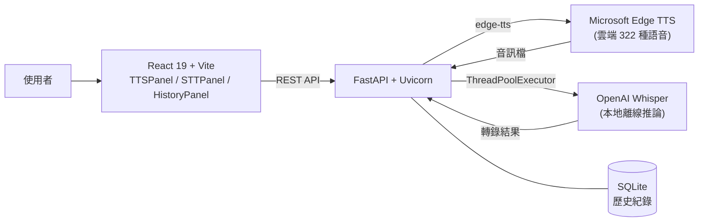
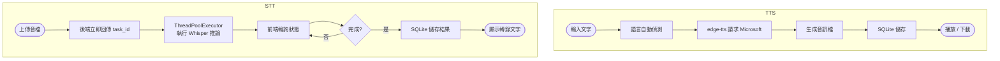

STT-TTS Unified 是一個整合文字轉語音（TTS）與語音轉文字（STT）的 Web 平台，TTS 使用 Microsoft Edge 雲端神經語音（322 種語言），STT 使用本地 Whisper 離線推論，所有結果持久化至 SQLite，完全免費且無需 API Key。

## 背景

開發者與內容創作者需要在同一個介面完成語音合成與語音辨識，但現有工具各自獨立，且商業 API 有使用量費用。這個專案目標是打造一個零成本、可自架的一站式語音處理平台，TTS 借助 Edge TTS 免費語音，STT 則完全本地執行。

## 挑戰

Whisper 語音辨識是 CPU-bound 任務，若在 FastAPI 主執行緒直接執行會造成整個服務阻塞，導致其他請求無法回應。同時需在同一個 Docker 容器中整合 Node.js 前端編譯與 Python 後端環境，並預先下載 Whisper 模型以避免首次啟動等待。

## 解法

採用異步架構將阻塞任務移出主執行緒，以 Multi-stage Docker 簡化部署：

- 以 **React 19 + Vite + TypeScript** 建置前端，含 TTSPanel、STTPanel、HistoryPanel 三個主面板，支援 Apple HIG 深色模式
- 以 **FastAPI + Uvicorn** 建置後端，整合 edge-tts（TTS）、openai-whisper（STT）與 aiosqlite（歷史紀錄）
- 以 **asyncio.create_task() + ThreadPoolExecutor** 將 Whisper CPU-bound 推論移至背景執行，主執行緒不阻塞
- 以 **SSE（Server-Sent Events）** 推送 STT 即時進度，前端每 2 秒輪詢直至完成
- 以 **Multi-stage Docker Build** 整合 Node.js 前端編譯與 Python 環境，預載 Whisper 模型

## 架構圖

## 流程圖

## 成果

完成 TTS + STT 雙功能整合平台，支援 322 種語音合成語言與本地離線 Whisper 辨識，以 Docker Compose 一鍵啟動（`make up` → localhost:8008），完全免費且無需任何 API Key。
