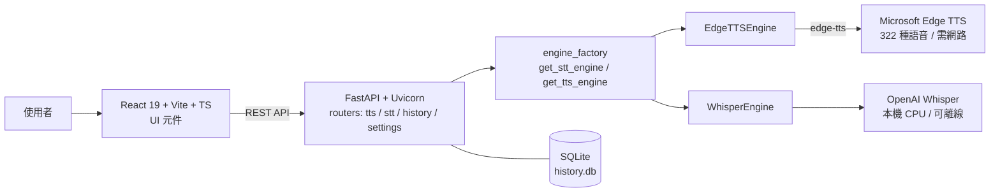

STT-TTS Unified 是一個把**語音合成（TTS）**與**語音辨識（STT）**整合到同一個 Web 介面的自架平台。它的設計取向很明確：TTS 借用 Microsoft Edge TTS 的免費神經語音，STT 則用 OpenAI Whisper **完全在本機 CPU 上離線執行**——整套系統不需要 GPU，也不需要任何 API Key。

## 為什麼這樣設計

一般要同時做語音合成與辨識，往往得拼湊好幾個工具，商業 API 也常綁定用量計費與金鑰管理。這個專案把兩件事收進同一介面，並刻意把成本壓到零：

- **Edge TTS** 直接呼叫 Microsoft 的免費語音合成服務，提供 322 種多語言語音，會依輸入語言自動篩選可用語音。
- **Whisper** 是開源模型，完全在本機執行，可離線使用。

代價分得很清楚：TTS 需要網路連線（呼叫 Microsoft 服務），STT 則完全本地、可離線。兩者都不需要金鑰。

## 純 CPU 也跑得動

專案明確以「純 CPU 執行」為前提設計，不需要顯示卡：

| 資源 | 最低 | 建議 |
|---|---|---|
| CPU | 任意現代 CPU | 多核心 CPU |
| RAM | 4 GB | 8 GB+（使用 medium／large 模型）|
| 磁碟 | 5 GB | 10 GB（含 Docker image）|
| GPU | 不需要 | — |

Whisper 預設使用 `base` 模型，在一般筆電 CPU 上約 **10–30 秒**可完成一段語音辨識。若需要更高精度，可在 `config.yaml` 切換為 `small` 或 `medium`，不需要任何硬體升級。

## 架構：把引擎抽象成可抽換元件

後端最值得一提的設計，是用 **Protocol 介面 + 工廠函式**把 STT／TTS 引擎抽象化。`services/protocols.py` 定義 `STTEngine` 與 `TTSEngine` 兩個 Protocol；`whisper_service.py` 的 `WhisperEngine` 與 `tts_service.py` 的 `EdgeTTSEngine` 各自實作對應介面；`engine_factory.py` 透過 `get_stt_engine()` / `get_tts_engine()` 依設定回傳實際引擎。換句話說，未來要換掉 Whisper 或 Edge TTS，只要新增一個實作該 Protocol 的類別即可，呼叫端不必改動。


```mermaid
graph LR
  User["使用者"] --> FE["React 19 + Vite + TS<br/>UI 元件"]
  FE -->|REST API| API["FastAPI + Uvicorn<br/>routers: tts / stt / history / settings"]
  API --> Factory["engine_factory<br/>get_stt_engine / get_tts_engine"]
  Factory --> TTSE["EdgeTTSEngine"]
  Factory --> STTE["WhisperEngine"]
  TTSE -->|edge-tts| MS["Microsoft Edge TTS<br/>322 種語音 / 需網路"]
  STTE --> WH["OpenAI Whisper<br/>本機 CPU / 可離線"]
  API --- DB[("SQLite<br/>history.db")]
```

前端為 React 19 + Vite + TypeScript，UI 採 Apple HIG 語意色彩系統，並支援自動跟隨系統偏好的 Dark Mode。所有合成與辨識結果都寫入 SQLite（透過 `aiosqlite`），可在歷史紀錄中播放與下載音檔。

## STT 的非阻塞流程

語音辨識是耗時任務，因此 STT 採**背景轉換**：上傳音檔後在背景執行 Whisper 推論，並透過 **SSE（Server-Sent Events）** 即時推送進度，完成時再以瀏覽器通知提醒使用者。這讓使用者不必盯著畫面等待，也不會卡住其他操作。


```mermaid
flowchart TD
  subgraph TTS流程
    A(["輸入文字"]) --> B["自動偵測語言<br/>篩選可用語音"]
    B --> C["edge-tts 請求 Microsoft"]
    C --> D["生成音檔"]
    D --> E["寫入 SQLite"]
    E --> F(["播放 / 下載"])
  end

  subgraph STT流程
    G(["上傳音檔"]) --> H["背景執行 Whisper 推論"]
    H --> I["SSE 推送即時進度"]
    I --> J["完成 → 瀏覽器通知"]
    J --> K["寫入 SQLite"]
    K --> L(["顯示轉錄文字"])
  end
```

## 設定與部署

設定集中在根目錄的 `config.yaml`，採階層式結構，可分別調整 STT 引擎（模型、device、語言）與 TTS 引擎（預設語音、重試次數）：

```yaml
stt:
  engine: whisper
  whisper:
    model: base        # tiny | base | small | medium | large
    device: cpu        # cpu | cuda | mps
    language: auto

tts:
  engine: edge-tts
  edge_tts:
    default_voice: zh-TW-HsiaoChenNeural
    retry_count: 3
```

設定可被環境變數覆蓋，優先順序為 `env var > .env > config.yaml`，命名規則是 `SECTION__SUBSECTION__KEY`，例如 `STT__WHISPER__MODEL=small`。後端以 Pydantic nested settings（`config.py`）統一讀取這套階層。

部署用 Docker Compose 的 multi-stage build，一鍵啟動：

```bash
git clone <repo>
cd stt-tts-unified
make up
# → http://localhost:8008
```

本地開發則用 `make install`（建立 Python venv + 安裝 npm 相依）與 `make dev`（同時啟動 backend:8000 與 frontend:5173）。

## 小結

STT-TTS Unified 用一個務實的組合，把語音合成與辨識收進單一自架介面：TTS 借 Microsoft Edge TTS 的免費語音、STT 用本地 Whisper 純 CPU 推論，再以 Protocol + 工廠模式把引擎做成可抽換元件。整套免 GPU、免 API Key、Docker 一鍵啟動，對想自架語音工具又不想付雲端費用的人是個輕量的起點。

## 參考資料

- [STT-TTS Unified — GitHub](https://github.com/a920604a/stt-tts-unified)
