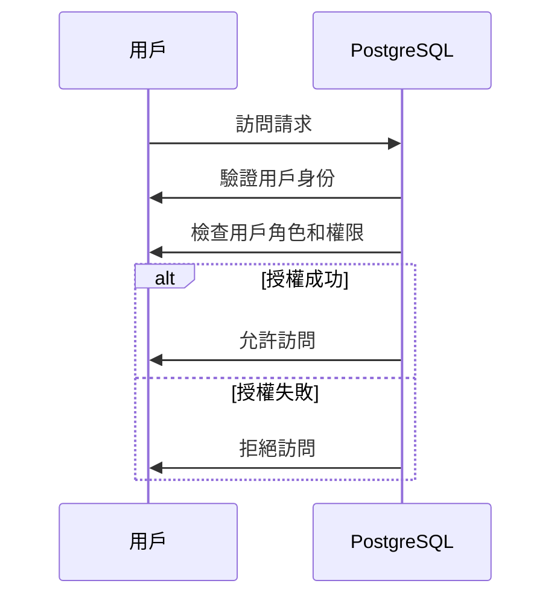

PostgreSQL 是目前世界上最安全的系統之一，為什麼呢？讓我們一步一步來了解。

## TL;DR
PostgreSQL 的安全性源自於其嚴格的安全模型和豐富的安全功能。

## 是什麼
PostgreSQL 是一款開源的關係型資料庫管理系統（RDBMS），它提供了豐富的安全功能和嚴格的安全模型，包括身份驗證、授權、資料加密等。

## 為什麼重要
資料庫安全是企業和組織的頭等大事，因為資料庫中存儲了大量的敏感信息。PostgreSQL 的安全性可以幫助企業和組織保護其資料免受未經授權的訪問、竊取和破壞，從而維護資料的完整性和保密性。

## 怎麼運作
PostgreSQL 的安全模型是基於角色的訪問控制（Role-Based Access Control，RBAC），用戶可以創建不同的角色，每個角色都有一系列的權限和責任。當用戶嘗試訪問資料庫時，PostgreSQL 會根據用戶的角色和權限來決定是否允許訪問。

## 跟 MySQL 的差別
PostgreSQL 和 MySQL 都是流行的關係型資料庫管理系統，但是它們在安全性方面有所不同。PostgreSQL 的安全模型更加嚴格和靈活，提供了更多的安全功能和設定選項。另外，PostgreSQL 的開源授權允許用戶自行修改和擴展其安全功能。

## 小結
PostgreSQL 是一個安全性非常高的資料庫管理系統，適合需要高安全性和靈活性的企業和組織使用。它的嚴格的安全模型和豐富的安全功能使其成為目前世界上最安全的系統之一。

## 參考資料
* PostgreSQL 官網：https://www.postgresql.org/
* PostgreSQL 安全指南：https://www.postgresql.org/docs/current/security.html