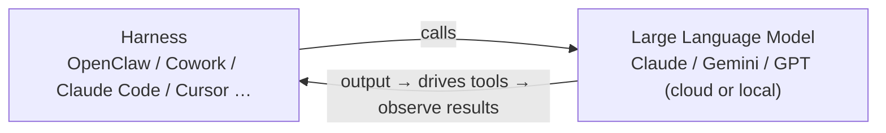
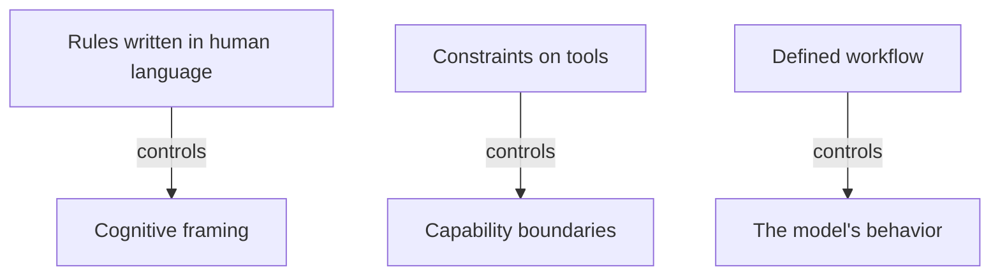

The major companies keep releasing new language models, and the central theme of this story is: **sometimes a language model isn't dumb, it just lacks human guidance.**

A few days ago Google released the open-source fourth generation of Gemma. Besides claiming to be very strong, it also comes in some especially small variants, such as **Gemma 4 2B** — the "2B" in the name means it has only 2 Billion parameters, an especially small model, claimed to let you run a language model even on the Edge. Since it's open source, you can download it and run it on your own machine. (The E in the model name stands for effective; as for why they put an E in front, I'll leave that for you to research yourself.)

Can such a tiny model be used to drive an AI Agent? Below is a small experiment I ran with it.

## The Experiment: Have a Small Model Fix a Bug

The task is straightforward: there's a `parser.py` in a folder, containing a function `extract_email` whose job is to extract emails from a piece of text, but it was written with a bug so not all emails get extracted correctly. Modify `parser.py` so that the tests in `verify.py` pass completely. Both `parser.py` and `verify.py` sit in the same folder as the language model.

A language model doesn't naturally become an Agent on its own — you have to give it tools. Here I use a very simple convention as the tool interface:

- If the model outputs "three dots → `bash` → one line of command → three dots," the environment takes that middle line as a bash command and runs it automatically.
- If the model outputs "three dots → `python` → a block of code → three dots," the environment saves that block as a file and runs it.

So the model now has three capabilities at hand: issue bash commands, write python, and run python.

### First Attempt: The Model Hallucinates a File

Gemma 4 2B's first reaction after reading the instructions was actually: "There's no `parser.py`."

Why? Because to the model, its context only contains the string of text "the filename `parser.py`" — but **not the file's contents**. Even if the file really is sitting in the same folder, the model doesn't automatically know that — it can only see the text you fed it.

So it took matters into its own hands: based on the `extract_email` mentioned in the prompt, it **hallucinated** what `parser.py` should look like, wrote a block of code it imagined, then hallucinated that it had verified it, and declared the task done.

This is of course not the result we wanted. But think about it — this isn't a dumb model. It knows exactly what should be in `parser.py`, and it's fully capable of writing a correct email parser; it just **didn't realize the file was right at its feet**. A model's thinking is often different from a human's: your intuition says the code should come attached to the problem, but the model didn't anticipate that the relevant file was right under its nose.

### Second Attempt: Just a Few Extra Lines of Working Principles

Next I only typed a few extra lines (fewer than 80 words), and they were **not hints specific to this task, but some general principles**:

1. You are in a Linux environment (nudging it to more readily execute bash commands).
2. Before doing anything, look at what's in the folder you're in, and list the relevant files.
3. Before modifying a file, don't just edit it — open it and read its contents first.
4. Define what "done" means: you have to meet certain established criteria before it counts as done.

The same Gemma 4 2B, with only this set of principles added, doing the exact same task, behaved completely differently:

- First `ls`, listing the directory, and discovering `parser.py` and `verify.py`;
- Then `cat parser.py`, printing out the contents and reading them into context;
- Now that it had the real contents, it rewrote `parser.py` (more of a full overwrite than an edit), using `cat` to overwrite the original file;
- Finally it ran `verify.py` to self-verify, saw verify success, and finished the task.

This is close to what a human wants. **The same model, with a few extra lines of instruction, can differ enormously in capability.**

## The Two Components of an AI Agent: Language Model + Harness

So when your AI Agent underperforms, where should you fix it? First, recall what an AI Agent is made of.

An AI Agent has two parts: one is the **Large Language Model** it calls (which can be Claude, Gemini, or GPT, in the cloud or local); the other is a whole pile of program scaffolding that supports it in calling the model and operating tools. In the past this "everything else" had no good name; now there's a shared name for it — the **Harness**. Many people translate it into Chinese as "駕馭" (to steer/harness), so the act of building a Harness is called **Harness Engineering**.

The symbolic meaning is: the AI is a powerful horse, and to steer it you need a saddle and reins — those are the Harness.

To strengthen an AI Agent, then, there are two paths:

- **Change the language model**: train a better model yourself, or fine-tune an existing one.
- **Change the Harness**: build a better set of tack. This is exactly the hot topic right now — Anthropic talked last November about effective Harnesses for keeping an agent running for a long time, OpenAI published a "Harness Engineering" piece in February, and Anthropic published "Harness Design" in March.

### Harness Is a Very Practical Term: Subscriptions and Heartbeat Mechanisms

This term really is used very often. For example, Claude's subscription users once received a notice saying that subscription accounts would no longer support third-party Harnesses (such as OpenClaw).

The reason behind this has to do with the payment model. There are two ways to pay for using a large language model: one is "pay for what you use," calling the API directly and being billed by Token; the other is a subscription-based "all-you-can-eat," where after paying a monthly fee you can in theory call it an unlimited number of times that month. In the past, providers thought the monthly plan was fine — you're a human, how many instructions can you possibly type? But with tools like OpenClaw, which have a **heartbeat mechanism** that can automatically send an instruction every few minutes, providers couldn't sustain it. So Claude decided: from now on, Harnesses like OpenClaw can no longer connect to Claude's models.

In other words, OpenClaw is now widely understood as "a kind of Harness."

## The Evolution of Three Terms: Prompt → Context → Harness Engineering

When people want to take something seriously, they tack "engineering" onto the end of a word. So first came Prompt Engineering, then Context Engineering, and now Harness Engineering. The three overlap heavily, but each emphasizes a different core value:

- **Prompt Engineering**: a language model is doing text autocomplete; different inputs produce different completions. In the past, models were weaker, and phrasing the same question differently could produce wildly different answers, so people studied how to write prompts — the most famous incantation being "think step by step." But such incantations grow less and less useful — how can it be that it only thinks when you tell it to? Today's models think carefully even when you don't emphasize it, and the difference between having an incantation and not is shrinking.
- **Context Engineering**: after incantations lost their power, people realized that when a model answers wrong, it often isn't a lack of ability but **a lack of sufficient information during autocomplete**. So you build a system to find the right context, assemble it into a prompt, and then feed it to the model — you could call it a more systematic, automated form of Prompt Engineering.
- **Harness Engineering**: this emphasizes "**getting the task done**." Today a model solving a task is no longer a single question-and-answer, but a multi-turn interaction — a human gives a task, the model produces output, the output drives tools, the model sees the tool results, and the loop repeats until an answer emerges. How to steer this multi-turn process is the job of Harness Engineering.

The boundary between Context Engineering and Harness Engineering is actually a bit blurry (good context is inherently a prerequisite for completing a task), but the value Harness Engineering wants to convey is: **enabling the model to do the job well across multiple turns of dialogue.**

## Three Means of Steering a Model

What means can humans use to steer a model? Here are three examples (this is not the entirety of Harness Engineering — it's still an evolving technique, and there are many different definitions of it in different places):

### One: Controlling the Cognitive Framing — agents.md and Natural Language Harness

You can use rules written in human language to influence the model's cognitive framing; these rules are like the laws of human society. The way to do it is to have the model, before doing anything, first put these rules into the prompt — because the rules are always in the prompt, the behavior becomes more predictable.

Such rules often have a fixed filename, for example **`agents.md`**, which can be thought of as "a README for the language model." How does the model know to read it first? This is a **hard-coded rule** in the Harness: on startup, the model is forced to read certain files first, ensuring they appear in the prompt before it does anything else.

Of course, rules written in natural language can't control behavior 100% — whether the model follows them is ultimately up to it, just as laws are on the books but not everyone obeys them 100%. So some argue that without enforcement it doesn't count as a Harness, but others have named this approach the **Natural Language Harness**: it's a kind of Harness, just one that uses natural language as the tack.

Take OpenClaw as an example: it calls Claude behind the scenes, and before each conversation begins it first opens the `agents.md` in the workspace, ensuring the contents enter the prompt before doing anything else. That's how the model knows: `soul.md` is its soul, memory is stored in `memory.md`, and to find older memories it should go to the memory folder and search with a tool — all of these behaviors come from `agents.md`.

### Moving from One Harness to Another

Earlier I mentioned that Claude no longer lets OpenClaw call it — what do you do? It's actually quite simple. Anthropic has its own official Harness: **Cowork** (and **Claude Code** also counts as a Harness), which by default reads the **`CLAUDE.md`** under the workspace on each startup, putting the contents into the prompt before doing anything else.

In other words, **Cowork's `CLAUDE.md` ≈ OpenClaw's `agents.md`**. To move an Agent running on OpenClaw over to Cowork, the only thing you have to do is: give Cowork the same workspace and rename `agents.md` directly to `CLAUDE.md`, and the Agent "comes back to life," behaving roughly as before. (After it revives, it may even proactively say "the contents of `CLAUDE.md` look a bit off — some of these tools I don't actually have, want me to fix it for you?" and once fixed it's roughly the same as the original.)

As long as you understand how these Harnesses work under the hood, moving house is really trivial.

### Does agents.md Really Work? Systematic Research Is Beginning

In the past everyone wrote `agents.md` however they felt like it, with no systematic research on whether it even worked. Starting this year, some papers have begun scientifically studying its impact on Agent behavior:

- **A paper from this January**: it went to GitHub to find a large number of repos containing `agents.md`, and compared execution "with vs. without `agents.md`." The results show `agents.md` can **speed things up, use fewer tokens, and complete tasks in less time**. On average the difference isn't large, but for the edge cases that would otherwise take an extremely long time, the help is more noticeable. However, this paper **only measured speed, not whether the work was done correctly** (because it didn't know what those repos were supposed to do or what the correct answers were).
- **Another paper from this February**: it directly measured "the impact of having or not having `agents.md` on the **accuracy** of various operations." It compared three conditions: no `agents.md`, an `agents.md` written by the LLM itself, and an `agents.md` written by a human. The finding was: **a human-written `agents.md` isn't always useful**, and on some stronger models it appeared to have no effect; and an **LLM-written one was even worse**, in most cases worse than the human-written one, sometimes even worse than having none at all.

This tells us: humans probably aren't very good at steering language models yet, and the `agents.md` we write isn't always effective. This is only a start, and there will be more systematic research in the future (for example, the impact on behavior of adding or removing one sentence in `agents.md`).

OpenAI also cautions in its blog: **`agents.md` can't be too long**. They once tried to cram everything the model should know and obey into it, turning it into an "encyclopedia / legal code," and the result was very poor performance — that one big book took up most of the model's context, leaving no room to do anything else. They stress that `agents.md` should be like **a map**: it mainly tells the model "where to go to find out about something," rather than stuffing all the content in.

### Two: Controlling the Capability Boundary — Restricting Tools

You can control what an Agent can do by restricting the tools the model is allowed to use. Even after renaming `agents.md` to `CLAUDE.md`, OpenClaw and Cowork still behave and perform quite differently because their underlying Harnesses and available tools differ:

- **OpenClaw runs on your computer**, can look at whatever it wants, and can modify any file on your machine — which is also why it has a tool to operate a browser, and could in theory upload videos and be a YouTuber.
- **Cowork is a cloud sandbox**, not running on your computer. For it to see things on your machine, you have to choose to **mount** a folder, and **every mount requires human consent**.

There's a key point here: that "do you consent to the mount" confirmation dialog **is not something the language model asks — it's a hard-coded line in the underlying Harness**. Even if you tell the Agent to stop asking for your consent in the future, the dialog will still pop up — because that's not something the model gets to decide. So Cowork is much safer by comparison: everything the model can see is something you've consented to.

But safety and convenience are a **trade-off**: the higher the safety, the lower the convenience; the higher the convenience, the lower the safety.

### Three: Controlling Behavior — Defining a Workflow

The third means is to define a workflow and have the model strictly follow it, thereby controlling its behavior. (In the diagram above, blue represents the means, and red represents the target being controlled.)

## Wrap-Up

Back to the experiment at the start: the same Gemma 4 2B, with a few lines of general working principles added, went from "hallucinating a file" to "exploring and verifying." This is exactly what Harness Engineering is getting at — **an AI Agent = language model + Harness**, and when it underperforms, besides swapping in a stronger or fine-tuned model, building a better Harness (steering it via cognitive framing, capability boundaries, and workflow) is often just as crucial.

The model isn't dumb; sometimes it just lacks good human guidance.

## References

* [Harness Engineering: Sometimes the Language Model Isn't Dumb, It Just Wasn't Guided Well by a Human (YouTube)](https://www.youtube.com/watch?v=R6fZR_9kmIw)
