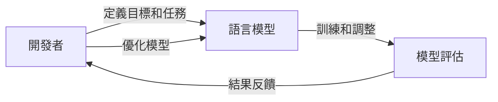

# Harness Engineering：有時候語言模型不是不夠聰明，只是沒有人類好好引導

## 是什麼
Harness Engineering是一種方法論，它旨在結合人工智慧（AI）和人類專業知識，來改進語言模型的表現。它認為，語言模型的不足不是因為模型本身不夠聰明，而是因為缺乏有效的引導和調整。通過Harness Engineering，開發者可以利用人類的專業知識和經驗，來優化語言模型的訓練和應用。

## 為什麼重要
Harness Engineering 解決了傳統語言模型訓練中的一個重要問題：缺乏有效的引導。傳統的語言模型訓練方法往往依靠大量的數據和計算資源，但是卻忽略了人類的專業知識和經驗。Harness Engineering 提供了一種新的方法，讓開發者可以利用人類的專業知識和經驗，來優化語言模型的訓練和應用。

## 怎麼運作
Harness Engineering 的運作流程如下：

開發者首先定義語言模型的目標和任務，然後訓練和調整模型。模型的表現會被評估，結果會反饋給開發者。開發者會根據結果優化模型，直到達到預期的效果。

## 跟其他方法的差別
與其他語言模型訓練方法相比，Harness Engineering 的主要差別在於它強調人類的專業知識和經驗的重要性。其他方法往往依靠大量的數據和計算資源，但是忽略了人類的專業知識和經驗。Harness Engineering 提供了一種新的方法，讓開發者可以利用人類的專業知識和經驗，來優化語言模型的訓練和應用。

## 小結
Harness Engineering 適合於需要優化語言模型的開發者和研究人員。它提供了一種新的方法，讓開發者可以利用人類的專業知識和經驗，來優化語言模型的訓練和應用。通過Harness Engineering，開發者可以創建更好的語言模型，提高其應用效果。

## 參考資料
* [Harness Engineering：有時候語言模型不是不夠聰明，只是沒有人類好好引導](https://www.youtube.com/watch?v=R6fZR_9kmIw)