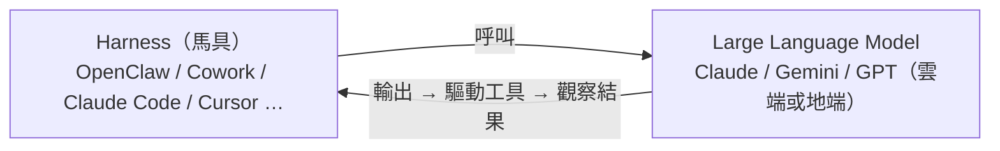
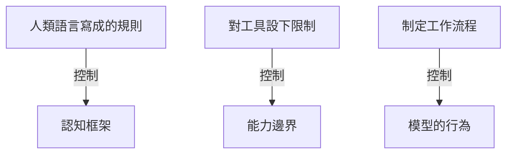

各大公司不斷推出新的語言模型，而這個故事的主軸是：**有時候語言模型不是不夠聰明，它只是缺乏人類的引導。**

幾天前 Google 推出了開源的 Gemma 第四代。除了號稱很強之外，它還有一些特別小的版本，例如 **Gemma 4 2B**——名字裡的 2B 代表它只有 2 個 Billion 的參數，是個特別小的模型，號稱可以讓你在 Edge 端也跑得動語言模型。既然是開源的，就能下載下來跑在自己的機器上。（型號裡那個 E 是 effective 的意思，至於為什麼前面要加 E，就留給大家自己研究。）

這麼小的模型，能不能拿來驅動一個 AI Agent？以下就是用它做的一個小實驗。

## 實驗：讓小模型去修一個 bug

任務很單純：資料夾裡有一個 `parser.py`，裡面有個函式 `extract_email`，作用是從一段文字中把 email 擷取出來，但當初寫的時候有 bug，不是所有 email 都能被正確擷取。請修改 `parser.py`，最終讓 `verify.py` 的測試完全通過。`parser.py` 與 `verify.py` 這兩個檔案就放在跟語言模型同一個資料夾裡。

語言模型本身不會自然而然變成 Agent，你得給它工具。這裡用一個很簡單的約定當作工具介面：

- 模型如果輸出「三個點 → `bash` → 一行指令 → 三個點」，環境就把中間那行當成 bash 指令自動執行。
- 模型如果輸出「三個點 → `python` → 一段程式碼 → 三個點」，環境就把那段程式碼存成檔案並執行。

於是模型手邊就有了三種能力：下 bash 指令、寫 python、執行 python。

### 第一次嘗試：模型幻想出一個檔案

Gemma 4 2B 讀完指令後的第一個反應竟是：「沒有 `parser.py` 啊。」

為什麼？因為對模型來說，它的 context 裡只有「`parser.py` 這個檔名」這串文字，**並沒有檔案的內容**。就算檔案真的躺在同一個資料夾下，模型也不會自動知道——它只看得到你輸入的文字。

於是它自作主張：根據題目提到的 `extract_email`，**幻想**出一個 `parser.py` 應該長什麼樣子，寫了一段自己想像的程式碼，再幻想自己 verify 過了，然後宣稱完成。

這當然不是我們要的結果。但仔細想想，這並不是一個笨模型——它完全知道 `parser.py` 裡該有什麼、也有能力寫出正確的 email parser，它只是**沒想到那個檔案就在它腳邊**。模型的想法常常跟人不一樣：你直覺認為出題時就該附上程式碼，但模型沒料到相關檔案就在腳下。

### 第二次嘗試：只多加幾行工作原則

接著只多打了幾行字（不到 80 個字），而且**不是針對這個特定任務的提示，而是一些通用原則**：

1. 你身處一個 Linux 環境（促使它更傾向去執行 bash 指令）。
2. 做任何事之前，先看看你所在的資料夾裡有什麼，把相關檔案列出來。
3. 要修改一個檔案前，不要直接改，先打開它看看內容再改。
4. 定義什麼叫「完成」：要達成一些既定的標準，才算完成。

同一個 Gemma 4 2B，只加了這段原則，再做一模一樣的任務，行為就完全不同了：

- 先 `ls`，列出目錄，發現有 `parser.py` 與 `verify.py`；
- 再 `cat parser.py`，把內容印出來、讀進 context；
- 有了真正的內容後，它重寫 `parser.py`（與其說修改，更像整份覆寫掉），用 `cat` 覆蓋原檔；
- 最後執行 `verify.py` 自我驗證，看到 verify success，結束任務。

這就接近人類要的結果了。**同一個模型，多加幾行指令，能力可能天差地遠。**

## AI Agent 的兩個成分：語言模型 + Harness

那麼當你的 AI Agent 表現不如人意時，該改它哪裡？先回想 AI Agent 是由什麼組成的。

```mermaid
graph LR
    H["Harness（馬具）<br/>OpenClaw / Cowork / Claude Code / Cursor …"]
    L["Large Language Model<br/>Claude / Gemini / GPT（雲端或地端）"]
    H -->|呼叫| L
    L -->|輸出 → 驅動工具 → 觀察結果| H
```

一個 AI Agent 裡有兩部分：一是它呼叫的 **Large Language Model**（可以是 Claude、Gemini、GPT，可以在雲端也可以在地端）；二是一大堆支撐它去呼叫模型、操控工具的程式框架。過去這「其他的東西」沒有好名字，現在有了共同的名字——**Harness**（馬具）。很多人把它意譯為「駕馭」，於是打造 Harness 這件事就叫 **Harness Engineering（駕馭工程）**。

象徵的意涵是：AI 是一匹力量強大的馬，要駕馭它，你需要馬鞍、韁繩，這些就是 Harness。

要強化一個 AI Agent，因此有兩條路：

- **改語言模型**：自己訓練一個更好的模型，或微調一個現成模型。
- **改 Harness**：打造更好的馬具。這正是現在很熱門的主題——Anthropic 去年 11 月談過讓 agent 長時間運作的有效 Harness，OpenAI 在 2 月發過一篇〈Harness 工程〉，Anthropic 又在 3 月發過〈Harness Design〉。

### Harness 是個很實際的詞：訂閱與心跳機制

這個詞真的非常常被使用。例如 Claude 的訂閱用戶，曾收到通知說訂閱帳號不再支援第三方 Harness（例如 OpenClaw）。

背後的原因跟付費模式有關。使用大型語言模型有兩種付費方式：一種是「用多少付多少」，直接呼叫 API、按 Token 計費；另一種是訂閱制的「吃到飽」，付月費後理論上該月可無限次呼叫。過去服務商覺得月費制沒問題——你是個人類，能輸入多少指令呢？但有了 OpenClaw 這類工具，它具備**心跳機制**，可以每隔幾分鐘就自動送一次指令，服務商就吃不消了。於是 Claude 決定：以後 OpenClaw 這類 Harness 不能再接 Claude 的模型。

換句話說，OpenClaw 現在被普遍認知為「一種 Harness」。

## 三個詞的演進：Prompt → Context → Harness Engineering

當人們想認真對待一件事，就在某個詞後面加上 engineering。於是先有 Prompt Engineering，後有 Context Engineering，現在有 Harness Engineering。三者高度重疊，但強調的核心價值不同：

- **Prompt Engineering**：語言模型在做文字接龍，輸入不同、接出來就不同。過去模型較弱，同一問題換個問法答案可能天差地遠，於是有人研究怎麼下 prompt，最知名的咒語就是「think step by step」。但這類咒語會越來越沒用——你怎麼能叫它思考它才思考？現在的模型就算你不強調，它也會認真思考，有沒有咒語的差異越來越小。
- **Context Engineering**：咒語失效後，人們發現模型答錯往往不是能力不行，而是**接龍時沒有足夠的資訊**。於是有一個系統去尋找合適的 context、組成 prompt 再丟給模型——可以說它是一種更有系統、自動化的 Prompt Engineering。
- **Harness Engineering**：強調的是「**把任務完成**」。今天模型解一個任務不再是一問一答，而是多輪互動——人類給任務、模型產生輸出、輸出驅動工具、模型看到工具結果，循環直到得出答案。怎麼駕馭這個多輪互動的過程，就是 Harness Engineering 的任務。

Context Engineering 與 Harness Engineering 的邊界其實有點模糊（好的 context 本來就是完成任務的前提），但 Harness Engineering 想傳達的價值就是：**讓模型能在多輪對話中把事情做好。**

## 駕馭模型的三種手段

人類可以用哪些手段來駕馭模型？以下舉三個例子（這不是 Harness Engineering 的全部，它仍是發展中的技術，各處對它有許多不同定義）：

```mermaid
graph TD
    A["人類語言寫成的規則"] -->|控制| B["認知框架"]
    C["對工具設下限制"] -->|控制| D["能力邊界"]
    E["制定工作流程"] -->|控制| F["模型的行為"]
```

### 一、控制認知框架：agents.md 與 Natural Language Harness

你可以用人類語言寫成的規則去影響模型的認知框架，這些規則就像人類社會的法律。做法是讓模型在做任何事之前，都先把這些規則放進 prompt——因為規則永遠在 prompt 裡，行為就比較可被預期。

這類規則往往有固定檔名，例如 **`agents.md`**，可視為「給語言模型的 README」。模型怎麼知道要先讀它？這是 Harness 裡**寫死的規則**：模型啟動時就強制先讀某些檔案、確保它們出現在 prompt 裡，再做其他事。

當然，用自然語言寫的規則不能 100% 控制行為——模型要不要 follow 其實看它自己，就像法律擺在那、也不是每個人都 100% 遵守。所以有人認為沒有強制力就不算 Harness，但也有人把這種方式取名為 **Natural Language Harness**：它是一種 Harness，只是用自然語言當馬具。

以 OpenClaw 為例，它背後呼叫 Claude，每次對話開始前都會先打開 workspace 裡的 `agents.md`，確保內容進入 prompt 才做其他事。模型因此知道：`soul.md` 是它的靈魂、memory 存在 `memory.md`、要找更久以前的記憶就去 memory 資料夾用工具搜尋——這些行為都來自 `agents.md`。

### 從一個 Harness 搬到另一個 Harness

前面提到 Claude 不再讓 OpenClaw 呼叫它，怎麼辦？其實很簡單。Anthropic 有自己的官方 Harness：**Cowork**（以及 **Claude Code** 也算一種 Harness），它們預設每次啟動會先讀 workspace 下的 **`CLAUDE.md`**，把內容放進 prompt 再做其他事。

也就是說，**Cowork 的 `CLAUDE.md` ≈ OpenClaw 的 `agents.md`**。要把一個跑在 OpenClaw 上的 Agent 搬到 Cowork，你唯一要做的就是：給 Cowork 同一個 workspace，把 `agents.md` 直接改名成 `CLAUDE.md`，Agent 就「復活」了，行為跟原來差不多。（復活後它甚至會主動說「`CLAUDE.md` 內容怪怪的，有些工具我其實沒有，要不要幫你改一下」，改完就跟原本差不多。）

只要你了解這些 Harness 背後的運作原理，搬家其實是舉手之勞。

### agents.md 真的有用嗎？開始有系統化研究

過去大家憑直覺隨便寫 `agents.md`，到底有沒有用沒什麼系統研究。今年起出現一些 paper 開始科學化地研究它對 Agent 行為的影響：

- **今年 1 月的一篇 paper**：到 GitHub 上找大量含 `agents.md` 的 repo，比較「有 / 沒有 `agents.md`」的執行情況。結果顯示 `agents.md` 能**加快運作、用更少 token、在更短時間內完成任務**。看平均差異不大，但對那些本來要花超長時間的 edge case，幫助較明顯。不過這篇**只量了速度，沒量做得對不對**（因為那些 repo 該做什麼、正確答案是什麼都不知道）。
- **今年 2 月的另一篇 paper**：直接量「有沒有 `agents.md` 對各種操作**正確率**的影響」。它比較三種情況：沒有 `agents.md`、LLM 自己寫的 `agents.md`、人類寫的 `agents.md`。發現是：**人類寫的 `agents.md` 並非總是有用**，在一些較強的模型上看起來沒發揮作用；而 **LLM 自己寫的更慘**，多數時候比人類差，甚至比完全沒有還差。

這告訴我們：人類目前可能還沒真的很會操控語言模型，寫的 `agents.md` 不見得總是有效。這只是個起步，未來會有更系統化的研究（例如在 `agents.md` 裡多一句、少一句話對行為的影響）。

另外 OpenAI 在 blog 裡也提醒：**`agents.md` 不能太長**。他們曾試著把模型該知道、該遵守的一切都塞進去，做成一本「百科全書 / 六法全書」，結果表現非常差——光那本大書就佔掉模型大部分 context，根本沒空間做其他事。他們強調 `agents.md` 應該像**一張地圖**：主要告訴模型「想知道某件事該去哪裡找」，而不是把所有內容都塞進去。

### 二、控制能力邊界：限制工具

你可以透過限制模型能用的工具，來控制 Agent 能做的事。即使把 `agents.md` 改名成 `CLAUDE.md` 後，OpenClaw 與 Cowork 因為背後 Harness 不同、可用工具不同，行為與能力還是會有蠻大差異：

- **OpenClaw 跑在你的電腦上**，想看什麼就看什麼，可以任意修改你電腦上的檔案——也因此它本身有操控 browser 的工具，理論上可以上傳影片、當個 YouTuber。
- **Cowork 是雲端沙盒**，不跑在你電腦上。它要看到你電腦的東西，得由你選擇**掛載**資料夾，而且**每次掛載都需要人類同意**。

這裡有個關鍵：那個「是否同意掛載」的確認視窗，**不是語言模型要問的，而是背後 Harness 寫死的一行程式**。就算你叫 Agent 以後別再問你同意，它也照樣會跳出視窗——因為那不是模型能決定的。所以 Cowork 相對安全很多：模型能看的都是你同意過的。

但安全與方便是一個 **trade-off**：安全性高、便利性就低；便利性高、安全性就低。

### 三、控制行為：制定工作流程

第三種手段，是制定工作流程，讓模型嚴格遵守，藉此控制它的行為。（在上面的圖中，藍色代表手段、紅色代表要控制的對象。）

## 小結

回到開頭的實驗：同一個 Gemma 4 2B，加上幾行通用的工作原則就從「幻想檔案」變成「會探索、會驗證」。這正是 Harness Engineering 想說的事——**一個 AI Agent = 語言模型 + Harness**，當它表現不如預期時，除了換更強或微調過的模型，打造更好的 Harness（用認知框架、能力邊界、工作流程去駕馭它）往往同樣關鍵。

模型不是不夠聰明，它有時只是缺乏人類好好的引導。

## 參考資料

* [Harness Engineering：有時候語言模型不是不夠聰明，只是沒有人類好好引導（YouTube）](https://www.youtube.com/watch?v=R6fZR_9kmIw)
