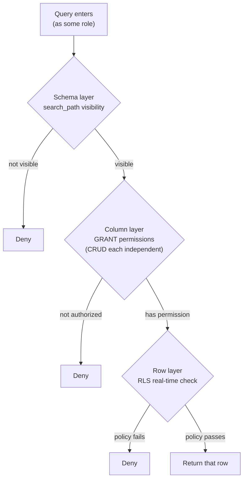

## TL;DR

Many people call PostgreSQL the "most secure database," and the original video goes a step further and argues it is the "most secure system" — because it can do all-around access control at the row, column, and even cell level. But before we get to those features, there's a more worthwhile question to raise first: the entire software industry takes "database security" far less seriously than it should.

## Two-Thirds of Security Incidents Are About Reading and Writing

There's a saying: "The essence of system security is the security of reading and writing data." Looking back at historical security incidents, they roughly fall into three categories:

- **Data breaches (READ)**: Confidential data gets read out. There are more of these than you can count — half the dark web is propped up by them.
- **Irreversible destruction (WRITE)**: Other programs can be restarted when they break, but the database is the single point of truth in the system. Once the real data is altered or deleted, it's often unrecoverable. The classic case is the **2017 GitLab incident** — after a string of "textbook-level absurd" operations, an engineer deleted **300GB of user data** hosted in their own PostgreSQL, with no recovery possible.
- **System takedown (DOWN)**: Things like ransomware and DDoS attacks that render the system unusable. This one leans more toward being a network-architecture problem, though.

Two of the three categories (READ / WRITE) are directly about reading and writing data. In other words, the core of security is really "**who can read and write which data**" — that is, authentication and access control.

## The Industry's Odd Pattern: The Closer to the Database, the Looser the Defense

The paradox is that the industry's defensive strength follows a distribution of "tightest at the outermost layer, and increasingly loose as you approach the database."

- **Frontend**: Browsers have evolved from a sieve of vulnerabilities in the early days to today's near-impenetrable sandbox.
- **Frontend–backend communication**: SSL / TLS has gone through several generations of upgrades, and HTTPS has gone from niche to default.
- **Backend**: Carelessly exposing IPs and SSH ports is now rare.

But the moment the data reaches its final destination — the database — the picture suddenly gets sloppy. Many large projects have the backend connect to the database directly with the **admin account**, with almost no protection at all; and even when there is some, it's just encrypting the admin username and password and stuffing them into the backend code.

There are reasons for doing this: fewer accounts, easier management; application-layer code is also simpler, plus there are performance benefits. But more often than not, it's a gambler's mindset — the feeling that "the backend is deployed inside our own house, the house is already well-defended, and the backend connecting to the database is like going from the living room to the bedroom, so why make it so complicated?" The result: anyone who breaks into this house (whether intentionally or not) immediately gets their hands on the nuclear bomb that can destroy the world in an instant — the admin account.

> "Security has a scope; everything outside that scope must be treated as insecure."

After identity data leaves the browser sandbox, travels over HTTPS encryption, and reaches the backend, why does the backend still need to verify identity again? Because every time you step outside "the former's security framework," the data is untrustworthy as far as "the latter" is concerned. By the same logic, when the database receives an external request — **no matter who the source is** — as long as it's outside the database's own security scope, it should redo a complete identity and permission check. This is fundamentally no different from how any other application layer operates.

## PostgreSQL's Core: role

PostgreSQL's security mechanism is designed around the "**role**." Whether you're building a sandbox environment or doing identity and permission checks, you first have to create the roles yourself — you can, for now, simply think of a role as "the database's login account."

Next, let's use a very simple query to understand the whole mechanism. Suppose I want to find the user IDs and names for users in the group named `bilibili` — this SQL goes through a whole series of permission checks from start to finish:

## Layer 1: The Schema Sandbox

Unlike MySQL, PostgreSQL has a full **database → schema → table** three-level structure. A transaction can't run across databases, but within the same database it can query tables across different schemas.

There's no isolation between schemas, so beyond helping perfectionists organize and categorize — achieving a namespace effect — what other value does it have? It does have some. PostgreSQL has a **`search_path`** mechanism that lets you set different schema visibility for different roles. For example, you can restrict each department's systems to see only their own schema, while a system that operates across departments can see several departments' schemas.

If the architecture isn't complex, you can define just three schemas like this:

- **public**: Tables users can query directly.
- **private**: Stores confidential data like accounts, passwords, and sessions. A user role without permission on this schema can't see these tables, and can only access them indirectly through fixed triggers or functions — thereby controlling the user's exposure to confidential data.
- **worker**: Tables completely unrelated to users, such as background asynchronous services that run automatically — visible only to the service itself, avoiding manual queries or side effects.

Treating schemas as a sandbox that isolates tables of different security levels is PostgreSQL's first layer of defense.

## Layer 2: Column-Level GRANT

Once you get into a table, PostgreSQL isn't like Excel where "opening it shows you everything." **By default, a role has no read or write permission on any column** — you have to grant it manually with `GRANT`, and CRUD is granted separately.

Take the earlier query: to read a user's ID and name, you have to `GRANT` the `SELECT` permission on the ID and name columns to the role issuing the query.

Many people get lazy and grant all CRUD permissions on all tables and all columns to every newly created role at once. That's certainly a lot more convenient — but if your goal is to save time, you might as well just `DROP TABLE` and get it over with in one step.

The advice at the column layer is: **give the user only the "minimum necessary" permissions.**

- Membership level: users can only view it, not change it, so grant only `SELECT`.
- Synchronized third-party parameters (such as an openID or unionID obtained via binding): although they belong to the user, if they're only used when the backend calls an API and the user themselves never uses them, then you shouldn't even grant `SELECT`.

> A security report noted that **96% of a company's permission settings are "empty"** — permissions get created, but nobody uses them and nobody turns them off. The report warns that as AI starts taking over operations, these "readily available" permissions will become an enormous security risk.

So for authorization, the recommendation is to adopt an "**add-only, never subtract**" principle, to avoid inadvertently leaking surplus permissions.

## Layer 3: Row Level Security (RLS)

Past the column layer comes the last and most powerful part of PostgreSQL — **Row Level Security**. It has a unique, Turing-complete dynamic rule system.

The `search_path` and `GRANT` discussed earlier are both **static** matching: you run a command to grant a role some permission on a schema / column, and that permission exists permanently until it's explicitly revoked.

RLS, on the other hand, is **fully dynamic**: at the start of every transaction, it validates the role's CRUD permissions in real time.

Take an orders table as an example. Suppose you want "buyers can only read and write their own orders, and sellers can only read but not write":

1. When the user issues a request, inject the user ID into this transaction via PostgreSQL's runtime parameters (`pg_settings`).
2. When the query reaches RLS validation, retrieve this user ID and compare it directly against the current row's buyer and seller IDs.
3. In the `UPDATE` policy, check whether the user is the buyer; in the `SELECT` policy, check whether the user is the buyer or the seller.

The key point: **even if you're the highest-privileged user, as long as your ID doesn't match this row's buyer or seller, you can't read this row's data.**

The reason RLS is the last and strongest lock in the whole mechanism is that the validation logic it runs can be any form of SQL or function, and inside that function you can call any data in real time to assist the validation. For example, to add "allow this store's employees to read all of the store's orders":

- During RLS validation, first query the employee data table to get the store ID the user currently works at;
- Then go back to the orders table and check whether the order's store ID matches.

Because this is **real-time** validation, the instant an employee leaves and the employee data table is updated, they immediately lose read access to all orders — **zero latency**.

If you don't care about performance and have no TPS bottleneck, you can even stuff all your "system-layer + business-layer" validation logic into that one function and do it as real-time RLS validation.

## Closing: Flexible, but Don't Go to Extremes

By this point you should have a feel for the shape of PostgreSQL's layered security system: it's not only 360-degree full coverage, it's also extremely flexible in use.

If you want to take it to the absolute extreme, you can go back to the topmost layer of role and **create a separate, independent role for every single user**, so you can configure permissions individually per person at the schema level. That said, it's not recommended — because many database performance nodes are tied to the role, such as connections: connections in the connection pool can only be reused among the same role, so the more roles you have, the more the benefits of connection reuse get shattered.

There's always a tradeoff between security and performance. What PostgreSQL gives you isn't a single switch but a whole set of tools that go from the outside in and can be fine or coarse: role determines identity, schema fences off the sandbox, GRANT locks down to the column, and RLS guards every single row. Use these four layers well, and the database itself becomes your last — and most reliable — line of defense.

## References

- [PostgreSQL is the most secure system in the world (original video)](https://www.youtube.com/watch?v=S_Z8Y0vMSzo)
- [PostgreSQL Official Security Documentation](https://www.postgresql.org/docs/current/security.html)
- [PostgreSQL Row Security Policies (official RLS documentation)](https://www.postgresql.org/docs/current/ddl-rowsecurity.html)
