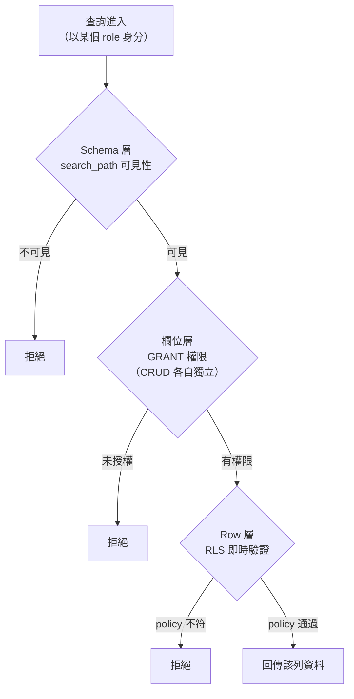

## TL;DR

很多人說 PostgreSQL 是「最安全的資料庫」，原影片更進一步主張它是「最安全的系統」——因為它能做到 row、column 甚至 cell 等級的全方位權限控制。但在談那些功能之前，有個更值得先講的問題：整個軟體業對「資料庫安全」的重視程度，遠遠不夠。

## 資安事件，三分之二都跟讀寫有關

有句話說：「系統安全的本質，就是資料讀寫的安全。」回顧歷史上的資安事件，大致可以分成三類：

- **機密外洩（READ）**：機密資料被讀走。這類事件多到數不清，半個暗網都靠它撐起來。
- **不可逆的破壞（WRITE）**：別的程式壞了還能重啟，但資料庫是系統裡的單一真實來源（single point of truth），一旦真實資料被改掉或刪掉，往往救不回來。經典案例是 **2017 年的 GitLab 事件**——在一連串「教科書等級荒謬」的操作之後，工程師把自家 PostgreSQL 裡託管的 **300GB 使用者資料**刪掉，無法復原。
- **系統被打掛（DOWN）**：像勒索軟體、DDoS 攻擊讓系統無法使用。不過這類比較偏網路架構問題。

三類裡有兩類（READ / WRITE）都跟資料讀寫直接相關。換句話說，資安的核心其實是「**誰能讀寫哪些資料**」，也就是認證（authentication）與權限控制（access control）。

## 業界的怪現象：離資料庫越近，防守越鬆

弔詭的是，業界的防護強度呈現「最外層守最嚴、越靠近資料庫越鬆散」的分布。

- **前端**：瀏覽器從早年的漏洞篩子，演進到今天近乎銅牆鐵壁的 sandbox。
- **前後端通訊**：SSL / TLS 歷經數代升級，HTTPS 從小眾變成預設。
- **後端**：隨意暴露 IP 與 SSH port 的做法，現在已經很少見。

可是資料一旦流到最終目的地——資料庫，畫面突然就潦草了。很多大型專案，後端直接用 **admin 帳號**裸連資料庫，幾乎沒有防護；就算有，也只是把 admin 帳號密碼加密後塞進後端程式碼。

這樣做不是沒理由：帳號少、好管理；應用層程式碼也更簡單，還有效能上的好處。但更多時候，這是一種僥倖心態——覺得「後端部署在自己家裡，家裡都防好了，後端連資料庫就像客廳通臥室，沒必要搞那麼複雜吧」。結果就是：任何人闖進這間房子（無論有意還是無意），就直接拿到了那顆能瞬間毀滅世界的核彈——admin 帳號。

> 「安全是有範圍的；超出範圍的一切，都要當成不安全。」

身分資料離開瀏覽器 sandbox、經過 HTTPS 加密抵達後端後，後端為什麼還要再驗一次身分？因為每一次跨出「前者的安全框架」，對「後者」而言資料就是不可信的。同理，資料庫收到外部請求時，**不管來源是誰**，只要在資料庫的安全範圍之外，就應該重新做一次完整的身分與權限驗證。這跟其他應用層的做法本質上沒有差別。

## PostgreSQL 的核心：role

PostgreSQL 的安全機制是圍繞「**role**」設計的。無論是建立 sandbox 環境，還是做身分與權限驗證，都得自己先把 role 建出來——你可以先簡單把它理解成「資料庫的登入帳號」。

接下來，用一個很單純的查詢來理解整套機制。假設我想查出群組名稱為 `bilibili` 的使用者 ID 與 name，這條 SQL 從頭到尾會經過一連串的權限檢查：

## 第一層：Schema 沙箱

跟 MySQL 不同，PostgreSQL 有完整的 **database → schema → table** 三層結構。一個交易（transaction）不能跨 database 執行，但在同一個 database 內可以跨 schema 查詢不同的 table。

schema 之間沒有隔離，那它除了幫完美主義者整理分類、達成 namespace 效果之外，還有什麼價值？有。PostgreSQL 有個 **`search_path`** 機制，可以為不同的 role 設定不同的 schema 可見度。例如限制各部門系統只看得到自己的 schema，而跨部門運行的系統能看到好幾個部門的 schema。

如果架構不複雜，可以像這樣只定義三個 schema：

- **public**：使用者可以直接查詢的 table。
- **private**：存放帳號、密碼、session 等機密資料。沒有這個 schema 權限的 user role 查不到這些 table，只能透過固定的 trigger 或 function 間接存取——藉此控制使用者對機密資料的接觸面。
- **worker**：與使用者完全無關的 table，例如背景自動跑的非同步服務，只對服務本身可見，避免被人工查詢或 side effect 影響。

把 schema 當成隔離不同安全等級 table 的 sandbox，這就是 PostgreSQL 的第一層防禦。

## 第二層：欄位級 GRANT

進到 table，PostgreSQL 並不像 Excel 那樣「打開就全看得到」。**預設情況下，一個 role 對任何欄位都沒有讀寫權限**，必須手動用 `GRANT` 授權，而且 CRUD 是分開授權的。

以前面的查詢為例，要查 user 的 ID 與 name，就得對發起查詢的 role `GRANT` ID、name 這兩個欄位的 `SELECT` 權限。

很多人偷懶，直接一次把所有 table、所有欄位的全部 CRUD 權限授給所有新建的 role。這當然方便很多——但如果你的目標是省時間，那不如直接 `DROP TABLE`，一步到位。

欄位層的建議是：**只給使用者「最小必要」的權限**。

- 會員等級：使用者只能看不能改，就只給 `SELECT`。
- 同步來的第三方參數（如綁定取得的 openID、unionID 等）：雖然屬於該使用者，但若只有後端呼叫 API 時才會用到、使用者本人用不到，那就連 `SELECT` 都不該給。

> 一份資安報告指出，企業 **96% 的權限設定是「空的」**——權限被建立了，卻沒人用、也沒人關掉。報告警告：當 AI 開始接手操作，這些「隨手可用」的權限會變成巨大的資安風險。

因此在授權上，建議採取「**只加不減**」的原則，避免不經意洩漏出多餘的權限。

## 第三層：Row Level Security（RLS）

過了欄位層，來到最後、也是 PostgreSQL 最強的部分——**Row Level Security**。它擁有獨特、Turing-complete 的動態規則系統。

前面講的 `search_path` 與 `GRANT` 都是**靜態**匹配：執行一條指令把某 role 對某 schema / 欄位的權限授出去，這個權限就永久存在，直到被明確 revoke。

RLS 則是**完全動態**的：每次交易開始時，即時驗證 role 的 CRUD 權限。

以一張訂單 table 為例，假設要讓「買家只能讀寫自己的訂單、賣家只能讀不能寫」：

1. 使用者發出請求時，透過 PostgreSQL 的 runtime 參數（`pg_settings`）把 user ID 注入這次交易。
2. 查詢進到 RLS 驗證時，取出這個 user ID，直接和當前 row 的買家、賣家 ID 比對。
3. 在 `UPDATE` policy 裡檢查使用者是不是買家；在 `SELECT` policy 裡檢查使用者是買家或賣家。

關鍵是：**即使你是權限最高的使用者，只要 ID 不符合這一列的買家或賣家，就讀不到這一列的資料**。

RLS 之所以是整套機制裡最後也最強的一把鎖，是因為它執行的驗證邏輯可以是任意形式的 SQL 或 function，而 function 內部還能即時呼叫任何資料來輔助驗證。例如要新增「允許該店家員工讀取店內所有訂單」：

- RLS 驗證時，先去查員工資料 table，取得使用者目前任職的店家 ID；
- 再回到訂單 table，比對該訂單的店家 ID 是否相符。

因為這是**即時**驗證，所以員工離職、員工資料 table 一被更新的那一瞬間，他就立刻失去所有訂單的讀取權限——**零延遲**。

如果你不在意效能、沒有 TPS 瓶頸，甚至可以把所有「系統層 + 業務層」的驗證邏輯，全部塞進那一支 function 裡做即時 RLS 驗證。

## 結尾：靈活，但別走極端

到這裡應該能體會 PostgreSQL 分層安全體系的樣貌：不只是 360 度全覆蓋，使用上也非常有彈性。

如果想做到最極致，可以回到最上層的 role，**為每一個使用者各建一個獨立 role**，這樣就能從 schema 層級為每個人單獨配權限。不過這並不建議——因為很多資料庫的效能節點是綁在 role 上的，例如連線：connection pool 裡的連線只能在相同 role 之間重用，role 一多，連線復用的效益就會被打碎。

安全與效能之間始終要權衡。PostgreSQL 給的不是一個開關，而是一整套由外而內、可細可粗的工具：role 決定身分、schema 圈出沙箱、GRANT 鎖到欄位、RLS 守住每一列。把這四層用好，資料庫本身就會是你最後、也最可靠的一道防線。

## 參考資料

- [PostgreSQL is the most secure system in the world（原始影片）](https://www.youtube.com/watch?v=S_Z8Y0vMSzo)
- [PostgreSQL 官方安全性文件](https://www.postgresql.org/docs/current/security.html)
- [PostgreSQL Row Security Policies（RLS 官方文件）](https://www.postgresql.org/docs/current/ddl-rowsecurity.html)
