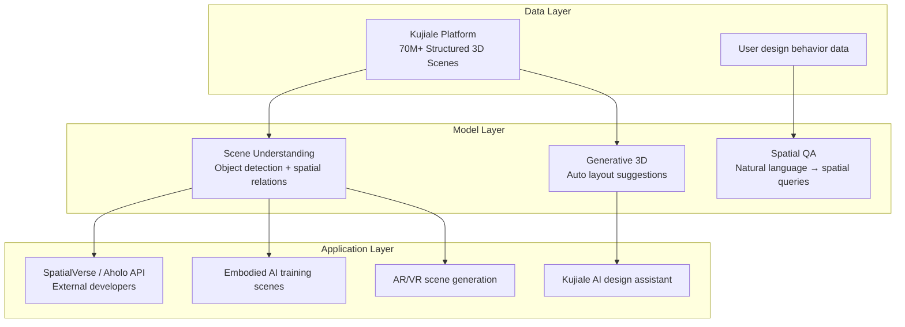

In April 2026, Manycore Tech (群核科技) listed on the Hong Kong Stock Exchange, becoming the first company among Hangzhou's so-called "Six Dragons"—a cohort of AI-adjacent startups including DeepSeek, Unitree Robotics, and others—to complete an IPO. The stock opened 171.65% above its issue price, putting the market cap above HK$30 billion. For engineers unfamiliar with the company, its core product is Kujiale (酷家乐), a cloud-based 3D interior design platform popular with Chinese home renovation designers. The narrative it brought to the IPO, however, was "spatial intelligence." This piece unpacks the technology behind that claim.

## TL;DR

Spatial intelligence refers to a cluster of AI capabilities centered on perceiving, modeling, and reasoning about three-dimensional physical space. Manycore's angle: after 15 years of operating Kujiale, it holds a database of over 70 million structured indoor 3D scenes—data that is increasingly scarce and valuable for training embodied AI systems.

## What Spatial Intelligence Actually Means

The term lacks a single authoritative definition, but in practice it covers four capability areas:

**Scene understanding**: Identifying objects in a space and modeling their geometric and semantic relationships—not just "there is a sofa" but "the sofa is 1.2 meters to the left of the coffee table, facing the TV."

**Spatial reasoning**: Answering questions that require 3D logic—"if I move the chair here, is the walkway still passable for a wheelchair?"

**3D reconstruction**: Rebuilding a complete 3D scene model from photos, LiDAR scans, or floor plans.

**Navigation and path planning**: Computing viable paths through known or unknown 3D environments, the core requirement for mobile robots and AR overlays.

Manycore's SpatialVerse platform focuses primarily on scene understanding and 3D reconstruction, and packages that capability as an API for external developers through its Aholo platform (released in 2025).

## Why 3D Scene Data Is Suddenly Valuable

The gap here is well understood by anyone following embodied AI research. GPT-4-class LLMs were trained primarily on text and 2D images. They can reason about physical space in a linguistic sense but have no genuine spatial intuition—no grounding in the geometry of the actual world.

Embodied AI systems (robots, autonomous agents that must navigate and manipulate physical objects) need something different: training data that encodes how real spaces are structured, how objects relate to each other in three dimensions, and how physical interactions play out. That training data is scarce.

Manycore claims more than 70 million structured indoor 3D scene models, each built by a real designer using Kujiale's tools, with accurate object positions, dimensions, and material properties. Unlike photogrammetry captures or synthetic procedural scenes, these are designs that correspond to real renovation projects. That combination of volume and semantic richness is the moat.

## How the Platform Works

The Aholo platform (2025) is the external-facing interface, providing APIs and SDKs so that third-party developers—robotics teams, AR application builders, architectural software vendors—can integrate Manycore's spatial scene data without building their own scene understanding stack.

## Founder Background

Huang Xiaohuang (黃曉煌), founder and chairman, holds a BS from Zhejiang University's Chu Kochen Honors College and an MS in computer science from the University of Illinois Urbana-Champaign. From 2010 to 2011 he worked as a software engineer at NVIDIA, primarily on CUDA development. He founded Manycore in 2011 with the initial goal of moving desktop CAD tools (AutoCAD-class design software) to the browser and cloud.

That SaaS trajectory—which initially looked like a standard cloud software story—turned out to be building a data flywheel: more designers on the platform means more 3D scene data; better scene data enables better AI-assisted design features; better features attract more designers.

## Financials and Valuation Logic

Manycore reported revenue of RMB 755 million in 2024 and RMB 399 million in H1 2025 (9.4% year-over-year growth). The company is not yet profitable, but its losses have been narrowing. The IPO valuation reflects less the current SaaS metrics and more the bet that structured spatial scene data will become a critical training asset for the next AI generation—a thesis that shifted the market's framing from "unprofitable design software" to "scarce AI infrastructure."

## Difference from Traditional Computer Vision AI

Classic computer vision AI (YOLO for object detection, ResNet for image classification) operates on 2D pixel-level questions: "Does this image contain a cat?" Spatial intelligence operates at a higher semantic level: "Can a wheelchair pass from the entrance to the kitchen in this layout?" "Does the placement of this furniture create an ergonomically viable work-from-home setup?" "Which objects would fall if I remove this load-bearing element?"

Answering these questions requires 3D geometry reconstruction, semantic understanding of object relationships, and physical common-sense reasoning—none of which emerge naturally from 2D image training data alone.

## Summary

Manycore's IPO illustrates a pattern worth watching across the AI era: vertical SaaS companies that accumulated large, structured, domain-specific datasets over years of real-world use may have harder-to-replicate moats than pure AI startups built from scratch. Whether spatial intelligence becomes a major AI battleground depends on how quickly humanoid robotics and immersive AR hardware mature. If they do, the companies holding high-quality 3D scene data will have a meaningful head start.

## References

- [Manycore Tech - Wikipedia](https://en.wikipedia.org/wiki/Manycore_Tech)
- [Manycore Tech Hong Kong IPO Filing Coverage (Sina Finance)](https://finance.sina.cn/stock/ggyj/2026-02-25/detail-inhnyups8136107.d.html)
- [Manycore Tech Market Cap Coverage (Sina Tech)](https://finance.sina.cn/tech/2026-04-18/detail-inhuwssn0407536.d.html)
- [Interview with Huang Xiaohuang on Spatial Intelligence and AI (YouTube)](https://www.youtube.com/watch?v=8pncy425QqQ)
