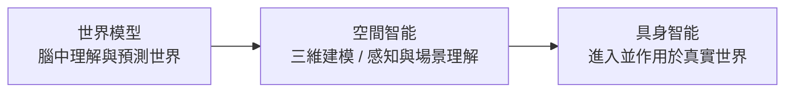

群核科技登陸港股，成為「杭州六小龍」中首家完成 IPO 的企業。在《矽谷 101》（主持人陳茜）的專訪中，創始人黃曉煌把公司的未來押在了一個關鍵詞上——空間智能（Spatial Intelligence）。他的判斷很直接：「對我來說，沒有空間智能是不可能去實現 AGI 的。」

這篇文章不談股價，而是順著這場專訪，把三件事講清楚：空間智能到底是什麼、它和世界模型／具身智能的關係，以及群核為什麼選擇一條「緊貼物理世界」的技術與商業路線。

## 空間智能是什麼

「空間智能」這個概念其實和世界模型一樣，起源於認知科學。1983 年，教育心理學家霍華德·加德納（Howard Gardner）在《心智框架》（Frames of Mind）中提出多元智能理論，把空間智能列為人類核心智能之一。在他的框架裡，空間智能不是簡單的「方向感」，而是理解物理世界、建立空間認知、進行抽象視覺思維的底層能力。

在電腦科學領域，它的技術起點來自電腦視覺對三維空間的感知與理解：

- **2009 年 ImageNet** 奠定了 AI 視覺辨識的基礎，但這一階段仍停留在二維層面，機器並不真正理解物體所處的空間關係。
- **SLAM（同步定位與地圖構建）** 讓機器在移動中同時完成定位與建圖，AI 不只知道「看到了什麼」，還開始知道「它在哪裡」。
- **NeRF、生成式模型與世界模型** 出現後，研究重點從「重建世界」走向「理解與預測世界」。

從模組上看，空間智能主要包含**感知、表徵、推理、預測、行動**五大部分。黃曉煌用一個很生活化的例子說明：你走進一個房間環顧一圈，大腦會快速對這個空間形成概念——某個物體離你多遠、你能不能穿過去、每塊物體的相對位置與是什麼東西。接下來無論你要往哪走、要不要去拿水杯，腦海裡都能馬上反應。這個「快速空間重建＋推理」的過程，就是空間智能。

## 它和世界模型、具身智能的關係

這三個詞常被混用，但黃曉煌用「開門」這個動作把它們區分得很清楚：

- **世界模型**像「大腦」：在腦中構建一張關於世界如何運行的內部地圖，理解因果、預測接下來會發生什麼，甚至先在內部「跑一遍」。對應到開門，就是你在走過去的過程中，有人在旁邊走動或有物體在移動，你要預測並避開。
- **空間智能**負責把世界模型的抽象理解落到三維物理空間：知道「這裡是門，門上一定有把手，要開就得去操作把手」。它連接視覺感知、物理規律與動作決策。
- **具身智能**是當 AI 真正有了「身體」（機器人、自動駕駛）：把感知、推理、規劃、控制整合成閉環，控制肢體走到門前、轉動把手、推門進去。

換句話說，這是一條清晰的路徑：從在「腦海中」理解世界，到在空間中三維建模，再到真正進入並作用於這個世界。要實現具身智能，**無法跳過空間智能**。

## 業界的兩條路線

目前空間智能主要有兩條技術路線。

### 空間生成

不少研究者認為，要實現空間智能得先「生成空間」——AI 必須先擁有一個夠真實、可互動的 3D 世界，才能在裡面反覆試錯、學習物理規律，再遷移到現實。代表者是李飛飛的 World Labs，也包括群核科技、Meshy AI 等。

空間的生成方式又分三種，並且越來越常被融合使用：

- **重建式**：用雷射掃描儀、深度相機、無人機攝影測量等從現實採集資料，再還原三維結構。上限取決於輸入資料的品質。
- **推斷式**：當輸入不足（例如只有一張照片或稀疏視角）時，AI 根據已有線索推理補全「看不見」的部分。隨著大模型能力提升，這是當前最活躍的方向之一。
- **生成式**：借助擴散模型、大型重建模型（LRM）等，讓 AI 直接從海量資料中學習三維世界規律，使用者輸入文字、圖片或草圖就能生成 3D 資產與場景。

以 World Labs 為例，它常被歸為生成式，但目標不只是生成 3D 內容，而是構建具備空間理解能力的世界模型——同時要處理深度估計、視角一致性、幾何約束，讓生成結果不只是「看起來像」，在空間結構上也成立。

### 潛空間預測

另一派研究者認為，很多需要空間智能的場景並不一定要做精緻的 3D 重建，直接在潛空間（latent space）裡壓縮感知、輸出動作就夠了。這類**潛空間預測模型**把複雜環境資訊壓進高維潛空間，學的是環境動態的統計規律、物體間的距離方位與因果聯繫，有點像人類的「直覺」，能實現更低延遲、更強泛化的即時互動。代表是 Yann LeCun 的 JEPA 架構，以及 DeepMind 的 Dreamer 系列。

它的代價是缺乏幾何層面的可解釋性：預測出錯時很難從空間角度定位問題，也難以人工干預除錯；在需要精細空間記憶的長時空任務上，也更容易丟失關鍵細節。因此從商業落地角度，空間生成路線目前是更穩健的選擇。

## 空間如何被表示：群核的 Mesh＋3D 高斯混合

無論用哪種方式生成，空間最終都要被「表示」出來。主流路徑各有取捨，黃曉煌也分享了群核一路試過來的經驗：

| 表徵方式 | 特點 | 群核的評價 |
|---|---|---|
| 點雲（Point cloud） | 離散點集 | 試過，但能表徵的資訊太少 |
| Mesh | 加上面與邊的連接，編輯方便 | 是三維世界的抽象，不是真實的，欠缺太多資訊 |
| NeRF | 隱式神經表示，畫質好 | 速度太慢，且每個場景要單獨訓練 |
| 3D 高斯潑濺 | 顯式高斯橢球＋神經渲染，快又清晰 | 視覺效果完美，但互動方面有缺陷 |

群核最早用 Mesh，後來發現它表達物理世界資訊不足，於是轉用 3D 高斯，但 3D 高斯在互動上有缺陷。所以現在實際採用的是 **Mesh ＋ 3D 高斯混合** 的方式來表達物理世界——一個負責互動與結構，一個負責視覺真實。

## World Labs 與群核：兩種商業路線

兩家公司路線差異明顯。

**World Labs** 偏學術＋前沿驅動，從基礎模型出發建立空間智能的基座，目標是打造通用的 3D 世界。其商業化速度很快：透過核心模型 Marble 與全新的 World API，已和波士頓動力、Figure 等機器人廠商合作，提供具備物理一致性的訓練環境；和 Autodesk 合作把空間生成能力植入建築與工業設計流程；並把 World API 接入 NVIDIA 的 Isaa
