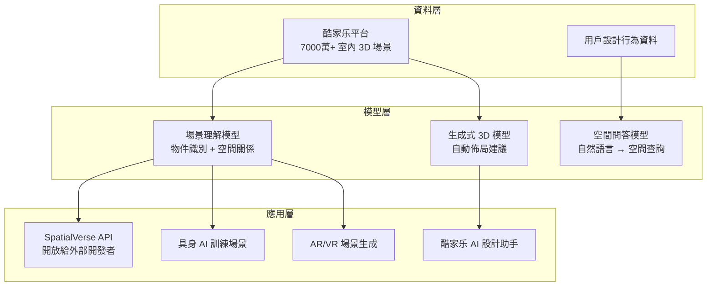

2026 年 4 月，群核科技（Manycore Tech）在香港交易所上市，成為「杭州六小龍」（深度求索、宇樹科技、群核科技等一批杭州 AI 新創）中首個完成 IPO 的公司，首日漲幅 171.65%，市值超過 300 億港元。對不熟悉這家公司的工程師來說，它的核心產品是酷家乐（Kujiale）——一個讓裝潢設計師用雲端 3D 工具做室內設計的平台。但 IPO 時它講的故事是「空間智能」（Spatial Intelligence）。這篇拆解空間智能的技術含義，以及為什麼一家做家裝設計軟體的公司，在 AI 時代能說這個故事。

## TL;DR

空間智能是讓 AI 系統能夠理解、建模、推理三維物理空間的能力集合。群核科技的入場角度：它有 15 年積累的結構化室內 3D 空間資料，這些資料是訓練具身 AI（Embodied AI）、機器人導航、AR/VR 應用的稀缺資源。

## 是什麼

「空間智能」這個詞在學術和產業界都沒有統一定義，但通常涵蓋以下幾個能力維度：

**場景理解（Scene Understanding）**：從 2D 影像或 3D 點雲中識別物件、理解空間關係（這個沙發在那張桌子左邊，距離約 1.2 米）。

**空間推理（Spatial Reasoning）**：在三維空間中進行邏輯推理，例如「如果把椅子移到這裡，走道還夠寬嗎？」

**3D 重建（3D Reconstruction）**：從相機影像、LiDAR 掃描或平面圖重建完整 3D 場景模型。

**導航與路徑規劃（Navigation & Path Planning）**：在已知或未知 3D 環境中規劃可行路徑（機器人、自動駕駛、AR 疊加）。

群核科技的 SpatialVerse 平台主要聚焦在前兩個維度，並把建構好的結構化 3D 場景提供給外部開發者用 API 取用。

## 為什麼重要

理解為什麼「空間資料」在 2024-2026 年突然變得重要，需要理解具身 AI 的技術瓶頸。

GPT-4 等 LLM 的訓練資料主要是文字和 2D 圖片。這讓它們在語言理解、程式碼生成、圖片描述上表現出色，但它們對「三維世界的物理關係」幾乎是盲的。你可以問 GPT-4「桌子上放了杯子，杯子旁邊是書，如果我傾斜桌子會怎樣？」它可以推理，但它沒有真正的空間直覺。

具身 AI（能夠在物理空間移動和操作物件的 AI Agent，例如機器人）需要的不只是語言理解，而是三維空間的感知與推理。這需要大量的 3D 空間訓練資料——而這類資料非常稀缺。

群核科技聲稱擁有超過 7,000 萬個結構化室內空間的 3D 模型資料庫，這些是由裝潢設計師用酷家乐實際建立的真實場景，有準確的物件位置、尺寸、材質資訊。這是訓練具身 AI 的高品質資料來源。

## 怎麼運作

群核科技的空間智能技術路線可以分成三層：

**Aholo 平台**（2025 年發布）是群核科技把這些能力對外開放的介面，提供 API 和 SDK，讓外部開發者可以把結構化 3D 空間資料用在自己的應用裡。

## 跟傳統 AI 的差別

傳統電腦視覺 AI（例如目標偵測 YOLO、圖像分類 ResNet）處理的是 2D 影像的像素層面問題：「這張圖裡有沒有貓？」

空間智能追求的是更高層次的理解：「這個房間的沙發擺放是否符合人體工學？如果要從門口走到廚房，最短路徑是什麼？這個空間能不能讓輪椅通行？」

這需要從 2D 影像重建 3D 幾何、理解物件之間的語意關係（不只是「這是沙發」，而是「這是功能性休息區域」），以及具備物理常識推理。

## 創始人背景與技術路線選擇

黃曉煌本科就讀浙江大學竺可楨學院，之後在伊利諾大學香檳分校拿到電腦科學碩士，2010-2011 年在 NVIDIA 做過 CUDA 開發工程師。2011 年創立群核科技，最初切入點是把 AutoCAD 等桌面設計工具搬到雲端，降低裝潢設計師的使用門檻。

這個看起來很傳統的 SaaS 路線，十五年後成了空間 AI 的資料飛輪：設計師越用，3D 場景資料越多；資料越多，AI 輔助設計越精準；設計越精準，設計師越願意用。

## 財務狀況與 IPO

根據招股說明書，群核科技 2024 年營收 7.55 億人民幣，2025 年上半年 3.99 億人民幣（年增 9.4%）。公司尚未盈利，但虧損幅度在縮窄。市場給出高估值的邏輯是「空間智能 + 具身 AI 資料」的稀缺性故事。

2026 年 4 月上市，首日漲幅 171.65%，讓原本質疑其 SaaS 盈利能力的投資人，改用 AI 基礎設施公司的框架來定價。

## 小結

群核科技的案例說明一個在 AI 時代值得觀察的模式：傳統垂直 SaaS 公司若在特定領域積累了大量結構化資料，在 LLM 和具身 AI 需要特定領域訓練資料的當下，可能具備比純 AI 新創更難複製的護城河。空間智能這個技術方向是否能成為 AI 下一個主戰場，取決於機器人和 AR/VR 的硬體普及速度。

## 參考資料

- [Manycore Tech - Wikipedia](https://en.wikipedia.org/wiki/Manycore_Tech)
- [群核科技向港交所遞交上市申請（新浪財經）](https://finance.sina.cn/stock/ggyj/2026-02-25/detail-inhnyups8136107.d.html)
- [群核十五年：一家被 AI 重新定價的公司上市了（東方財富）](https://caifuhao.eastmoney.com/news/20260417142411976026810)
- [杭州六小龍破冰，群核科技撐起 300 多億市值（新浪科技）](https://finance.sina.cn/tech/2026-04-18/detail-inhuwssn0407536.d.html)
- [「杭州六小龍」首個 IPO、空間智能與 AI 的下一步：對話群核科技創始人黃曉煌（YouTube）](https://www.youtube.com/watch?v=8pncy425QqQ)
