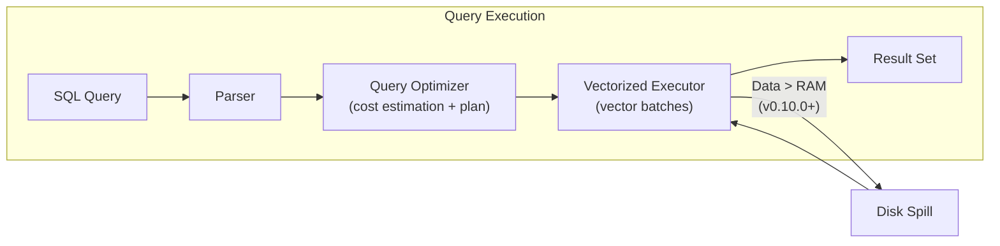

DuckDB has been improving faster than most people expected. Engineers who benchmarked it a year ago and set it aside are discovering it has moved considerably since then. This piece covers the actual benchmark numbers, what it compares to, and why the performance ceiling question remains genuinely open.

## TL;DR

DuckDB improved group-by performance by more than 12x and join performance by 4x over three years. It can now run TPC-H at SF3,000 (3 TB) in 31 minutes on a 12-core laptop. Its design constraint is single-node embedded analytics—but within that constraint, what is achievable keeps expanding with each release.

## What DuckDB Is

DuckDB is an embedded OLAP database with a philosophy similar to SQLite, but aimed at the opposite workload. SQLite is optimized for OLTP (individual record reads and writes); DuckDB is optimized for OLAP (aggregations and scans across large datasets).

"Embedded" means it runs inside your process with no separate server to start:

```python
import duckdb

con = duckdb.connect()
result = con.execute("""
    SELECT category, SUM(amount) as total
    FROM 'sales.parquet'
    GROUP BY category
    ORDER BY total DESC
""").fetchdf()
```

Zero startup time, no network latency, no connection pool to manage. For data scientists replacing pandas, the migration cost is essentially zero.

## Why It Matters

Before DuckDB, the local options for analyzing gigabyte-scale data were pandas (limited by RAM, crashes above it) or a local PostgreSQL instance (OLTP architecture, slow for analytical queries). DuckDB fills the gap of "data too large for pandas but not worth spinning up a Spark cluster."

Key features engineers appreciate:

- Reads Parquet, CSV, and JSON directly without ETL
- Zero-copy interop with pandas and Polars via Apache Arrow
- Full SQL: window functions, LATERAL joins, UNNEST, list comprehensions
- Out-of-core query execution since version 0.10.0 (data can exceed RAM)

## How It Achieves This Performance

Three architectural decisions drive DuckDB's numbers:

**Vectorized execution**: processes thousands of values at once (a "vector") rather than row by row, enabling SIMD CPU instructions (SSE, AVX) and minimizing per-row overhead.

**Columnar storage**: reads only the columns needed for a query, dramatically reducing I/O.

**Adaptive query execution**: the query plan adjusts dynamically during execution based on observed data distributions, rather than committing to a static plan upfront.



## Performance Numbers (2022–2025)

DuckDB publishes its own [benchmarks over time](https://duckdb.org/2024/06/26/benchmarks-over-time) page. Key findings:

- **Group by / aggregation**: more than 12x improvement over three years—this is the most critical OLAP operation
- **Join**: 4x improvement over three years
- **Memory management** (v0.10.0): out-of-core execution unlocked—queries can now handle datasets significantly larger than available RAM
- **2023–2024 window**: even after what looked like a plateau, the period shows approximately 20% continued improvement on a zoom-in view

At large TPC-H scale (12-core Framework laptop):

| Scale Factor | Data Size | Runtime |
|--|--|--|
| SF3,000 | ~3 TB | ~31 minutes |
| SF10,000 | ~10 TB | ~4.2 hours |

These are single-machine laptop numbers, not server clusters.

## Comparison with Alternatives

| | DuckDB | ClickHouse | Polars | pandas |
|--|--------|-----------|-------|--------|
| Deployment | Embedded | Server | Embedded | Embedded |
| Target scale | GB–TB (single node) | TB–PB (cluster) | GB–TB (single node) | GB (RAM-limited) |
| SQL support | Full | Full | Partial (LazyFrame) | None (DataFrame API) |
| Out-of-core | Yes (v0.10.0+) | Yes | Yes | No |
| Distributed | No | Yes | No | No |
| OLAP speed | 3–10x faster than pandas | ~4x faster than DuckDB at large scale | Close to DuckDB | Baseline |

**Exasol's benchmark** (2025): on 10/30/100 GB TPC-H-style tests, Exasol ran more than 4x faster than DuckDB on a high-spec single machine. However, Exasol is a dedicated server requiring separate deployment—a different use case than an in-process library.

**ClickHouse** is clearly superior for distributed, high-concurrency scenarios at TB-to-PB scale. DuckDB's edge is the embedded, zero-setup experience and the aggressive performance it delivers without any operational overhead.

## When to Use and When Not To

**Good fit**:
- Data science and ML preprocessing (replacing pandas for >1 GB files)
- Local analysis of Parquet / CSV data
- Embedded analytics inside Python, Go, or Node.js applications
- Data quality checks in CI pipelines
- ETL transformations across multiple file formats

**Poor fit**:
- High-concurrency OLTP (many short reads and writes)
- Multi-node distributed real-time analytics
- Multi-user environments requiring fine-grained access control

## Summary

DuckDB's performance ceiling is hard to pin down because the target keeps moving. The design scope is clear: single-node, single-user, embedded OLAP. What is achievable within that scope in the 2025 version is substantially more than what was imaginable in the 2022 version. For most analytics engineers, the question has shifted from "is it fast enough?" to "should I design my workflow around it?"—which is a more interesting problem to have.

## References

- [DuckDB Benchmarks Over Time (official)](https://duckdb.org/2024/06/26/benchmarks-over-time)
- [DuckDB Performance Benchmarks Guide](https://duckdb.org/docs/current/guides/performance/benchmarks)
- [DuckDB vs. Polars vs. Pandas Benchmark - Codecentric](https://www.codecentric.de/en/knowledge-hub/blog/duckdb-vs-dataframe-libraries)
- [Exasol vs DuckDB Benchmark](https://www.exasol.com/blog/exasol-vs-duckdb/)
- [DuckDB OLAP TPC-DS First Impressions - Bicortex](http://bicortex.com/duckdb-the-little-olap-database-that-could-tpc-ds-benchmark-results-and-first-impressions/)
- [We still don't know the performance ceiling of the world's best database (YouTube)](https://www.youtube.com/watch?v=wmGikV_393Y)
