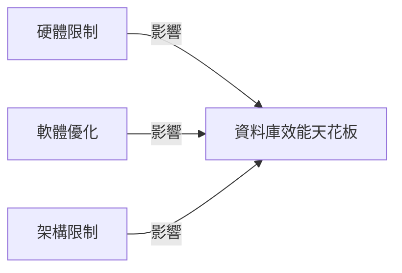

你還不知道世界上最好的資料庫的效能天花板是什麼
=====================================================

## TL;DR
探討資料庫效能的極限。

## 是什麼
資料庫的效能天花板是指資料庫在理論上能達到的最大效能極限。這個極限是由資料庫的架構、硬體限制、以及軟體優化等因素決定。

## 為什麼重要
了解資料庫的效能天花板有助於我們優化資料庫的設計和配置，進而提高整體系統的效能和可擴展性。

## 怎麼運作
資料庫的效能天花板受到多個因素的影響，包括：

* 硬體限制：CPU、記憶體、儲存設備等硬體資源的限制。
* 軟體優化：資料庫的索引、查詢優化、緩存等技術的優化。
* 架構限制：資料庫的架構設計，包括分佈式資料庫、分區等。

## 跟效能測試的差別
效能測試是評估資料庫在特定工作負載下的效能表現，而效能天花板是探討資料庫在理論上能達到的最大效能極限。兩者都是評估資料庫效能的方法，但重點不同。

## 小結
了解資料庫的效能天花板有助於我們優化資料庫的設計和配置，進而提高整體系統的效能和可擴展性。因此，對於需要高效能資料庫的應用，了解效能天花板是非常重要的。

## 參考資料
* [資料庫效能優化](https://www.google.com/search?q=database+performance+tuning)
* [資料庫架構設計](https://www.google.com/search?q=database+architecture+design)
- [We still don't know the performance ceiling of the world's best database](https://www.youtube.com/watch?v=wmGikV_393Y)