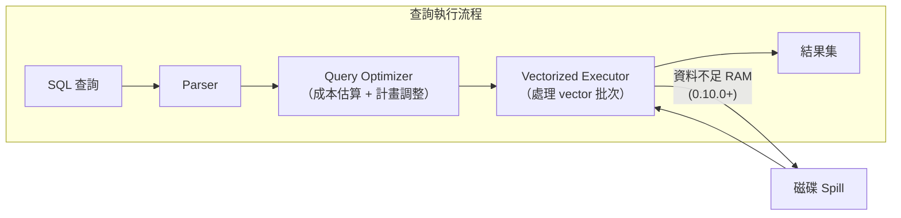

DuckDB 最近幾年的效能提升速度，讓不少原本以為「夠用就好」的使用者不斷驚訝。這篇梳理 DuckDB 的實際 benchmark 資料、它跟其他 OLAP 系統的比較，以及為什麼在 2025 年，它的效能天花板仍然是個值得探索的問題。

## TL;DR

DuckDB 在三年內把核心 OLAP 操作提升了 4-12 倍。在 TPC-H SF3,000（3TB）測試上可以在 31 分鐘跑完，SF10,000（10TB）可以在 4 小時完成。它不是大數據叢集的替代品，而是「單機分析資料庫」這個類別的最佳代表——而這個類別能做到多少，社群還在持續發現中。

## 是什麼

DuckDB 是一個嵌入式（embedded）OLAP 資料庫，設計哲學類似 SQLite，但方向完全相反：SQLite 針對 OLTP（單筆記錄讀寫），DuckDB 針對 OLAP（大量資料的聚合分析）。

「嵌入式」的意思是它跑在你的 process 裡面，不需要啟動獨立的 server：

```python
import duckdb

con = duckdb.connect()
result = con.execute("""
    SELECT category, SUM(amount) as total
    FROM 'sales.parquet'
    GROUP BY category
    ORDER BY total DESC
""").fetchdf()
```

這讓它的啟動時間幾乎為零，且沒有網路延遲。對於資料科學家和分析師來說，替換 pandas 的一行程式碼成本極低。

## 為什麼重要

在 DuckDB 出現之前，分析 GB 級資料的本地選項是 pandas（受 RAM 限制，超過 RAM 就爆）或者設一個本地 PostgreSQL（OLTP 架構，分析查詢慢）。DuckDB 填補了「資料太大放不進 pandas，但又不值得開 Spark 叢集」這個很常見的需求。

它還有幾個讓工程師喜歡的特性：
- 直接讀 Parquet、CSV、JSON，不用 ETL
- 支援 Arrow 格式，跟 pandas / polars 無縫互轉
- SQL 方言接近標準，有 window function、LATERAL join、UNNEST 等
- 0.10.0 版本後支援 out-of-core 查詢（資料大過 RAM 也能跑）

## 怎麼運作

DuckDB 的效能來自幾個關鍵設計決策：

**Vectorized execution（向量化執行）**：一次處理一個 vector（數千個值）而不是一行一行處理，讓 CPU 可以充分利用 SIMD 指令（SSE、AVX）。

**Columnar storage（列式儲存）**：只讀分析需要的欄位，大幅減少 I/O。

**Adaptive query execution**：查詢計畫在執行期間根據實際資料分佈動態調整。


```mermaid
graph LR
  subgraph "查詢執行流程"
    SQL["SQL 查詢"]
    Parser["Parser"]
    Optimizer["Query Optimizer\n（成本估算 + 計畫調整）"]
    Exec["Vectorized Executor\n（處理 vector 批次）"]
    Out["結果集"]
  end

  SQL --> Parser --> Optimizer --> Exec --> Out
  Exec -->|"資料不足 RAM\n(0.10.0+)"| Spill["磁碟 Spill"]
  Spill --> Exec
```

## 效能演進：三年的資料

DuckDB 官方有自己的 [benchmarks over time](https://duckdb.org/2024/06/26/benchmarks-over-time) 頁面，追蹤每個 release 的效能變化。主要發現：

- **Group by / Aggregation**：三年內提升超過 12 倍，這是 OLAP 最核心的操作
- **Join**：三年內提升 4 倍
- **記憶體管理**（0.10.0）：原本不能超過 RAM 的限制被打破，現在可以處理遠大於 RAM 的資料集
- **2023-2024 年**：即使外觀上看起來已到瓶頸，細看仍有約 20% 的持續改進

在 TPC-H 大規模測試（Framework Laptop，12 核心）：
- SF3,000（3TB 資料）：31 分鐘完成
- SF10,000（10TB 資料）：4.2 小時完成（加入冷卻暫停後 30.8 分鐘 SF3,000）

這對單機筆電來說是相當驚人的數字。

## 跟常見替代方案比較

| | DuckDB | ClickHouse | Polars | pandas |
|--|--------|-----------|-------|-------|
| 部署方式 | 嵌入式 | Server | 嵌入式 | 嵌入式 |
| 適用規模 | GB-TB（單機） | TB-PB（叢集） | GB-TB（單機） | GB（受 RAM 限制） |
| SQL 支援 | 完整 | 完整 | 部分（LazyFrame） | 無（DataFrame API） |
| Out-of-core | 有（0.10.0+） | 有 | 有 | 無 |
| 分散式 | 無 | 有 | 無 | 無 |
| 速度（典型 OLAP） | 3-10x pandas | 比 DuckDB 快 4x（大規模） | 接近 DuckDB | 基準 |

**Exasol 的比較測試**（2025）顯示在 10/30/100GB 的 TPC-H 規模測試上，Exasol 比 DuckDB 快約 4 倍。但 Exasol 是需要單獨部署的 server，而 DuckDB 是嵌入在你的 process 裡面的——這是兩個不同的使用場景。

**ClickHouse** 在分散式場景、TB 到 PB 規模的線上分析（高並發查詢）上明顯優於 DuckDB。DuckDB 的邊界是單機離線分析。

## 適合與不適合的情境

**適合**：
- 資料科學 / ML 前處理（取代 pandas 處理 >1GB 的資料）
- 本地分析 Parquet / CSV 資料
- 嵌入在 Python / Go / Node.js 應用裡做內嵌分析
- CI pipeline 裡跑資料品質檢查
- ETL 中間層（從各種格式讀、轉、寫出）

**不適合**：
- 高並發 OLTP（大量短查詢、寫入）
- 需要多節點分散式的大規模實時分析
- 需要細緻存取控制的多用戶共享環境

## 小結

DuckDB 的效能天花板之所以是開放問題，是因為它的開發速度本身就是個移動目標——每次 release 都在打破上一個版本設定的記錄。它的設計邊界（單機、單用戶、嵌入式 OLAP）很清楚，但在這個邊界內，2025 年的 DuckDB 能做到的事情，比 2022 年的設計目標要多得多。對大多數分析工程師來說，它現在的問題不是「夠不夠快」，而是「我的工作流程是否應該圍繞它設計」。

## 參考資料

- [DuckDB Benchmarks Over Time（官方）](https://duckdb.org/2024/06/26/benchmarks-over-time)
- [DuckDB Performance Benchmarks Guide](https://duckdb.org/docs/current/guides/performance/benchmarks)
- [DuckDB vs. Polars vs. Pandas Benchmark - Codecentric](https://www.codecentric.de/en/knowledge-hub/blog/duckdb-vs-dataframe-libraries)
- [Exasol vs DuckDB Benchmark](https://www.exasol.com/blog/exasol-vs-duckdb/)
- [DuckDB OLAP TPC-DS 初印象 - Bicortex](http://bicortex.com/duckdb-the-little-olap-database-that-could-tpc-ds-benchmark-results-and-first-impressions/)
- [We still don't know the performance ceiling of the world's best database（YouTube）](https://www.youtube.com/watch?v=wmGikV_393Y)
