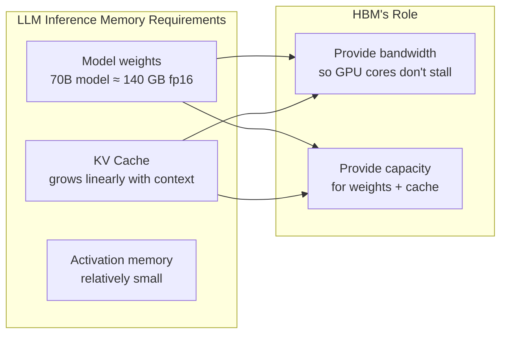

Since 2023, semiconductor markets have split. Consumer electronics chip demand has been soft; data center memory has been severely supply-constrained. The driver is AI—specifically, the fact that LLM inference is fundamentally memory-bandwidth-bound in a way that traditional computing workloads are not. This piece explains why.

## TL;DR

LLM inference requires loading model weights and maintaining KV caches in high-bandwidth memory at all times. This makes HBM (High Bandwidth Memory) the rate-limiting component of AI accelerators. The memory market grew 78% in 2024; HBM supply is committed through 2026, and the upcycle is expected to run at least through 2028.

## What HBM Is

HBM stacks multiple DRAM layers vertically using Through-Silicon Vias (TSV) and connects them to a GPU via a silicon interposer. The result is dramatically higher bandwidth and capacity than conventional GDDR memory, at the cost of significantly higher manufacturing complexity and price.

| | HBM3e | GDDR6 |
|--|-------|-------|
| Bandwidth (per GPU) | 1.2+ TB/s | 768 GB/s |
| Capacity (per GPU) | 80–192 GB | 24–48 GB |
| Power consumption | Lower (short trace lengths) | Higher |
| Cost | Significantly higher | Relatively lower |

NVIDIA's H100 ships with 80 GB HBM3; the H200 uses HBM3e with up to 141 GB. These specs exist because LLM workloads demand them.

## Why AI Creates Unusual Memory Requirements

LLM inference has a compute profile unlike gaming, scientific simulation, or traditional database queries.

**Model weights must fit in memory**: a 70B-parameter model at fp16 precision requires approximately 140 GB of memory. Those weights need to be accessible to GPU compute cores on every forward pass, which means they must live in HBM—swapping to CPU DRAM introduces latency that is prohibitive for real-time inference.

**Inference is memory-bandwidth-bound, not compute-bound**: during the decode phase (generating tokens one by one), the transformer attention mechanism repeatedly reads the KV cache and weight matrices. GPU compute cores spend most of their time waiting for data to move from HBM rather than performing calculations. Adding more compute cores does not help; adding more memory bandwidth does.

**KV caches grow with context length**: during generation, the model must cache key-value states for every token in the context. A 4K-context KV cache is a few gigabytes; a 128K-context cache is orders of magnitude larger. Longer context windows—which users increasingly want—directly translate to more HBM pressure.

## Market Structure

**Supply side**: HBM production requires complex wafer bonding and TSV processes. Only three manufacturers have commercial capacity:

- SK Hynix: approximately 62% market share, dominant supplier to NVIDIA (roughly 90% of NVIDIA's HBM comes from SK Hynix)
- Micron: approximately 21%
- Samsung: approximately 17% (yield challenges have kept it behind)

HBM capacity across all three suppliers is essentially committed through the end of 2026.

**Demand side**: data center DRAM consumption has risen from 32% of global DRAM demand five years ago to approximately 50% in 2025, and is projected to exceed 60% by 2030.

**Prices**: overall DRAM prices rose 30–60% in 2024-2025; NAND flash prices approximately doubled over the same period.

**Cycle duration**: Micron projected in December 2025 that tight market conditions would persist beyond calendar 2026. Analyst projections put the HBM total addressable market at approximately $35 billion in 2025, growing to approximately $100 billion by 2028—a 40% CAGR.

## Why This Cycle Differs from Previous Semiconductor Cycles

Previous cycles, like the 2021 COVID chip shortage, were demand shocks combined with supply-chain disruption. The current cycle has a different structure.

**Demand is structural**: hyperscaler AI infrastructure investment is multi-year capital expenditure, not consumer demand that snaps back after a shock. Google, Microsoft, Meta, and Amazon are signing multi-year procurement agreements for both GPUs and HBM.

**Supply is genuinely constrained**: HBM fab capacity takes two to three years to expand. Yield challenges at Samsung have kept effective supply growth slower than planned.

**Demand has stickiness**: even if AI investment moderates, deployed models still require HBM for inference. The installed base of AI accelerators creates persistent demand independent of new purchases.

## Implications for Engineers

**Cloud GPU costs remain elevated**: HBM is a significant cost component of H100 and A100 hardware. GPU rental prices will stay high as long as HBM is constrained.

**Model compression becomes economically rational**: quantization (INT8, INT4), weight pruning, and knowledge distillation are not just academic exercises—they directly reduce HBM requirements, which reduces infrastructure cost.

**Memory-efficient attention is a real engineering discipline**: FlashAttention, PagedAttention (vLLM), and related techniques aim to reduce KV cache HBM footprint, allowing the same hardware to serve more concurrent requests or handle longer contexts.

## Summary

The AI memory supercycle is not hype. It follows directly from a technical property of LLM inference: the decoder is memory-bandwidth-bound, model weights are large, and KV caches grow with context. HBM is not "faster RAM"—it is the enabler that makes large-scale LLM inference possible at all. How long this cycle lasts depends on the pace of AI infrastructure investment and the rate at which HBM production capacity can be expanded.

## References

- [The AI Memory Supercycle - Introl Blog](https://introl.com/blog/ai-memory-supercycle-hbm-2026)
- [Memory Semiconductor Supercycle Set to Run Through 2028 - Blocks and Files](https://www.blocksandfiles.com/ai-ml/2026/01/21/memory-semiconductor-supercycle-set-to-run-through-2028/4090501)
- [How AI Demand Is Driving a Multi-Year Memory Supercycle - Vik's Newsletter](https://www.viksnewsletter.com/p/how-ai-demand-is-driving-a-memory-supercycle)
- [IDC Global Memory Shortage Crisis 2026](https://www.idc.com/resource-center/blog/global-memory-shortage-crisis-market-analysis-and-the-potential-impact-on-the-smartphone-and-pc-markets-in-2026/)
- [AI Saves a Toilet Company and Ignites the Storage Chip Super Cycle (YouTube)](https://www.youtube.com/watch?v=tzEWYNQmnmc)
