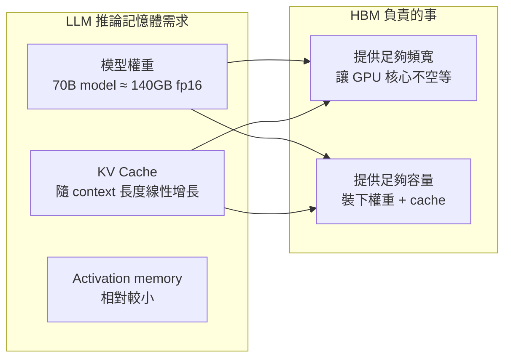

2023 年以來，半導體產業有個有趣的分裂：消費性電子的晶片需求疲軟，但資料中心的記憶體供不應求。驅動後者的核心原因是 AI——具體來說，是 LLM 訓練和推論對記憶體頻寬有遠超傳統工作負載的要求。這篇從技術角度解釋這個超級周期背後的原因。

## TL;DR

AI 模型的推論過程是記憶體頻寬瓶頸，而不是計算瓶頸。這讓 HBM（High Bandwidth Memory）成為 AI 加速器的核心元件，供給嚴重不足。記憶體市場 2024 年整體成長 78%，HBM 市場規模 2028 年預計超過 1,000 億美元。

## 是什麼

**HBM（High Bandwidth Memory）** 是一種把多層 DRAM 用 TSV（Through-Silicon Via）垂直堆疊、並用 interposer 緊密連接到 GPU 的記憶體技術。跟傳統 GDDR6 相比：

| | HBM3e | GDDR6 |
|--|-------|-------|
| 頻寬（單 GPU） | 1.2+ TB/s | 768 GB/s |
| 容量（單 GPU） | 80-192 GB | 24-48 GB |
| 功耗 | 低（因為距離短） | 較高 |
| 成本 | 極高 | 相對低 |

NVIDIA H100 配備 80GB HBM3，A100 配備 80GB HBM2e。容量和頻寬都遠超消費級 GPU。

## 為什麼 AI 對記憶體有特殊要求

LLM 推論的計算模式跟遊戲渲染或科學計算很不同：

**Model weights 要裝進記憶體**：一個 70B 參數的模型，fp16 精度下約需 140GB 記憶體。推論時這些權重要隨時可被 GPU 核心存取，意味著它必須在 HBM 裡，不能 swap 到 CPU RAM（延遲太高）。

**Memory bandwidth 是瓶頸，不是計算**：Transformer 的 attention mechanism 在推論時（decode 階段）是 memory-bound 的——GPU 的計算核心大部分時間在等記憶體把資料搬過來，而不是在做計算。提升計算核心數量沒有用，提升記憶體頻寬才有用。

**KV Cache 佔用大量記憶體**：LLM 在生成回應時需要快取之前所有 token 的 key-value 狀態。上下文越長，KV cache 越大。4K context 的 KV cache 已經幾 GB，128K context 更是急劇膨脹。

## 市場結構

**供給側**：HBM 的生產工藝複雜，只有三家廠商有量產能力：
- SK Hynix：約 62% 市場份額（NVIDIA 的主要供應商）
- Micron：約 21%
- Samsung：約 17%（良率問題讓它落後）

NVIDIA H100 / H200 的 HBM 約有 90% 來自 SK Hynix。HBM 容量在 2026 年以前基本上已全部預售完。

**需求側**：資料中心對 DRAM 的需求佔比，從五年前的 32% 上升到 2025 年的約 50%，預計 2030 年超過 60%。

**價格**：整體 DRAM 價格 2024-2025 年上漲 30-60%，NAND flash 價格漲幅接近 100%。

**周期長度**：Micron 和多個分析機構預估這個上行周期持續到至少 2028 年，HBM 市場從 2025 年的約 350 億美元成長到 2028 年的約 1,000 億美元，CAGR 約 40%。

## 跟傳統記憶體超級周期的差別

傳統半導體周期（例如 2021 年的 COVID 晶片荒）是由需求衝擊加上供應鏈中斷同時發生。這次不同：

**需求端**：AI 基礎設施投資是長期的資本支出，不是一次性的消費性電子需求。Google、Microsoft、Meta、Amazon 都在簽多年期的 GPU 和 HBM 採購合約。

**供給端**：HBM 產能的擴充需要 2-3 年建廠時間，且良率問題（特別是 Samsung）讓有效產能增速比預期慢。

**需求質地**：即使 AI 投資稍微降溫，已部署的模型仍然需要推論用的記憶體。需求有一定的剛性。

## 對開發者的意義

對應用層的工程師來說，這個超級周期帶來幾個實際影響：

**GPU 租用成本上升**：HBM 是 H100 / A100 成本的重要組成部分，GPU 雲端費用維持在高水位。

**模型壓縮技術的動機**：量化（INT8、INT4）、稀疏化、蒸餾等技術，核心動機之一就是減少推論時的 HBM 使用量，讓同樣的硬體跑更大的模型或更多的並發。

**Memory-efficient attention**：FlashAttention、PagedAttention（vLLM）等技術，目標都是減少 KV cache 的 HBM 佔用，讓有限的記憶體服務更多請求。

## 小結

AI 引爆的記憶體超級周期不是概念炒作，而是由 LLM 的技術特性（memory-bound 推論、巨大 KV cache）驅動的結構性需求。HBM 不只是「更快的 RAM」，而是 AI 加速器能夠存在的前提。這個周期的持續時間和幅度，取決於 AI 基礎設施投資的持續性和 HBM 產能的擴充速度。

## 參考資料

- [The AI Memory Supercycle - Introl Blog](https://introl.com/blog/ai-memory-supercycle-hbm-2026)
- [Memory Supercycle: How AI's HBM Hunger Is Squeezing DRAM - Medium](https://medium.com/@Elongated_musk/memory-supercycle-how-ais-hbm-hunger-is-squeezing-dram-and-what-to-own-79c316f89586)
- [Memory Semiconductor Supercycle Set to Run Through 2028 - Blocks and Files](https://www.blocksandfiles.com/ai-ml/2026/01/21/memory-semiconductor-supercycle-set-to-run-through-2028/4090501)
- [IDC Global Memory Shortage Crisis 2026](https://www.idc.com/resource-center/blog/global-memory-shortage-crisis-market-analysis-and-the-potential-impact-on-the-smartphone-and-pc-markets-in-2026/)
- [AI 救活了一家馬桶公司，也點燃了儲存晶片超級周期（YouTube）](https://www.youtube.com/watch?v=tzEWYNQmnmc)
