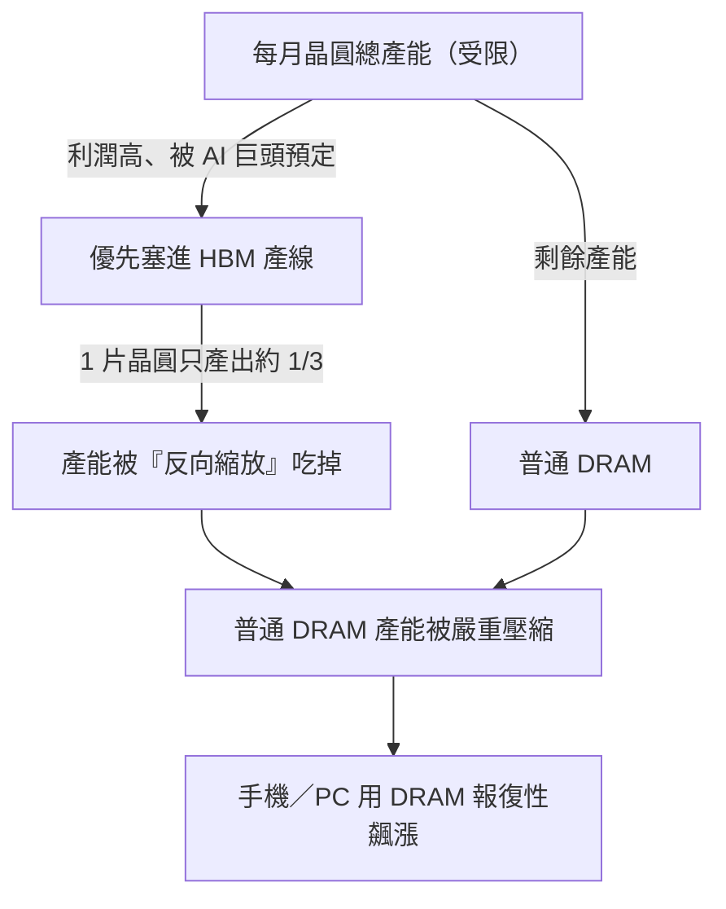

一家做高階智慧馬桶的日本公司 TOTO，最近幾個月股價飆升，理由跟馬桶賣得好不好沒有關係。它有一塊隱藏業務——高純度陶瓷靜電吸盤，是晶片製造時用來固定晶圓的關鍵耗材，精度做到頭髮絲的 1/80、純度業界第一。恰逢儲存晶片需求爆發、上游廠商瘋狂擴產，這塊耗材成了絕對剛需，訂單已經排到 2027 年，如今占了 TOTO 超過四成的營業利潤，高盛等投行也紛紛調升評級。

一家馬桶公司被當成 AI 概念股，就能看出現在記憶體這條賽道有多熱。這篇文章把這輪「超級周期」梳理一遍：它為什麼跟過去不一樣、記憶體在 AI 產業為什麼這麼關鍵、供給端為什麼擴不出產能，以及它會持續多久。

## 市場到底有多緊

先用幾個數字感受一下緊俏程度。

2026 年 1 月底，韓國雙雄三星與 SK 海力士同時公布上一年第四季財報，兩家合計營業利潤接近 40 兆韓元，約 278 億美元，相當於每天淨賺約 3 億美元。在這樣的利潤下，SK 海力士的年終獎金人均達到約 64 萬人民幣，刷新公司紀錄。

把這一切推上巔峰的核心產品是 **HBM（High Bandwidth Memory，高頻寬記憶體）**。一塊指甲蓋大小的 HBM 售價約 400–500 美元，比同等重量的黃金還貴，而全球能量產的只有三家：SK 海力士約六成，三星與美光各約兩成。

但 HBM 只是冰山一角。真正讓整個產業慌的是從高階到低階、從 DRAM 到 NAND 全線告急：

| 產品 | 起點價 | 近期價 | 漲幅 |
|------|--------|--------|------|
| DDR5 16GB（現貨均價） | 4.6 美元（2024 年底） | 28 美元（2025 年 12 月） | 約 +500% |
| DDR4（更舊世代） | 3.2 美元 | 62 美元以上 | 約 +1800% |
| 64GB 伺服器記憶體模組 | 255 美元 | 700 美元（半年內） | 約 +175% |

DRAM 的現貨價已經超過 2016–2018 年雲端那一輪的高點。SK 海力士 2026 年產能已全部賣光，三星更直接把 2026 年第一季的 NAND 供應價上調 100%、直接翻倍。SSD 那邊，給某個核心 GPU 廠商的報價甚至出現「一週內乘以二」的情況。

還有一個更具標誌性的訊號：SanDisk 在 2026 年初的 CES 上告訴華爾街，它正在跟客戶簽一種全新的長期供應協議（LTA，Long Term Agreement），這次客戶要付預付款、毀約不退。在儲存產業幾十年歷史上，過去的 LTA 從來沒有真正的執行效力——市場一進入下行周期，客戶說不認就不認，供應商拿他沒辦法。這次畫風變了，是強勢的供給方在制定規則。受訪的華爾街投資人 Rob 判斷：如果連 SanDisk 都做得到，SK 海力士、三星、美光沒有理由做不到，這輪超級周期很可能延續到 2027 年。

## 技術速覽：記憶體的「冷」與「熱」

要理解這輪周期，先把幾個基本概念分清楚。可以用「離計算越近就越熱、越偏純儲存就越冷」來劃分。

- **DRAM（動態隨機存取記憶體）**：最「熱」，離計算最近，就是電腦、手機的「執行記憶體」。速度極快但斷電就丟資料，屬於短期記憶。DRAM 家族其實品類很多，包括顯卡用的 GDDR、低功耗的 LPDDR 等，不同場景用不同產品。
- **HBM**：是 DRAM 的一種特殊進化形態。它把多層 DRAM 裸晶用 TSV（矽穿孔）垂直堆疊，再用先進封裝跟 GPU 貼在同一塊基板上，藉此大幅拉高頻寬。所有用於 AI 訓練的頂級晶片——無論是 NVIDIA 的 GPU 還是 Google 的 TPU——都離不開 HBM。它是這輪最耀眼、也最緊缺的產品。
- **NAND Flash**：較「冷」，是長期記憶，斷電不丟資料，固態硬碟（SSD）、手機儲存、隨身碟的核心。在 AI 時代，它正從後台「倉庫」變成前線「彈藥庫」。
- **HDD（機械硬碟）**：最「冷」，靠磁碟旋轉讀寫，慢但便宜、容量大，主要用在資料中心的冷儲存與歸檔。

AI 推理對儲存的需求越來越像一個分層倉儲系統：最急著用的「熱資料」放 HBM（擺在手邊），常用但沒那麼急的放 DRAM（辦公桌抽屜），備用的「冷資料」放 NAND／SSD（儲物櫃），長期積累、需多方共享的大量資料放後端的共享儲存或資料湖（總檔案館）。

## 產業鏈：定價權集中在中游三家

整條鏈很長，但定價權高度集中。

- **上游**：材料與矽晶圓（如日本 SUMCO）、製造設備（曝光機龍頭 ASML、涵蓋塗佈顯影／沉積／蝕刻／清洗的 Tokyo Electron）、晶片設計層的 EDA（Cadence、Synopsys），以及在 HBM 高速架構裡扮演關鍵角色的介面 IP 廠商 Rambus。
- **中游**：儲存晶片的設計與製造。DRAM 領域三星、SK 海力士、美光三家合計約占全球 95% 市占；NAND 領域再加上鎧俠（Kioxia）、Western Digital、SanDisk。這輪特別關鍵的環節是**先進封裝**——HBM 不是把 DRAM 造出來就結束，還要把多層裸晶堆疊、再用 2.5D 封裝跟 GPU 整合，CoWoS 一度成為 AI 晶片供應鏈最關鍵的瓶頸之一，而 CoWoS 產能主要由台積電提供。
- **下游**：資料中心與雲端業者（微軟、Google、Amazon、字節跳動等）、手機廠、PC 廠、車廠、遊戲主機、工業設備等。

真正的定價權集中在中游那三家。在當前供給遠小於需求的市場裡，它們決定做什麼產品、供給誰、賣什麼價，議價權前所未有地強。

## 為什麼這是個周期性行業

儲存歷來在「大漲」與「大崩」之間反覆橫跳，背後有兩層原因。

**物理學**：DRAM 靠儲存電荷保存資料，過去工程師靠把儲存單元做小、做多來提升密度，巔峰時期密度每十年能翻 100 倍。但 SemiAnalysis 的報告指出，過去十年 DRAM 密度總共才翻了大約 2 倍——縮放嚴重放緩。這意味著成本下降不再靠技術進步「自動」實現，而更取決於產能增減與供需博弈。

**經濟學**：儲存製造是資本密度最高的產業之一，建一座先進晶圓廠動輒數十到上百億美元、週期兩三年，且是「先建後賣」——廠商得自己猜未來兩三年的需求、提前布產能，猜對皆大歡喜、猜錯就是災難。這跟台積電「先接單後擴產」的邏輯完全不同。

於是就有了那個經典循環：需求爆發 → 供不應求 → 價格飆漲 → 利潤暴增 → 激進擴張 → 供過於求 → 價格崩盤 → 大洗牌。過去三十年平均每 3–4 年上演一次，從未例外。全球 DRAM 供應商從 1990 年代的 20 多家淘汰到今天只剩三巨頭，加上中國長鑫這樣的追趕者；德國奇夢達破產、日本爾必達退出，都是血淋淋的教訓。

歷史上四次大周期分別由 1993 年 Windows PC 黎明期、2010 年智慧型手機加雲端、2017–2018 年雲端資料中心升級、2020–2021 年疫情驅動。每一次的鐵律都是：**過去的超級周期從來沒撐超過兩年**，都是高利潤 → 瘋狂擴產 → 過剩 → 崩盤。也正因如此，從業者有一種根深蒂固的條件反射：漲得越猛、崩得越快。但這一次，越來越多證據暗示歷史模式可能要被打破。

## AI 為什麼狂吃記憶體：從訓練到推理到 Agent

受訪者用了一個很直觀的比喻：記憶體就像一塊黑板。以前計算簡單，「1+1=2」用普通黑板就夠。但 AI 時代計算強度極高、步驟極多，如果黑板太小，每寫一步就得擦掉，100 步要擦 100 次，浪費時間。所以現在需要一塊巨大無比的黑板，一口氣把計算寫完——這就是 AI 對記憶體的需求。

在生成式 AI 早期，算力和錢都砸在**訓練**上：儲存系統主要是向上千個 GPU 高效餵資料，並定期做模型檢查點（checkpoint）。如今**推理**正迅速成為主戰場，而推理對儲存的需求模式複雜得多——模型要從儲存層載入，活躍權重主要駐留在 HBM，部分狀態與快取留在 DRAM，當 KV cache 在高層記憶體裝不下時會被卸載到 SSD／NAND，而 RAG 查詢依賴的外部知識通常放在更後端的共享儲存或資料湖。

更大的變數是 **AI Agent** 的崛起。摩根士丹利在研報中指出，2026 年將是 AI 從實驗走向核心基礎設施的一年，而「**推理正在成為一種記憶體挑戰，而不只是計算挑戰**」。Agent 要運轉就得維護多層記憶：當前對話的短期工作記憶、跨會話的長期使用者歷史、預訓練知識庫、工具呼叫紀錄等——每一層都需要不同層級的儲存去支撐。

摩根士丹利做了一份分層測算，以一個類似 ChatGPT 規模的模型為基準（約 8 億週活躍使用者、尖峰每秒 30 萬請求、每次 2000 個輸入 token、只算純文字）：

- HBM 約 226 PB
- DRAM 約 4.6 EB
- NAND／SSD 約 47 EB
- 資料湖約 294 EB

如果全球有三個這種規模的模型（例如 ChatGPT＋Gemini＋Claude），**僅純文字推理**就會吃掉 2026 年全球 HBM 供給的 17%、DRAM 的 35%、NAND 的 92%——而這還沒把圖片、影片等多模態算進去。更敏感的是上下文長度：把輸入從每次 2000 token 提到 5000 token，其他條件不變，每個模型的 DRAM 需求就再增加約 2 EB、Rack SSD／NAND 再增加約 3 EB。

SemiAnalysis 把這叫做「記憶體帕金森定律」：HBM 容量每提升一次，開發者就立刻建更大的模型來把它填滿，以前用來壓縮模型的各種技巧一有新空間就會被放鬆，直到再次撞牆。這也是為什麼有人認為，儲存廠商可能集體低估了大語言模型 token 激增帶來的需求——這次的周期，有機會把一個周期性行業變成結構性成長行業。

## HBM 悖論：越擴產，DRAM 越缺

理解這輪超級周期還有一個核心密碼，是一個看似矛盾的現象：**HBM 大規模擴產，不但沒緩解 DRAM 短缺，反而讓它更嚴重了。**

SemiAnalysis 的追蹤數據顯示，三大廠分配給 HBM 的晶圓產能，從 2023 年底的每月約 12.3 萬片，漲到 2025 年底的每月約 33.1 萬片（兩年將近 3 倍），預計 2027 年底進一步擴到每月約 66.8 萬片（四年翻 5 倍）。擴得這麼猛，DRAM 為什麼還缺？

關鍵在於：做 HBM 要消耗大量普通 DRAM 的產能，而且效率極低。一片用於 HBM3E 12 層堆疊的晶圓，產出只有普通 DRAM 晶圓的約 1/3，到了 HBM4 這個比例可能進一步惡化到 1/4。也就是說，廠商每多生產 1 GB 的 HBM，市場就要失去生產 3–4 GB 普通 DRAM 的機會。

效率為什麼這麼低？因為 HBM 製造複雜度遠超普通 DRAM：TSV、晶圓減薄、背面加工這些步驟都會引入額外良率損耗，做 8 層或 12 層堆疊時，只要有一顆裸晶是壞的，整堆可能就報廢。所有問題加起來，使 HBM 成為一種「反向縮放」的產品——越做它，對產能的消耗就越大。

這就是業內所說的「產能排擠效應」。J.P. Morgan 的供需模型也得出類似結論：未來兩年 DRAM 供給增長將被壓制在 20% 以下，跟不上需求。於是又出現一個匪夷所思的現象——雖然普通 DRAM 工藝比 HBM 簡單，但因產能受限、現貨價飛漲，到 2025 年第四季其利潤率竟已追平甚至超過 HBM（HBM 多被長約鎖了價，普通 DRAM 的現貨價能迅速反映供需緊張）。這讓廠商陷入兩難：到底繼續擴 HBM，還是把部分產能留給同樣暴利的普通 DRAM。

## 供給端為什麼擴不出產能

需求端已經夠瘋狂，供給端的約束更讓人窒息，主要有三個瓶頸。

1. **無塵室與電力資源不足。** 疫情後產業進入周期低谷，廠商集體保守、投資縮水，導致 2025、2026 年無塵室嚴重不足；此外晶片做得再多，也得有足夠電力讓產線運轉。SemiAnalysis 追蹤顯示，2026 年全產業幾乎所有新增晶圓產能都集中在三座廠：三星 P4、SK 海力士 M15X、美光 A3，而 M15X 與 A3 主要供 HBM、對普通 DRAM 貢獻有限。真正有意義的新產能——SK 海力士的龍仁（Yongin）廠最早要到 2027 年 2 月、美光的愛達荷廠瞄準 2027 年中——也就是說未來一年多供給端基本沒有增量。

2. **上游設備商不肯擴產。** 像 Tokyo Electron 這樣的設備龍頭自己很保守，理由是過去幾十年走過太多周期，擴產能也要幾年，等自己擴出來說不定 AI 周期就爆掉了，寧可不改。這是典型的「木桶效應」——就算儲存廠有錢有決心，上游供貨瓶頸也會拖慢產能上限。

3. **先進製程遷移的摩擦。** 為了在有限晶圓上多產出記憶體位元，三大廠都在加速往 1b（最尖端量產節點）與 1c（下一代）遷移。製程越先進、同一片晶圓能切出的顆粒越多，但遷移過程必須把機器停下來做數週甚至數月的重新調試，本身就會造成幾個季度的良率波動與產能損失，在 2026 年需求爆發的當口屬於遠水救不了近火。

從決定增產，到建好晶圓廠、再到後端做出 DRAM／NAND 晶片，需要約 3 年；偏偏這時又冒出 HBM 這種「1/3 產能」的難做晶片。產能本來就要等兩三年才增加，又只能砍掉一塊產出——在這個周期下，供需自然非常緊張。

## 利潤重分配：贏家與輸家

價格瘋漲不是沒有代價，它正在重新分配整條電子產業鏈的利潤。

**贏家**除了韓國雙雄的天文數字利潤，中國國內儲存廠也跟著起飛（佰維儲存預計 2025 年利潤年增 427%–520%，德明利預計增 85%–128%）。野村的口徑是 2026 財年通用 DRAM 原廠利潤率有望回到上一輪峰值 70%，J.P. Morgan 更激進，認為到 2027 年營業利潤率可能超過 80%。

**輸家**是硬體廠。摩根士丹利測算，儲存價格每漲 10%，硬體 OEM 毛利率就下降 45–150 個基點：

- **手機**最先遭殃：小米、OPPO 出貨預測下調超過 20%，vivo 下調近 15%，TrendForce 直接把 2026 年全球智慧型手機產量預測砍到年減 10%，魅族甚至取消了魅族 22 Air 的上市計畫。
- **PC**同樣慘烈：聯想部分機型上調 500–1500 元，Dell 與 HP 也明確預告漲價；Dell 營運長直言從沒見過成本漲這麼快，HP 執行長甚至在考慮減少產品裡的記憶體用量。
- **汽車**也沒能倖免：理想汽車供應鏈主管公開警告，2026 年車規儲存滿足率可能不到 50%；蔚來李斌說今年最大的成本壓力就是記憶體；雷軍坦言光車用記憶體一項成本就增加好幾千元。甚至有國產車企因記憶體不夠，把後排車載娛樂系統閹割掉。

對比之下，雲端業者（特別是微軟、Google、AWS）表現出驚人的價格不敏感——它們的邊際軟體成本近乎為零，敘事又跟股價綁定，幾乎不在乎記憶體多少錢。所以對廠商而言，即便手機和 PC 市場歸零也無所謂，因為 AI 資料中心的前景實在太誘人。

## 還會持續多久，這次真的不一樣嗎

整個產業鏈競爭格局依然穩固，HBM 大致是 6:2:2（SK 海力士占大頭，三星、美光各守自己的地盤）。但在這個賣方市場裡，爭論誰份額大其實意義不大——三家產能都受限、都賣完了，誰能多擠一點產能、誰就能多吃一口。有意思的是，儲存大廠反而不追求壟斷：在周期波動極大的行業裡，100% 市占等於 100% 的需求風險，客戶一砍單就極度被動，所以它們反而希望維持三家競爭的平衡。

至於持續多久：2026 年已 100% 售罄，供需缺口估計達 30%–50%，2027 年同樣處於短缺，可能要到 2028 年才真正好轉。SemiAnalysis 認為 2026 年總 DRAM 供給仍會比需求低約 7%，HBM 的供需缺口到 2027 年還會繼續擴大；真正有意義的新增供給更可能要到 2027 下半年才陸續出現，按野村口徑，真正體現在產量上的增量甚至要等到 2028 年。同時需求端完全看不到放緩——AI 推理與 Agent 之後，還有機器人與實體 AI 的需求，會讓儲存的吞吐量與容量需求出現指數級跳躍。

更值得關注的是一個更大的問題：**這個行業會不會從此告別周期？** 受訪的 Rob 給了一個有意思的角度——如果它從一個周期性行業，變成一個結構性、穩定成長多年的行業，整個市場對它的看法就會質變。周期股市場頂多給 10 倍本益比，但結構性成長股的本益比可以再翻倍。摩根士丹利那張圖很傳神：橫軸是以過去五輪周期谷底為零點的時間線，縱軸是市場漲幅，每輪周期都會走過悲觀 → 懷疑 → 樂觀 → 狂熱再回到悲觀；而當前這輪紅線已經走到「樂觀」區間，且漲幅遠大於以往任何一輪。

換句話說，萬一 AI 真的打破了這種周期，那麼哪怕利潤不再增長，光是估值從「周期股」重新定價為「成長股」，就足以讓股價再翻一倍。

## 參考資料

- [AI 救活了一家馬桶公司，也點燃了儲存晶片超級周期（硅谷101，YouTube）](https://www.youtube.com/watch?v=tzEWYNQmnmc)
- [SemiAnalysis](https://semianalysis.com/) — DRAM 密度縮放、HBM 晶圓產能配置與「記憶體帕金森定律」分析來源
- [Morgan Stanley Research](https://www.morganstanley.com/ideas) — AI 推理／Agent 的記憶體分層測算與周期階段圖
