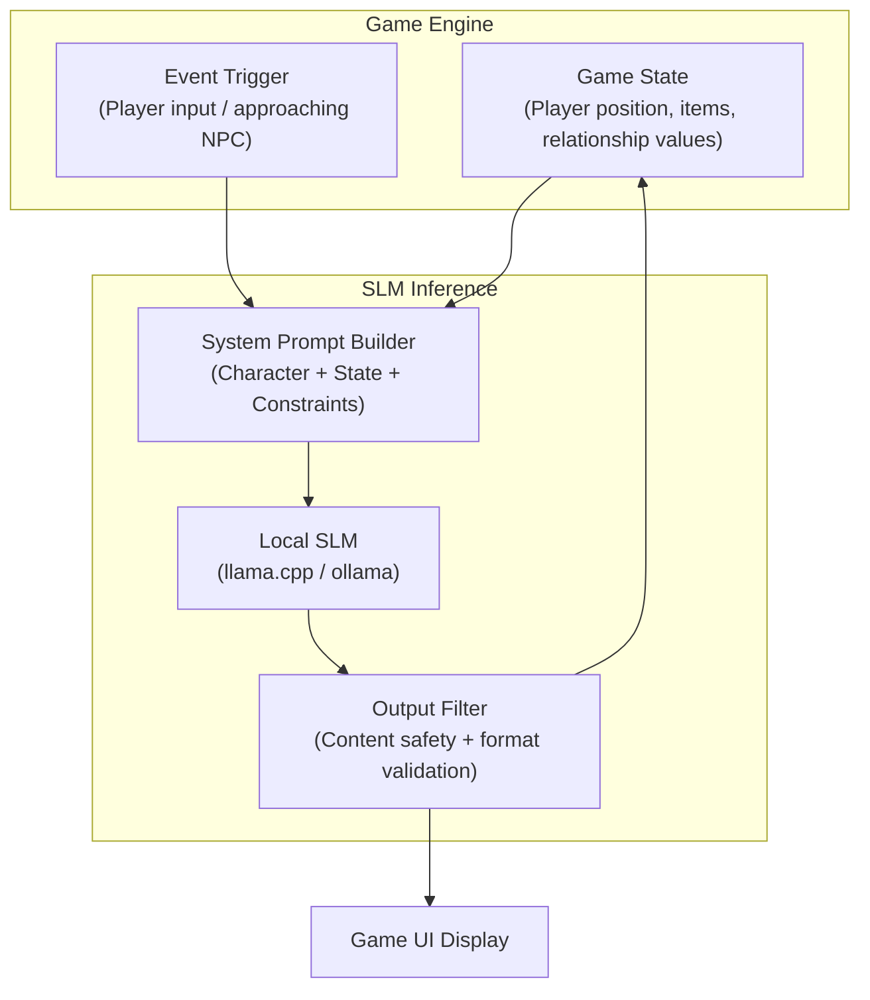

GPT-4 can obviously generate great game dialogue. But GPT-4 costs money per second, latency runs hundreds of milliseconds to seconds, and routing all NPC dialogue to a cloud API raises privacy concerns — player behavior data leaves the device. Small language models (SLMs) exist precisely to address these problems. Let's look at what models around 10B parameters can actually do in a gaming context.

## TL;DR

10B-parameter models (Mistral 7B, Gemma 9B, Llama 3.2 11B) can run locally on consumer GPUs (RTX 4090) or Apple Silicon Macs at 20–50 tokens/second — fast enough for real-time NPC dialogue. They excel at clear, well-constrained tasks; they fall short on complex reasoning and long-range consistency. Game design needs to work within these constraints.

## What We're Talking About

"Small models" here means 7–13B active parameter language models, such as:

- **Mistral 7B / Mistral Nemo 12B**: High inference efficiency, suited for real-time inference
- **Gemma 9B** (Google): Strong instruction-following capability
- **Llama 3.2 11B** (Meta): Multilingual support, multimodal version available
- **Phi-3.5 Mini 3.8B** (Microsoft): Smaller still, sacrifices some quality for speed

With 4-bit quantization, these models need approximately 4–8GB of memory, runnable on consumer GPUs from RTX 4060 Ti up, or on M2/M3 Mac unified memory (16–32GB configurations).

## What They Can Do in Games

### Dynamic NPC Dialogue

This is the most mature application area right now. Traditional RPG NPC dialogue is pre-written as a tree structure — player picks options. SLMs allow genuinely free conversation:

```
Player: "I heard you know something about the missing children?"
NPC (SLM-generated): "Keep your voice down. The guards rotate at midnight — that's when I can talk.
Ask me now and I know nothing."
```

The key is NPC system prompt design: it needs to include character background (personality, secrets, speech patterns), current scene state (player trust level, time, location), and world constraints (what this NPC knows and doesn't know).

### Procedural Narrative Generation

Small models can dynamically generate short story fragments based on player behavior. In a roguelike, for example, generating a description each time the player enters a new area (the history of this abandoned dungeon, clues left by the last explorer).

A 2025 arXiv paper ("High-quality generation of dynamic game content via small language models: A proof of concept") shows that SLMs can approach large model quality on short, clearly-contexted creative content, with more variety than purely rule-based generation.

### Adaptive Game Content

Adjusting difficulty descriptions based on player behavior (same mission, different hint language for players of different skill levels), generating personalized mission briefings, or generating different branching narration based on player choices.

### Interactive Fiction and Text Adventures

This is where SLMs shine most. Text adventure games with a clear worldbuilding setup, where the SLM drives the story forward based on player input. Godoka's [Painter Game](https://painter.godoka.cn) is an experimental interactive painting narrative using a small model.

## How It Works

Typical architecture for integrating SLMs in a game:



**Inference frameworks**: llama.cpp is the most commonly used local inference engine, can be integrated directly into game engines via C++; Ollama provides an HTTP API suited for quick prototyping; Unity and Unreal both have community-developed llama.cpp integration packages.

## The Real Gap Versus Large Models

| | 10B SLM (local) | GPT-4o (API) |
|--|-----------------|--------------|
| Speed | 20–50 tok/s (RTX 4090) | 50–100 tok/s (but with network latency) |
| Latency | <100ms (direct local call) | 300ms–2s (including network round trip) |
| Cost | One-time hardware investment | ~$5–15 per 1M tokens |
| Privacy | Data never leaves the device | Sent to OpenAI servers |
| Long-range consistency | Weaker (smaller context window) | Strong |
| Complex reasoning | Noticeable gap | Strong |
| Short creative generation | Approaches large model quality | Strong |

**The biggest practical gap** is long-range consistency: if a conversation exceeds a few thousand tokens, SLMs tend to "forget" character setup or plot details established earlier. The solution is to explicitly maintain important state outside the model (game database), re-injecting it into context on each call, rather than relying on the model's memory.

## Wrap Up

10B models in 2025 are sufficient for real-time NPC dialogue, short procedural text generation, and interactive narrative. They're not a replacement for GPT-4 — they're an entry ticket to the category of "real-time, free, on-device language generation." Game design needs to accommodate their limitations: short context, clear constraints, explicit state management. Games designed within these constraints may actually end up with uniquely interesting mechanics because of them.

## References

- [High-quality generation of dynamic game content via small language models: A proof of concept (arXiv)](https://arxiv.org/html/2601.23206)
- [Narrative-to-Scene Generation: An LLM-Driven Pipeline for 2D Game Environments (arXiv)](https://arxiv.org/html/2509.04481v1)
- [awesome-LLM-game-agent-papers (GitHub)](https://github.com/git-disl/awesome-LLM-game-agent-papers)
- [Painter Game (Godoka)](https://painter.godoka.cn)
- [What Games Can We Build with a Small Model (10B active parameters)? (YouTube)](https://www.youtube.com/watch?v=Yysg5-WnVhg)
