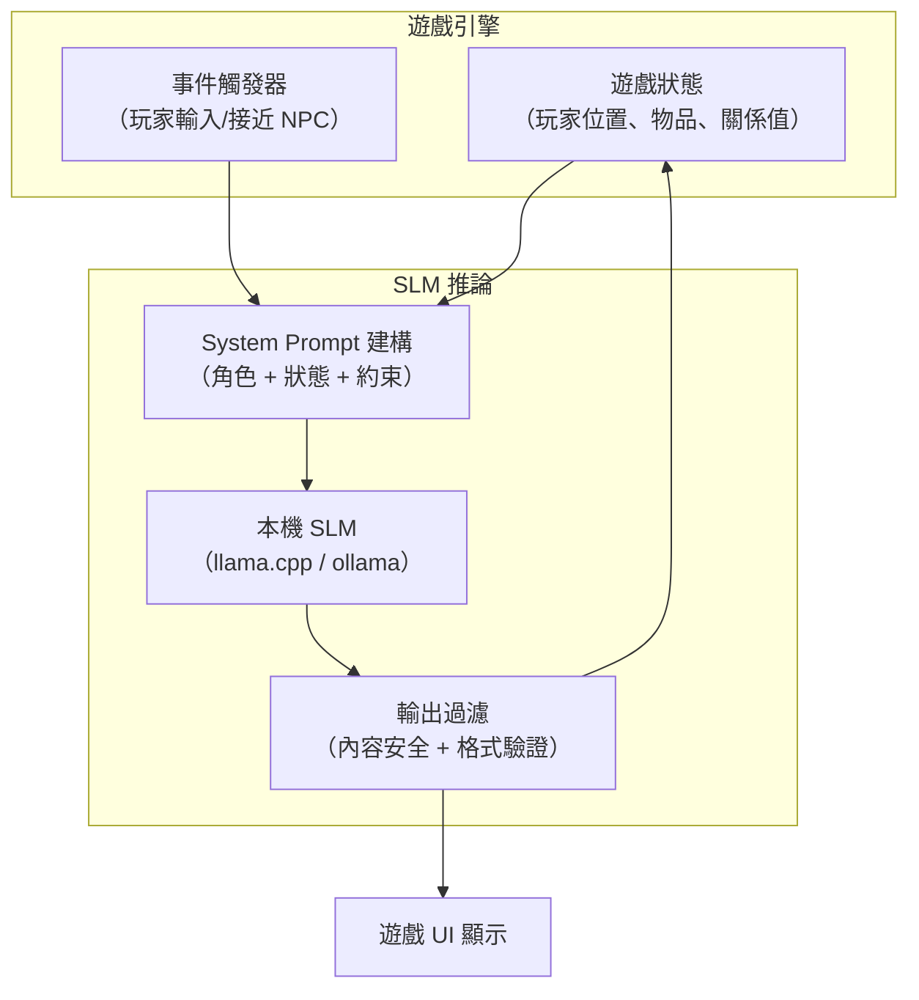

GPT-4 當然可以生成精彩的遊戲對話。但 GPT-4 每秒要花錢，延遲在幾百毫秒到數秒之間，而且把所有 NPC 對話都送去雲端 API 會有隱私問題——玩家的行為資料會離開設備。小型語言模型（SLM）正是為了解決這些問題而存在。這篇看 10B 左右的模型在遊戲場景實際能做什麼。

## TL;DR

10B 參數的模型（Mistral 7B、Gemma 9B、Llama 3.2 11B）可以在消費級 GPU（RTX 4090）或 M 系列 Mac 上以 20-50 tokens/second 的速度本機運行，足以做到即時 NPC 對話。它們在清晰、有約束的任務上表現出色；在複雜推理和長程一致性上不如大模型。遊戲設計需要配合這些限制。

## 是什麼

這裡討論的「小型模型」是指 7-13B 活躍參數的語言模型，例如：

- **Mistral 7B / Mistral Nemo 12B**：推理效率高，適合即時推論
- **Gemma 9B**（Google）：指令遵循能力強
- **Llama 3.2 11B**（Meta）：多語言支援，有多模態版本
- **Phi-3.5 Mini 3.8B**（Microsoft）：更小，犧牲部分品質換速度

這些模型用 4-bit 量化後，記憶體需求約 4-8GB，可以在 RTX 4060 Ti 以上的消費級 GPU 跑，或者在 M2/M3 Mac 的 unified memory 上跑（16-32GB 配置）。

## 遊戲中能做什麼

### 動態 NPC 對話

這是目前最成熟的應用場景。傳統 RPG 的 NPC 對話是預寫的樹狀結構，玩家選選項。SLM 允許真正的自由對話：

```
玩家：「我聽說你知道失蹤孩子的事？」
NPC（SLM 生成）：「噓，聲音小一點。警衛換班是在子時，那時候我才能說。
現在問我，我什麼都不知道。」
```

關鍵是 NPC 的 system prompt 設計：它需要包含角色背景（性格、秘密、說話方式）、當前場景狀態（玩家信任度、時間、地點）、以及世界觀約束（哪些事情 NPC 知道/不知道）。

### 程序化敘事生成

小型模型可以根據玩家行為動態生成短篇故事片段。例如在 roguelike 遊戲裡，每次進入新地圖時生成一段描述（這個廢棄地牢的歷史、上一個探險者留下的線索）。

ArXiv 上 2025 年的研究（"High-quality generation of dynamic game content via small language models: A proof of concept"）顯示：SLM 在短篇、有清楚脈絡約束的創意內容上，品質可以接近大型模型，而且比純規則式生成更有變化性。

### 遊戲內容的自適應調整

根據玩家行為調整遊戲難度描述（同樣的任務，給不同程度的玩家不同的提示語言）、生成個人化的任務說明、或根據玩家選擇生成不同分支的旁白。

### 互動小說與文字冒險

這是 SLM 最能發揮的場景：有清楚世界觀設定的文字冒險遊戲，SLM 負責根據玩家輸入推進故事。Godoka 的 [Painter Game](https://painter.godoka.cn) 是一個用小型模型做互動繪畫敘事的實驗性作品。

## 怎麼運作

遊戲中整合 SLM 的典型架構：



**推論框架**：llama.cpp 是目前最常用的本機推論引擎，可以用 C++ 直接整合進遊戲引擎；Ollama 提供 HTTP API，適合快速原型；Unity 和 Unreal 都有社群開發的 llama.cpp 整合套件。

## 跟大模型的實際差距

| | 10B SLM（本機） | GPT-4o（API） |
|--|----------------|--------------|
| 速度 | 20-50 tok/s（RTX 4090） | 50-100 tok/s（但有網路延遲） |
| 延遲 | <100ms（本機直接調用） | 300ms-2s（含網路往返） |
| 成本 | 硬體一次性投資 | 每 1M token 約 $5-15 |
| 隱私 | 資料不離開設備 | 傳到 OpenAI 伺服器 |
| 長程一致性 | 較弱（context window 小） | 強 |
| 複雜推理 | 有明顯落差 | 強 |
| 短篇創意生成 | 接近大模型品質 | 強 |

**實際上最大的差距**是長程一致性：如果對話超過幾千個 token，SLM 容易「忘記」早先建立的角色設定或劇情細節。解法是把重要狀態顯式維護在系統外（遊戲資料庫），每次呼叫時重新注入 context，而不是依賴模型的記憶。

## 小結

10B 模型在 2025 年已經夠用做即時 NPC 對話、程序化短文生成、互動敘事。它不是 GPT-4 的替代品，而是「在設備上、即時、免費的語言生成能力」這個新類別的入場券。遊戲設計需要配合它的限制：短上下文、清楚約束、顯式狀態管理。在這些約束下設計出的遊戲機制，反而可能形成獨特的遊戲玩法。

## 參考資料

- [High-quality generation of dynamic game content via small language models: A proof of concept（ArXiv）](https://arxiv.org/html/2601.23206)
- [Narrative-to-Scene Generation: An LLM-Driven Pipeline for 2D Game Environments（ArXiv）](https://arxiv.org/html/2509.04481v1)
- [awesome-LLM-game-agent-papers（GitHub）](https://github.com/git-disl/awesome-LLM-game-agent-papers)
- [Painter Game（Godoka）](https://painter.godoka.cn)
- [What Games Can We Build with a Small Model (10B active parameters)?（YouTube）](https://www.youtube.com/watch?v=Yysg5-WnVhg)
