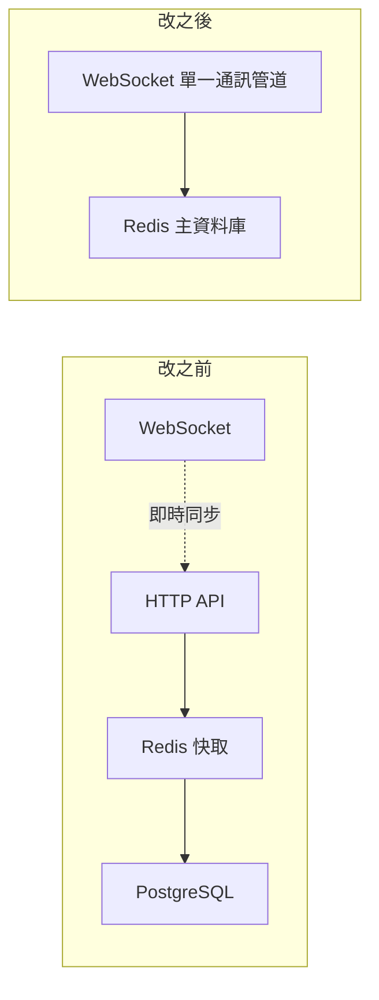
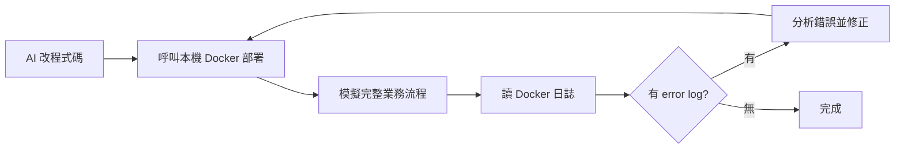

過年期間閒著沒事，我做了一個「你畫我猜」的網頁遊戲：不用註冊、不用安裝，打開網址就能玩。這是我從學校畢業之後第一次做遊戲，所以刻意挑了一個架構相對直觀的類型——社交遊戲。而「你畫我猜」又是其中互動最簡單的一種：一邊只負責畫、一邊只負責猜，全程不需要交流，堪稱最適合社恐的遊戲。考慮到看我的觀眾基本上都是工程師，而工程師又是社恐重災區，這選擇可以說是相當寵粉了。

但這篇真正想分享的不是遊戲本身，而是這次開發我換用了 **MiniMax 最新的 M2.5**——一顆**激活參數只有 10B 的小模型**，主打「小快靈」。一開始我幾乎沒為它調整流程，結果就是一直抽卡、一直碰壁，花了差不多兩天才摸出幾個駕馭小模型的窍門。下面是三個最有感的教訓。

## 教訓一：架構別搞太複雜

我一開始的後端是很中規中矩的「經典起手式」：

- 一個 **HTTP API** 傳輸基本資料
- 一個 **WebSocket** 做遊戲即時同步
- HTTP API 前面掛一個 **Redis** 做快取
- 後面再放一個 **PostgreSQL** 當主資料庫

這套設計的問題在於：**一個狀態會被四個組件經手**。比如新玩家加入房間時，HTTP 和 WebSocket 都要更新，Redis 和 PostgreSQL 也都會留紀錄，只要任何一步出錯就會不同步。

倒不是說 AI 寫不出正確的邏輯，而是你**沒必要讓它去扛這份額外的複雜度**——這除了撐大上下文視窗、給 debug 製造難度、多吃 token 之外，沒什麼好處。所以最後我砍掉了一半的技術棧：

前端只用 **WebSocket** 做所有通訊，後端只用 **Redis** 當主資料庫——只保留一個通訊管道和一個儲存終點。效果立竿見影：第一版生成的程式碼只有兩個小 bug，從生成、測試到修復只花了 10 分鐘。

## 教訓二：小模型要避開冷門技術棧

最初的 prompt 裡我想趕時髦，前端選了 **SvelteKit + GraphQL**——這兩個在中文圈都算冷門。結果就是語法層級的 bug 怎麼修都修不完，折騰半天連業務邏輯都沒機會看到。

後來我把它們換成主流的 **Vue 3 + Express.js**，語法 bug 瞬間全部消失。原因很直接：**激活參數少的小模型，對冷門技術的熟悉度不會高**。

但這也是一種取捨。參數少換來的價值不少：足夠輕量化、對私有化部署的錢包友善，而最重要的是——**參數少意味著思考鏈路更精簡、推理速度更快**。畢竟「更大、更快、更便宜」本來就是不可能三角。

## 教訓三：速度夠快，就讓它自己測自己修

之前開發那個視訊通話平台 o2o 的時候，我幾乎全程手動測試、再把問題回報給 AI。倒不是我愛當 QA，而是參數多的大模型行動偏慢，會把整個開發時間拖得很長。

這次 M2.5 速度夠快，我就能讓它**自己跑測試、自己找 bug、自己修**。我唯一要做的，是提前把本機測試環境搭好——這裡我選擇全套 **Docker** 打包，AI 每次改完程式碼就能直接呼叫我電腦上的 Docker 做本機部署，把業務流程從頭到尾模擬一次，自己看日誌、發現 error log 就琢磨、自己修，修完重啟再來，直到看不到 error log 為止：

這個「修 bug → 啟 Docker → 跑測試 → 看日誌 → 分析錯誤 → 再修」的迴圈會發生非常多次，這時小模型的速度優勢就累積出可觀的時間。

## 省下的時間拿去加功能：油漆桶

省下來的時間當然是拿去加功能。整個開發中我加的最複雜功能是繪圖工具「油漆桶」，難點有兩個：

1. **它是二維平面填色**，運作原理跟畫筆、橡皮擦這些一維線條工具不同，為了相容得對專案做不少重構。
2. **效果只能在 canvas 上看到**，而 canvas 很難自動化測試——從成本上講，最划算的做法只能靠人眼觀察、人來判斷填色效果對不對。

後來甚至有不少觀眾勸我，乾脆找個成熟的繪圖外掛裝上去算了。還好在耐心調教下，AI 最後還是把它做出來了。

## 小結

這次的核心體會是：**用小模型寫程式，不是把駕馭大模型那套照搬、再期待它跟得上**，而是要為它的特性重新設計工作流——

- **架構極簡**：少一個組件，就少一份它要扛的複雜度。
- **走主流技術棧**：冷門框架會把它卡在語法 bug 上，連業務邏輯都摸不到。
- **用速度換自動化**：推理快，就把人從手動 QA 解放出來，交給 Docker + AI 的自測迴圈。

在這些約束下，10B 激活參數的小模型已經足以快速產出一個能玩的網頁遊戲。

## 參考資料

- [What Games Can We Build with a Small Model (10B active parameters)?（YouTube）](https://www.youtube.com/watch?v=Yysg5-WnVhg)
