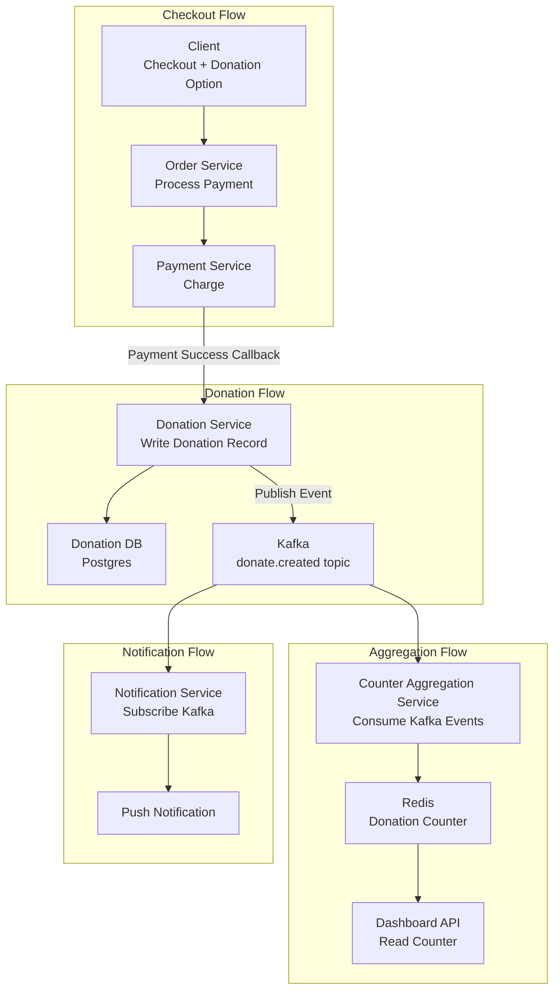

The DoorDash donation feature system design question has appeared in interviews frequently enough to be documented across LeetCode Discuss and multiple interview sharing platforms. The premise seems simple — users can choose to donate at checkout — but the detail handling and scale discussion can go deep. This is a complete mock walkthrough with focus on the reasoning behind design decisions, not on memorizing the "right" answer.

## TL;DR

The core problem of designing the DoorDash donation feature: with millions of users checking out simultaneously, each order potentially triggering a donation, how do you reliably record every donation, prevent double-counting, and provide an accurate (or near-accurate) real-time total? The answer is event-driven architecture + Redis counter + async reconciliation — not writing to the database and querying the count on every donation.

## Design Philosophy

DoorDash's real system is built on Apache Kafka event-driven architecture, with their core system called Iguazu processing hundreds of billions of events per day. This background explains why DoorDash's system design thinking naturally gravitates toward event-driven: microservices are decoupled, communicating via Kafka topics, with downstream services subscribing to the event streams they need.

## Core Concepts

### Requirements Breakdown

**Functional requirements:**
- Users can choose to donate at checkout (typically $1, $2, or custom amount)
- Display cumulative donation total for the campaign (e.g., "Campaign total: $1,234,567")
- Notify users when donation succeeds
- Backend can query donation statistics for specific time ranges

**Non-functional requirements:**
- Donation records cannot be lost (financial transaction reliability)
- Donations cannot be double-counted (user clicks donate once; system retries can't record it twice)
- Cumulative total can tolerate second-level latency (no need for strong-consistency real-time update)
- Peak times (dinner hours): potentially tens of thousands of orders per second

### Scale Estimation

In interviews, scale estimation isn't about hitting exact numbers — it's about confirming the design choices are appropriate for the right order of magnitude:

- DoorDash daily order volume: approximately a few million (2024 data)
- Assuming 30% of users donate: ~1M donations/day
- Peak hour (3-hour dinner window) contains ~40% of orders: ~400K/3 hours ≈ **37/sec average**, peak 3–5x ≈ **100–180/sec**
- This volume is manageable for a single Postgres database, but the read/write contention on the cumulative counter is the problem

### System Architecture



## Key Design Decisions

### Decision 1: Strong Consistency for Donation Records

Donations are financial transactions. Requirements:
1. Record donation only on successful payment (can't record first, charge later)
2. Donation record cannot be duplicated by system retries

**Solution: Idempotency design**

Use `order_id + donation_attempt_id` as a unique key per donation (or the payment system's `payment_reference_id`):

```sql
CREATE TABLE donations (
  id UUID PRIMARY KEY DEFAULT gen_random_uuid(),
  order_id TEXT NOT NULL,
  payment_ref TEXT NOT NULL UNIQUE,  -- prevent duplicate inserts
  amount_cents INTEGER NOT NULL,
  created_at TIMESTAMPTZ DEFAULT NOW()
);
```

The `UNIQUE` constraint on `payment_ref` means duplicate payment callback inserts fail silently (Postgres `ON CONFLICT DO NOTHING`), ensuring only one record exists per donation even if the payment callback fires multiple times.

### Decision 2: Redis Counter for Aggregation, Not SQL COUNT(*)

If every query for the donation total runs `SELECT SUM(amount_cents) FROM donations WHERE campaign_id = 'xxx'`, that's a heavy query on millions of records. The solution is maintaining a Redis counter:

```
INCRBYFLOAT campaign:2026q2:total_cents 200
```

Each time a new donation event is consumed from Kafka, atomically accumulate with `INCRBYFLOAT`. Redis's atomic operations ensure count consistency at O(1) performance.

**Challenge: what happens when Redis restarts?**

Answer: Redis AOF or RDB persistence reduces the loss window. But even if the counter is lost, you can recalculate from the database's SUM and backfill. The design accepts "displayed total may have second-to-minute lag but won't be permanently inconsistent."

### Decision 3: Kafka Consumer At-Least-Once Semantics

Kafka's consumer guarantees at-least-once delivery (the same event may be consumed multiple times). This means the counter could be incremented multiple times.

Solution: track processed event IDs on the consumer side (stored in a Redis set or DB), idempotency check:

```python
event_id = event.headers['donation_id']
if redis.sismember('processed_donations', event_id):
    return  # already processed, skip
redis.incrbyfloat(f'campaign:{campaign_id}:total', event.amount)
redis.sadd('processed_donations', event_id)
redis.expire('processed_donations', 86400 * 7)  # clean up after 7 days
```

## Comparison with Common Alternatives

| Approach | Pros | Cons |
|----------|------|------|
| SQL COUNT/SUM on every query | Strong consistency, simple to implement | Heavy DB load under concurrency, slow |
| Redis counter (event-driven) | Fast, scalable | Need to handle duplicate consumption, eventual consistency |
| DB + materialized view | Strong consistency, SQL queryable | High refresh cost when updates are frequent |
| 2PC (distributed transaction) | Strong consistency | High complexity, poor performance, easily a bottleneck |

## How to Expand in an Interview

The depth in this question comes from "what do you choose, why, and at what cost":

1. **Scale up**: If the campaign gets 30 million donations, is a Redis counter still sufficient? (Yes — `INCR` is O(1), Redis handles millions of operations per second)

2. **Fraud detection**: Same user makes 1,000 donations in a short time — how do you handle it? (Rate limiting + anomaly detection added at the donation service layer)

3. **Precise final count when campaign ends**: You need an exact final number, not an estimate (after closing Kafka consumption, run SQL SUM as final confirmation, overwrite Redis counter with DB value)

## The Bottom Line

The value of the DoorDash donation feature question isn't in the answer — it's that it covers the most common distributed systems design problems in one problem: idempotency, counter aggregation, eventual vs. strong consistency, event-driven decoupling. A good mock is: first clarify requirements and scale, then propose a few approaches and discuss trade-offs, rather than reciting a "standard answer."

## References

- [DoorDash Engineering Blog](https://doordash.engineering/)
- [From Zero to a Hundred Billion: Building Scalable Real-Time Event Processing at DoorDash (InfoQ)](https://www.infoq.com/presentations/doordash-event-system/)
- [DoorDash Onsite System Design: Donation App (LeetCode Discuss)](https://leetcode.com/discuss/post/318214/doordash-onsite-system-design-question/)
- [DoorDash System Design Interview Guide](https://www.systemdesignhandbook.com/guides/doordash-system-design-interview/)
- [System Design Mock DoorDash donation event (YouTube)](https://www.youtube.com/watch?v=xbnrvkVf0s8)
