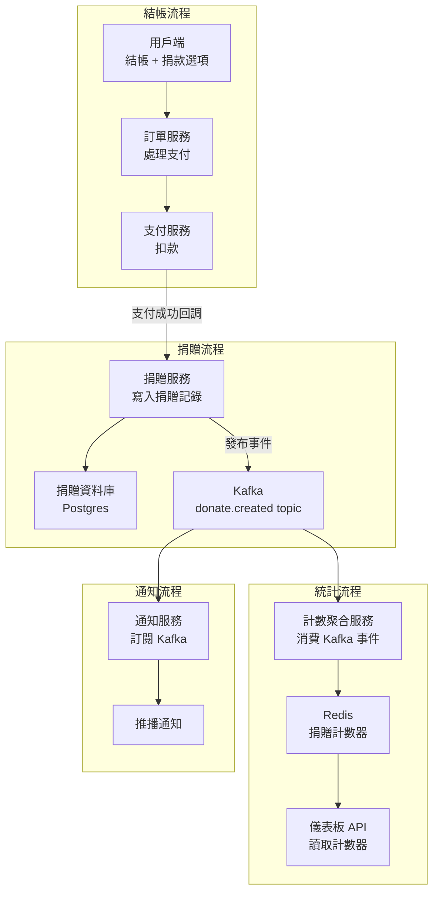

DoorDash 的捐贈活動系統設計是一道在系統設計面試中出現頻率較高的題目，曾在 LeetCode Discuss 和多個面試分享平台上被記錄。題目看似簡單（用戶結帳時可以選擇捐款），但細節處理和規模討論可以展開很多。這篇複盤一個完整的 Mock 過程，重點在設計決策背後的推理，而不是記答案。

## TL;DR

設計 DoorDash 捐贈活動的核心問題是：在數百萬用戶同時結帳、每筆訂單都可能觸發一次捐贈的情況下，如何可靠地記錄每筆捐贈、防止重複計算、並提供準確（或接近準確）的即時總計。答案是事件驅動架構 + Redis counter + 非同步 reconciliation，而不是每次捐贈都去寫資料庫再查計數。

## 設計哲學

DoorDash 的真實系統是基於 Apache Kafka 的事件驅動架構，核心系統叫做 Iguazu，每天處理數千億事件。這個背景解釋了為什麼 DoorDash 的系統設計思維天然地傾向事件驅動：微服務之間解耦，透過 Kafka topic 通信，下游服務訂閱各自需要的事件流。

## 核心概念

### 需求拆解

**功能需求**：
- 用戶在結帳時可以選擇捐款（通常是 $1、$2 或自訂金額）
- 顯示活動累積捐贈總計（例如「本次活動已募集 $1,234,567」）
- 捐款成功需要通知用戶
- 後台可以查詢特定時間段的捐贈統計

**非功能需求**：
- 捐款記錄不能丟失（金融交易的可靠性要求）
- 捐款不能重複計算（用戶只點一次捐款，但系統重試不能讓它被計算兩次）
- 累積總計允許秒級延遲（不需要強一致性的即時更新）
- 高峰期（晚餐時間）每秒可能同時有數萬筆訂單

### 規模估算

在面試中，規模估算的目的不是算出精確數字，而是確認設計選擇的量級合理性：

- DoorDash 的日訂單量約在數百萬筆（2024 年數據）
- 假設 30% 用戶選擇捐款：約 100 萬筆捐款/天
- 高峰期（晚餐 3 小時）集中約 40% 的訂單：約 40 萬筆/3 小時 ≈ **37 筆/秒**平均，峰值可能 3-5 倍 ≈ **100-180 筆/秒**
- 這個量級單一 Postgres 資料庫可以處理，但累積計數器的讀寫爭用是問題

### 系統架構



## 關鍵設計決策

### 決策一：捐贈記錄的強一致性

捐款是金融交易，必須要求：
1. 支付成功才記錄捐贈（不能先記錄再付款）
2. 捐贈記錄不能因系統重試而重複

**解法：冪等性設計**

每筆捐贈用 `order_id + donation_attempt_id` 作為唯一鍵（或支付系統提供的 `payment_reference_id`）：

```sql
CREATE TABLE donations (
  id UUID PRIMARY KEY DEFAULT gen_random_uuid(),
  order_id TEXT NOT NULL,
  payment_ref TEXT NOT NULL UNIQUE,  -- 防重複插入
  amount_cents INTEGER NOT NULL,
  created_at TIMESTAMPTZ DEFAULT NOW()
);
```

`payment_ref` 加上 `UNIQUE` 約束，重複的支付回調 insert 會失敗（pg 的 `ON CONFLICT DO NOTHING` 讓這個情況靜默處理），確保即使支付回調被觸發多次，資料庫裡只有一筆記錄。

### 決策二：計數器聚合用 Redis，不用 SQL COUNT(*)

如果每次有人查看捐贈總計都去跑 `SELECT SUM(amount_cents) FROM donations WHERE campaign_id = 'xxx'`，在百萬筆記錄下這個查詢很重。解法是維護一個 Redis counter：

```
INCRBYFLOAT campaign:2026q2:total_cents 200
```

每次新的捐贈事件被消費（從 Kafka），就用 `INCRBYFLOAT` 原子性地累加。Redis 的原子操作保證計數的一致性，效能是 O(1)。

**反詰點**：Redis 重啟後 counter 怎麼辦？

回答：Redis AOF 或 RDB 持久化可以減少丟失窗口。但即使丟失，可以用資料庫的 SUM 重新計算並回填。設計上接受「顯示的總計可能有秒級到分鐘級的延遲，但不會永久不一致」。

### 決策三：Kafka 消費的 at-least-once 語意

Kafka 的 consumer 保證 at-least-once delivery（可能重複消費同一事件）。這意味著計數器可能被重複增加。

解法：在消費端記錄已處理的事件 ID（存在 Redis set 或 DB），用冪等性 check：

```python
event_id = event.headers['donation_id']
if redis.sismember('processed_donations', event_id):
    return  # 已處理，跳過
redis.incrbyfloat(f'campaign:{campaign_id}:total', event.amount)
redis.sadd('processed_donations', event_id)
redis.expire('processed_donations', 86400 * 7)  # 7天後清理
```

## 跟常見替代方案比較

| 方案 | 優點 | 缺點 |
|--|--|--|
| 每次查詢跑 SQL COUNT/SUM | 強一致性，實作簡單 | 高並發下 DB 壓力大，慢 |
| Redis counter（事件驅動） | 快，可擴展 | 需要處理重複消費，最終一致 |
| 資料庫 + 物化視圖 | 強一致性，SQL 查詢 | 更新頻繁時物化視圖刷新代價高 |
| 2PC（分散式事務） | 強一致性 | 複雜度高，效能差，容易成瓶頸 |

## 適合面試的展開方向

面試中這道題的深度在於「你選擇什麼、為什麼、有什麼代價」：

1. **Scale up**：如果活動有 3,000 萬捐款，Redis counter 還夠嗎？（是的，`INCR` 是 O(1)，Redis 每秒可以處理數百萬次操作）

2. **Fraud detection**：同一個用戶短時間內捐款 1,000 次，怎麼處理？（rate limiting + anomaly detection 在捐贈服務層加）

3. **Campaign end 的精確計數**：活動結束時需要精確的最終數字而不是估算值（關閉 Kafka 消費後，跑一次 SQL SUM 作為最終確認，用 DB 值覆蓋 Redis counter）

## 整體來說

DoorDash 捐贈活動這道題的價值不在於答案，而在於它覆蓋了分散式系統設計裡最常見的幾個問題：冪等性、計數器聚合、最終一致性 vs 強一致性、事件驅動解耦。一個好的 Mock 過程是先釐清需求和規模、再提出幾個方案並討論取捨，而不是直接背出一個「標準答案」。

## 參考資料

- [DoorDash Engineering Blog](https://doordash.engineering/)
- [From Zero to a Hundred Billion: Building Scalable Real-Time Event Processing at DoorDash（InfoQ）](https://www.infoq.com/presentations/doordash-event-system/)
- [DoorDash Onsite System Design: Donation App（LeetCode Discuss）](https://leetcode.com/discuss/post/318214/doordash-onsite-system-design-question/)
- [DoorDash System Design Interview Guide](https://www.systemdesignhandbook.com/guides/doordash-system-design-interview/)
- [系統設計 Mock 複盤 DoorDash donation event（YouTube）](https://www.youtube.com/watch?v=xbnrvkVf0s8)
