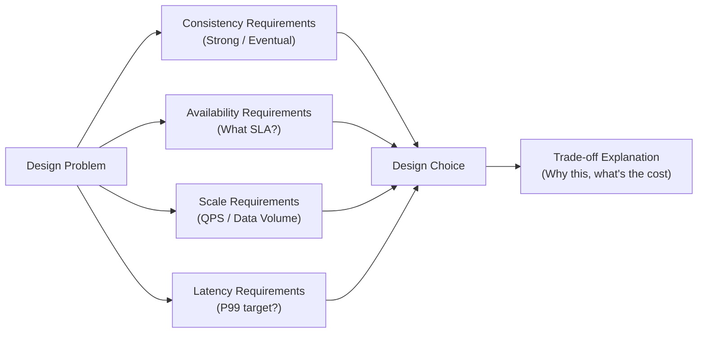

Every few months, someone posts in a tech community: "How do I prep for system design?" Then all the "must-know" lists come pouring out: consistent hashing, Kafka architecture, CAP theorem, database sharding strategies... But if memorizing these were enough to pass, the interview itself would be meaningless.

## TL;DR

System design interviews test engineering judgment, not knowledge breadth. Knowing architecture patterns helps, but what interviewers actually want to see is: can you make grounded design decisions under ambiguous requirements and clearly explain the trade-offs? That ability can only come from real engineering experience and deliberate practice.

## What "System Design Interview" Actually Means

Break the phrase apart.

**System design**: Given a vague functional requirement (design Twitter, design a URL shortener, design DoorDash's donation feature), propose an architecture that can support a specified scale within 45–60 minutes, and explain every design decision.

**Interview**: A two-way communication process. The interviewer evaluates your engineering intuition; you're understanding the real requirements and clearly articulating your thought process.

Combined: a system design interview is a structured context for showing how you think about and solve engineering problems. It's not an exam. There's no correct answer.

## Why "Rote Memorization" Fails

The problem with memorizing answers isn't that "memorizing is useless" — it's that "memorizing alone can't answer follow-ups."

When an interviewer sees Kafka in your architecture diagram, the next question is always: "Why Kafka? Why not SQS? Why not database polling?"

If your answer is "because Kafka is a high-throughput messaging system," that's a description you memorized, not engineering judgment. A convincing answer looks like this:

"I need multiple downstream services (notification service, count aggregation, audit log) to independently consume the same batch of events, and I need replay capability because the count aggregation might have bugs that require reprocessing from scratch. These requirements make Kafka more appropriate than SQS FIFO. But if I only needed a one-to-one task queue, SQS is simpler to set up and I'd choose that instead."

This answer shows you know *why* you made the choice — not just "this technology is famous so I'm using it."

## What Interviewers Are Evaluating

Based on public statements from multiple FAANG interviewers, system design interview scoring typically covers:

**Requirements clarification**: Before starting the design, did you ask the critical questions? (What's the scale of this system? Read-heavy or write-heavy? Need immediate consistency or eventual consistency?)

**Functional decomposition**: Can you break a vague requirement into well-defined sub-problems?

**Design reasoning**: Does every design decision have a reason? Did you mention alternatives and trade-offs?

**Scale awareness**: Does your design hold at 10x, 100x load? Where are the bottlenecks?

**Communication ability**: Can you explain complex designs clearly to people with different backgrounds?

Notice: "breadth of knowledge points covered" is not on this list. Interviewers aren't counting how many correct technical terms you mentioned.

## How to Build Design Thinking

Effective preparation isn't memorizing lists — it's developing the habit of thinking like an engineer:

### Read Real Engineering Articles

Company engineering blogs (DoorDash Engineering, Airbnb Engineering, Uber Engineering, Netflix Tech Blog) document real design decisions and hard lessons learned. The takeaway from reading these isn't "I learned an architecture" — it's "I learned which solution to choose in which situation, and the reasoning behind it."

DoorDash's Iguazu event system article explains why they built their own Kafka proxy. Uber's sharding strategy article explains why they switched from single-region to multi-region at a particular point in time. All of these have concrete trade-off analysis behind them.

### Ask "Why" About Systems You Work With

"We use Redis for session storage — why not PostgreSQL?" "This API is polling instead of webhook — what was the original reasoning?" "Why is this service deployed independently instead of as part of the monolith?"

Ask these questions, try to derive the answers yourself, then verify (ask a senior or check documentation). This habit is more valuable than reading ten system design books.

### Mock Interviews Should Focus on Language, Not Architecture Correctness

Many people practice by drawing a complete architecture on a whiteboard and thinking "looks right." But interviews require drawing and explaining simultaneously, articulating your thinking in real time.

Effective practice: find a real person (colleague, friend, or paid platform), have them ask follow-up questions, and practice explaining your design choices under pressure.

### Understand the Trade-off Framework, Not Answers

For any design problem, there are a few dimensions to systematically think through:

Clarify requirements along each dimension and the design decisions often surface naturally.

## Common Interview Mistakes

**Jumping to technical details too fast**: Starting the architecture before clarifying requirements often produces a system that doesn't match actual needs.

**Lack of initiative**: Only answering questions, not proactively explaining your reasoning process. Interviewers can't see your thinking — even if the design is correct, they don't know whether you guessed intuitively or derived it logically.

**Being afraid to say "I'm not sure"**: When you're unfamiliar with a technical detail, saying "I'm not entirely sure about this, but my intuition is X because Y — can you help me confirm?" is much better than faking knowledge.

**Presenting only one option**: A good system design interview proposes at least two directions, compares trade-offs, then makes a grounded choice. Giving only one option means you're reciting an answer, not doing design.

## Wrap Up

System design interviews do have some knowledge worth being familiar with (CAP theorem, consistency models, distributed ID generation, caching strategies), but these are tools, not answers. What the interviewer is actually evaluating is whether you can derive a reasonable design from first principles in a novel problem context. That capability develops through reading real engineering case studies, asking "why" about systems you work with, and doing feedback-driven mock practice — not by drilling a list of technology names until you can recite them in your sleep.

## References

- [A Senior Engineer's Guide to the System Design Interview (Interviewing.io)](https://interviewing.io/guides/system-design-interview)
- [The Complete System Design Interview Guide (System Design Handbook)](https://www.systemdesignhandbook.com/guides/system-design-interview/)
- [DoorDash Engineering Blog](https://doordash.engineering/)
- [From Zero to a Hundred Billion: Building Scalable Real-Time Event Processing at DoorDash (InfoQ)](https://www.infoq.com/presentations/doordash-event-system/)
- [Original video: Is system design just rote memorization? (YouTube)](https://www.youtube.com/watch?v=a7JHJ8Tzwpg)
