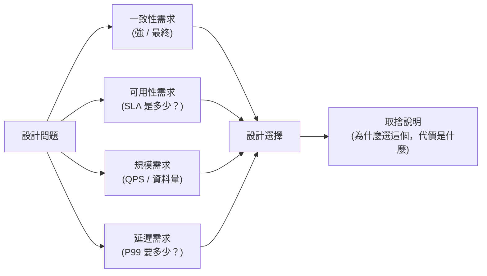

每隔一段時間就會有人在社群上問：「系統設計要怎麼準備？」接著各種「必背知識點」清單就冒出來：一致性雜湊、Kafka 架構、CAP 定理、資料庫分片策略……。但如果這些東西能背下來就通過面試，那面試本身就失去意義了。

## TL;DR

系統設計面試考的是工程判斷力，不是知識廣度。背熟架構模式有幫助，但面試官真正想看的是「你能不能在模糊的需求下，做出有根據的設計決策，並且清楚解釋取捨」。這個能力只能從實際工程經驗和刻意練習中培養。

## 是什麼

先把「系統設計面試」這個詞拆開看。

**系統設計**：給定一個模糊的功能需求（設計 Twitter、設計一個 URL shortener、設計 DoorDash 的捐贈功能），在 45-60 分鐘內提出一個可以支撐指定規模的架構方案，並能解釋每個設計決策。

**面試**：這是一個雙向溝通的過程。面試官在評估你的工程直覺；你在理解題目的真正需求，並把你的思考過程清楚表達出來。

把這兩件事合在一起：系統設計面試是在一個結構化的情境下，展示你如何思考和解決工程問題。它不是考試，沒有「正確答案」。

## 為什麼「背八股」會失效

背八股的問題不是「背了沒用」，而是「只靠背沒法回答 follow-up」。

面試官看到你的架構圖上有 Kafka，下一個問題一定是：「為什麼是 Kafka？為什麼不用 SQS？為什麼不用 Database polling？」

如果你的答案是「因為 Kafka 是高吞吐量的訊息系統」，這是背出來的描述，不是工程判斷。一個有說服力的答案應該是：

「我需要多個下游服務（通知服務、計數聚合、稽核日誌）都能獨立消費同一批事件，而且需要重播（replay）能力，因為計數聚合可能有 bug 需要從頭重算。這些需求讓 Kafka 比 SQS FIFO 更合適。但如果只需要一對一的任務佇列，SQS 設定更簡單，我會選 SQS。」

這個答案說明你知道自己為什麼做這個選擇，而不只是「這個技術很有名所以我用它」。

## 面試官在評估什麼

根據多個 FAANG 面試官的公開說明，系統設計面試的評分維度通常包含：

**需求釐清**：在開始設計前，你有沒有問出關鍵問題？（這個系統的規模是？讀多還是寫多？需要即時一致性還是最終一致性？）

**功能拆解**：你能不能把一個模糊的需求分解成明確的子問題？

**設計推理**：你的每個設計決策有沒有理由？有沒有提到替代方案和取捨？

**規模意識**：你的設計在 10x、100x 規模下還能運作嗎？哪裡會是瓶頸？

**溝通能力**：你能不能把複雜的設計清楚解釋給不同背景的人？

注意：以上沒有「知識點覆蓋度」。面試官不是在算你說出了幾個正確的技術名詞。

## 怎麼培養設計思維

真正有效的準備方式不是背清單，而是養成「工程師看問題的習慣」：

### 讀真實工程文章

公司的技術部落格（DoorDash Engineering、Airbnb Engineering、Uber Engineering、Netflix Tech Blog）記錄了真實的設計決策和踩坑過程。讀這些文章的收穫不是「學到一個架構」，而是「學到在什麼情況下選什麼方案，以及背後的推理」。

DoorDash 的 Iguazu 事件系統文章解釋了為什麼他們要建自己的 Kafka proxy；Uber 的分片策略文章說明了為什麼他們在某個時間點從 single-region 切到 multi-region。這些背後都有具體的 trade-off 分析。

### 對自己工作的系統問「為什麼」

「我們用 Redis 做 session 儲存，為什麼不用 PostgreSQL？」「這個 API 設計成 polling 而不是 webhook，當初是什麼考量？」「這個服務為什麼要獨立部署而不是 monolith 的一部分？」

把這些問題問出來，試著自己推導答案，再去確認（問前輩或查文件）。這個習慣比讀十本系統設計書都有效。

### Mock 面試的重點是語言表達，不是架構正確性

很多人做 Mock 的方式是自己在白板上畫完架構，然後想「好像對了」。但面試是要邊說邊畫，要能即時解釋你的想法。

有效的 Mock 是：找一個真人（同事、朋友、或付費平台），讓他們問 follow-up，讓你練習在壓力下即時解釋你的設計選擇。

### 理解 trade-off 的框架，不是記答案

面對任何設計問題，有幾個維度可以系統性思考：

在每個維度上問清楚需求，設計決策往往自然浮現。

## 面試中的常見錯誤

**太快跳到技術細節**：在搞清楚需求之前就開始畫架構，會設計出一個不符合實際需求的系統。

**缺乏主動性**：只回答問題，不主動說出你的推理過程。面試官看不到你的思考，就算設計是對的，他也不知道你是憑直覺猜的還是有根據地推導出來的。

**不敢說「我不確定」**：遇到不熟悉的技術細節，說「我不太確定這個細節，但我的直覺是 X，因為 Y；你能幫我確認嗎？」比不懂裝懂要好得多。

**只給一個方案**：好的系統設計面試會提出至少兩個方向，比較取捨，然後做出有根據的選擇。只給一個方案意味著你沒有在做設計，而是在背答案。

## 小結

系統設計面試裡確實有一些知識點值得熟悉（CAP 定理、一致性模型、分散式 ID 生成、快取策略），但這些是工具，不是答案。能不能在新的題目情境下，從 first principles 推導出合理的設計，才是面試官真正在評估的事。這個能力的培養路徑是：讀真實工程案例、對自己工作的系統問「為什麼」、做有反饋的 Mock 練習——而不是把技術名詞清單背到滾瓜爛熟。

## 參考資料

- [A Senior Engineer's Guide to the System Design Interview（Interviewing.io）](https://interviewing.io/guides/system-design-interview)
- [The Complete System Design Interview Guide（System Design Handbook）](https://www.systemdesignhandbook.com/guides/system-design-interview/)
- [DoorDash Engineering Blog](https://doordash.engineering/)
- [From Zero to a Hundred Billion: Building Scalable Real-Time Event Processing at DoorDash（InfoQ）](https://www.infoq.com/presentations/doordash-event-system/)
- [直播切片：system design 是背八股嗎（YouTube）](https://www.youtube.com/watch?v=a7JHJ8Tzwpg)
