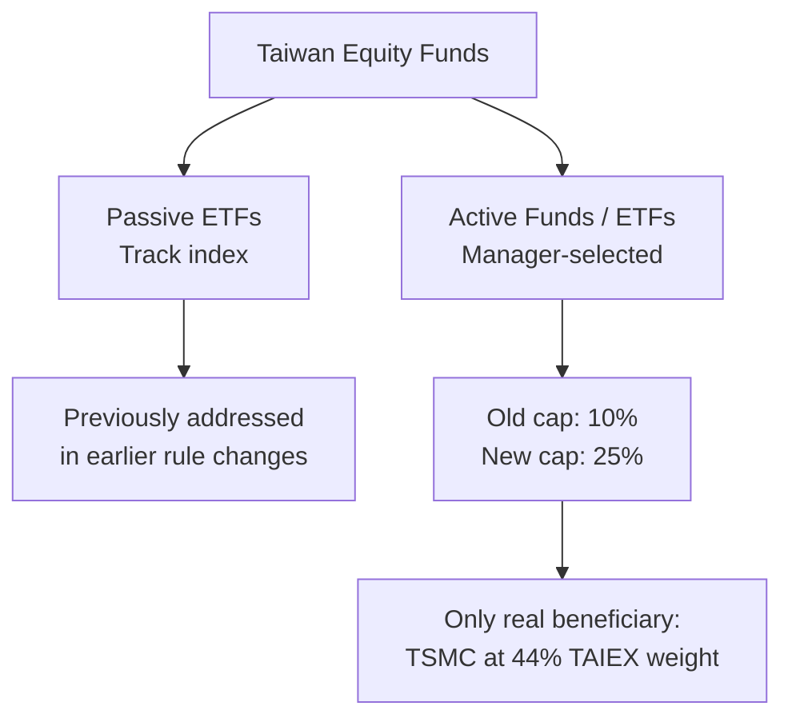

On April 23, 2026, Taiwan's Financial Supervisory Commission (FSC) announced it would raise the single-stock holding cap for domestic actively managed funds and active ETFs from 10% to 25%. The next day, TSMC surged 5% to a fresh all-time high. Anyone following Taiwan's market understood the connection immediately: TSMC is the only stock in the TAIEX with a weighting above 10% — currently sitting at roughly 44% of the index.

This wasn't a broad deregulation. It was a structural fix to a structural problem that had been building for years.

## TL;DR

- FSC raised the single-stock cap for active funds and ETFs: 10% → 25%, effective April 24, 2026
- Only TSMC is materially affected (TAIEX weighting ~44%)
- Estimated NT$200 billion in underweight institutional positions can now be corrected
- This is the third round of relaxation in under a year, driven by TSMC's continued market cap expansion
- Side effect: capital rotation out of small/mid-caps into TSMC

## Background: Why the 10% Rule Broke

Taiwan's fund regulations historically capped single-stock exposure at 10% of net asset value for domestic equity funds. The rationale was straightforward — diversification, investor protection, no single-bet blowup risk.

That rule made sense when TSMC represented 20% of the TAIEX. It started creating structural distortions when TSMC crossed 30%, then 40%. By early 2026, active fund managers tracking the Taiwan market found themselves in an impossible position: their benchmark held 44% TSMC, but regulations capped them at 10%. The tracking error wasn't a mistake — it was mandated by law.

Passive index ETFs had already been addressed in earlier rule changes. Active funds were the remaining holdout, and the April 2026 change closed that gap.

## What the New Rule Actually Changes

Active fund managers can now allocate up to 25% of fund NAV to a single stock. For any fund benchmarked to the TAIEX, this effectively means the TSMC underweight problem is solved. A manager who was previously forced to cap TSMC at 10% — while the index held 44% — can now narrow that gap significantly.

The FSC's Securities and Futures Bureau Deputy Director Huang Chung-Hao acknowledged this is the third liberalization move in roughly twelve months, each triggered by TSMC's continued market cap growth.

## Capital Flow Math

Market estimates put the aggregate institutional underweight in TSMC — caused by the old 10% rule — at between NT$180 billion and NT$200 billion. With the cap raised, this capital can theoretically flow back into TSMC in a relatively short window. On the announcement day, TSMC hit a record high as institutional buying started repricing the stock.

The flip side: that capital has to come from somewhere. Observers noted a broad selloff in small and mid-cap Taiwan tech stocks in the days following the announcement — a textbook capital rotation effect.

## How Taiwan Compares to Other Markets

The US has its own concentration rules under the Investment Company Act. Diversified funds face the "75-5-10 rule" — 75% of assets must be diversified, with no single holding exceeding 5% and no position representing more than 10% of the investee's shares. However, US funds can elect non-diversified status, exempting them from this requirement. Many concentrated thematic funds hold this designation explicitly.

Taiwan's approach is more index-aware: the new 25% threshold sits well above the typical non-TSMC constituent's weight, making it a practical ceiling rather than a political one.

## What This Signals

Taiwan's equity market increasingly functions as "TSMC plus everything else." The regulatory response — repeatedly adjusting concentration rules as TSMC's weight grows — reflects how few tools regulators have when a single company dominates a national index at this scale.

For investors, the practical implication is that any new regulatory tailwind for TSMC concentration is likely to compress active-to-passive performance gaps in Taiwan-focused funds. For engineers evaluating TSMC as a business: the regulatory ecosystem is now clearly structured to facilitate, rather than limit, institutional ownership of the company.

## References

- [TSMC shares jump to record high as Taiwan eases single-stock investment caps (CNBC)](https://www.cnbc.com/2026/04/24/tsmc-shares-record-high-taiwan-single-stock-investment-cap-for-funds.html)
- [Taiwan's FSC Eases Rules: Single-Stock Cap Raised to 25% (BigGo Finance)](https://finance.biggo.com/news/qWnouZ0Bq7sy_YQMjBSF)
- [Taiwan to Ease Limits on Active Funds' Investments in TSMC (Bloomberg)](https://www.bloomberg.com/news/articles/2026-04-23/taiwan-to-ease-limits-on-active-funds-investments-in-tsmc)
- [FSC drops cap on single stock holdings in ETF indices (Asia Asset Management)](https://www.asiaasset.com/post/29626-etf-0512)
