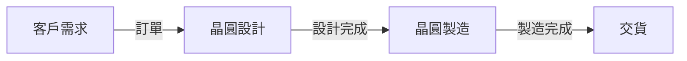

台積電（TSMC）股價不斷創新高，指數衝破四萬點，投資人趨之若鶩。金管會放寬主動型ETF單一個股投資上限，讓投資人對TSMC的期待更高。到底TSMC的極限在哪裡？本篇文章將深入分析台股美股風險優勢，全面的解析TSMC的未來發展前景。

## TL;DR
TSMC股價將如何影響台股市場？

## 是什麼
台積電（TSMC）是一家全球領先的晶圓代工廠，提供先進的半導體製造服務。TSMC的股價近期不斷創新高，吸引了大量投資人的目光。

## 為什麼重要
TSMC的崛起對台股市場有著舉足輕重的影響。其一，TSMC是台股市場的龍頭股，其股價波動直接影響著整個市場的走勢。其二，TSMC的業務遍及全球，對於全球科技產業的發展有著重要的意義。

## 怎麼運作
TSMC的業務主要分為兩大塊：晶圓代工和晶圓設計。晶圓代工是指TSMC為客戶提供半導體製造服務，而晶圓設計則是指TSMC自行設計和製造半導體產品。TSMC的業務流程如下：

## 跟其他晶圓代工廠的差別
TSMC與其他晶圓代工廠的主要差別在於其先進的製造技術和龐大的生產能力。TSMC的7奈米製程技術是目前業界領先的製造技術，能夠提供更高性能和更低功耗的半導體產品。

## 小結
TSMC的股價將如何影響台股市場？投資人應該關注TSMC的業務發展和市場走勢。TSMC的崛起為台股市場帶來了新的機會和挑戰，投資人應該謹慎投資，避免過度投機。

## 參考資料
* 台積電官方網站：https://www.tsmc.com/
* 金管會新聞稿：https://www.fsc.gov.tw/ch/home.jsp?id=135&parentpath=0,3
- [EP.150一直漲！一直賺！指數衝破四萬點，台積電極限在哪裡？【台股美股風險優勢全解析！】金管會放寬主動型ETF單一個股投資上限，TSMC會飆多高？不只記憶體，CPU也缺貨漲價，龍蝦幕後黑手？](https://www.youtube.com/watch?v=zpmBleCwvGo)