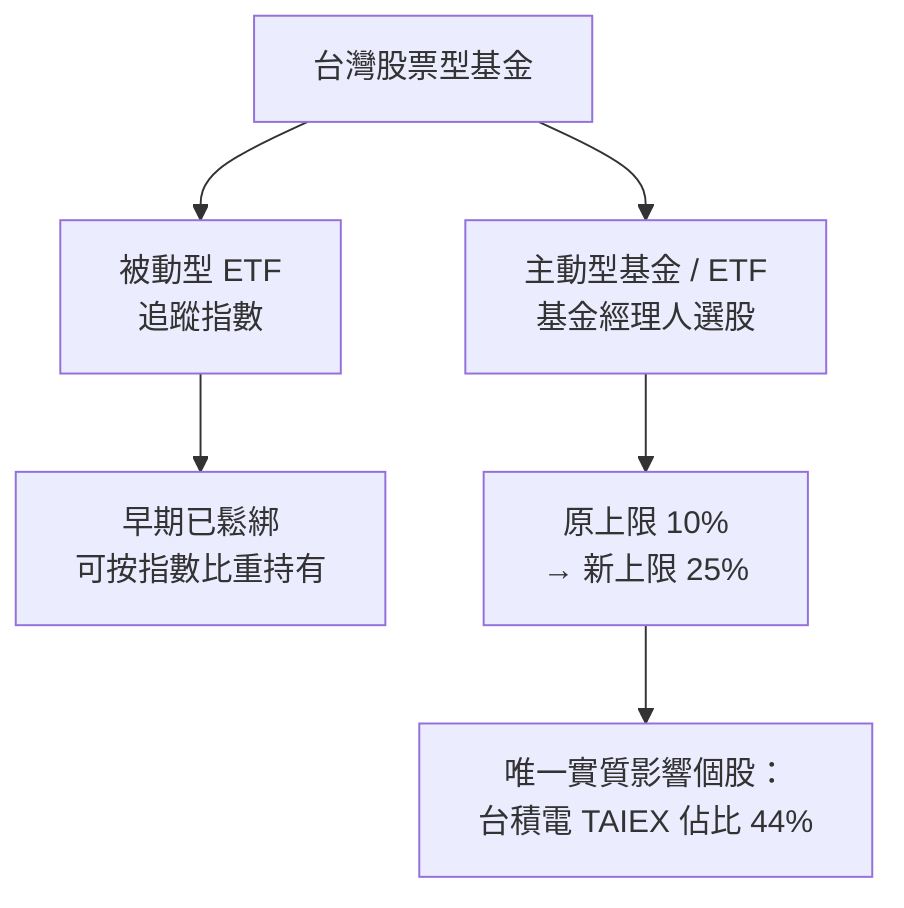

2026 年 4 月 24 日，台積電股價盤中再創歷史新高，背後的觸媒是金管會前一天公告的一則看似平淡的法規修正：將國內主動型基金與主動型 ETF 的單一個股持股上限，從原本的 10% 調高至 25%。市場立刻讀懂這道「隱形台積電條款」的意涵——全台股市值佔比逾 44% 的台積電，是唯一一家會被舊規則強制壓抑的個股。

這不是一個單純的財經新聞，更是台股生態系走到今天不得不面對的結構問題。本文拆解政策邏輯、資金影響，以及工程師在評估台股科技股時需要理解的幾個核心機制。

## TL;DR

- 金管會 2026/04/24 正式調高單股持股上限：主動型基金及 ETF 從 10% → 25%
- 實質受益者只有台積電（TAIEX 佔比 44%，是唯一超過 10% 的個股）
- 預估釋放近 NT$2,000 億資金流入台積電
- 政策背景：這是過去一年的第三波鬆綁，因應台積電市值持續膨脹
- 副作用：資金輪動造成中小型股籌碼面壓力

## 是什麼

### 10% 上限的由來

台灣過去的基金法規規定，單一國內股票型基金或 ETF 持有同一個股，不得超過基金淨值的 10%。這個規則的出發點是風險分散：避免基金管理人把雞蛋放在同一個籃子裡，保護投資人。

這個邏輯在台積電市值還不那麼誇張的年代完全合理。但當台積電在 TAIEX 的佔比從 20% 爬升到 30%、40%、甚至一度逼近 45% 的時候，10% 的上限開始讓基金管理人陷入一個尷尬的困境：被動追蹤大盤的 ETF 可以（因為指數型 ETF 另有規範），但主動型基金卻無法按市場比重持有台積電，導致系統性的績效追蹤誤差。

### 25% 上限的新規則

新規定將集中度上限提高到 25%，且只適用於主動型基金與主動型 ETF。指數型 ETF 的限制早在更早的一波鬆綁中已由金管會另行處理。

由於台積電是唯一市值佔比超過 10% 的台股個股，這條修正實際上是為單一公司量身打造的「台積電條款」。金管會副主委黃仲華在說明時也坦承，過去一年已是第三次針對此議題鬆綁。

## 為什麼重要

### 資金流向試算

市場估計，因 10% 上限而被迫低配台積電的主動型基金，持有缺口約在 NT$1,800 億至 NT$2,000 億之間。政策一出，這批資金理論上都可以補倉台積電。加上外資與散戶的跟風效應，消息宣布當日台積電股價單日飆升逾 5%。

### 中小型股的隱憂

資金不會從天上掉下來。法規鬆綁帶來的輪動，有很大一部分來自中小型股的減碼。Bloomberg 的後續追蹤顯示，政策宣布後的一週內，TAIEX 加權指數的漲幅集中在少數大型晶圓廠與 AI 供應鏈個股，而中小型科技股出現明顯的籌碼面賣壓。

這個「馬太效應」在指數集中化嚴重的市場中並不罕見，南韓 KOSPI 中的三星電子、美股 S&P 500 中的 Magnificent 7 都有類似現象，但台積電在 TAIEX 中的比重遠比這些案例還要極端。

## 怎麼運作

理解這個政策，需要區分兩種不同的 ETF 架構：

主動型基金的策略邏輯是：基金經理人可以根據判斷超配或低配特定個股，不必死板追蹤指數。但在舊規則下，即使基金經理看多台積電，也無法把超過 10% 的資金押注在它身上。新規解除了這個枷鎖。

## 跟其他市場的差別

拿美股比較：美國 SEC 的投資公司法（Investment Company Act）對多元化基金（diversified fund）有「75-5-10 規則」：至少 75% 的資產需分散，單一個股不超過 5%，且不超過被投資公司 10% 的流通股。但美股基金也可以選擇申報為「非多元化基金（non-diversified fund）」，規避這個限制，代表性例子是一些集中持有 Magnificent 7 的主題型基金。

台灣這次的修正，其實是把主動型基金從「一刀切 10%」移向「條件性放寬至 25%」，算是在台積電市值持續膨脹的現實壓力下，監管機構的務實妥協。

## 小結

這次金管會的法規調整，本質上是市場結構問題倒逼出來的政策回應。台積電在 TAIEX 的極端集中，讓台股幾乎等同於「台積電加上其他」，而這個格局在 AI 算力需求持續推升晶圓代工需求的背景下，短期很難逆轉。

對投資人來說，25% 的新上限意味著更多法人資金會更積極地配置台積電；對工程師與技術分析師來說，這也是一個提醒：理解一家公司的市場結構地位，有時候比理解它的技術路線圖更能解釋股價的中短期行為。

## 參考資料

- [TSMC shares jump to record high as Taiwan eases single-stock investment caps for funds (CNBC)](https://www.cnbc.com/2026/04/24/tsmc-shares-record-high-taiwan-single-stock-investment-cap-for-funds.html)
- [Taiwan's FSC Eases Rules: Single-Stock Cap Raised to 25% (BigGo Finance)](https://finance.biggo.com/news/qWnouZ0Bq7sy_YQMjBSF)
- [Taiwan to Ease Limits on Active Funds' Investments in TSMC (Bloomberg)](https://www.bloomberg.com/news/articles/2026-04-23/taiwan-to-ease-limits-on-active-funds-investments-in-tsmc)
- [FSC drops cap on single stock holdings in ETF indices (Asia Asset Management)](https://www.asiaasset.com/post/29626-etf-0512)
- [EP.150 一直漲！一直賺！指數衝破四萬點，台積電極限在哪裡？](https://www.youtube.com/watch?v=zpmBleCwvGo)
