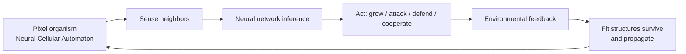

What happens if you control the rules of survival rather than the survivors themselves? Sakana AI turned that question into a browser-based simulation anyone can run. The God Simulator isn't a game — it's a research tool that makes evolutionary dynamics tangible, and the insights it surfaces connect directly to Sakana AI's core research thesis: that evolution and collective intelligence offer a fundamentally different path to capable AI systems than raw scale alone.

## TL;DR

- The God Simulator is built on **Neural Cellular Automata (NCA)** — each pixel-organism is a small neural network that can grow, attack, defend, and learn
- Users set the rules (survival thresholds, mixing rules, resource density) rather than controlling individual agents
- Key finding: harsh rules cause extinction; too-easy rules produce fragile booms; alternating conditions can produce stable borders and even spontaneous cooperation
- This is a public-facing demonstration of Sakana AI's "evolution-first" research philosophy
- Free to use at [sakana.ai](https://sakana.ai)

## What It Is

### Neural Cellular Automata

You may know Conway's Game of Life — a grid world where cells follow simple rules (alive/dead based on neighbor count) and complex patterns emerge from those rules. Sakana AI's simulator extends this: instead of fixed rules, each pixel-organism runs a small neural network. It perceives its neighbors, integrates that signal, and acts — growing, attacking, defending, or attempting cooperation.

Because the neural networks are subject to selection pressure, evolution is literal here. Individuals whose network structure produces better survival outcomes reproduce; others don't. Across many generations, behaviors emerge that no one explicitly programmed.

### Your Role: The Rule-Setter

You don't control individual organisms. You control the environment:

- **Survival threshold**: How hard is it to stay alive?
- **Mixing rules**: What happens when different species meet?
- **Resource density**: How abundant is energy?

This puts you in the position of setting incentive structures — not playing, but governing.

## What the Simulator Reveals

Sakana AI documented several counterintuitive outcomes:

**Harsh rules → Extinction**: Set the survival threshold too high and nothing survives. The grid goes silent within a few hundred timesteps regardless of initial conditions.

**Easy rules → Fragile boom**: When conditions are too permissive, populations explode — but the selection pressure is so low that individual neural networks never evolve robustness. Tighten the rules slightly and the whole system collapses immediately.

**Alternating strict and permissive conditions (the interesting case)**: Start permissive to let populations establish, then increase pressure. This tends to produce "crystallization" — stable territorial borders form between species. Under certain parameter combinations, cooperation emerges: two competing species begin protecting each other because the cost of continued conflict exceeds the cost of coexistence. No one programmed this behavior. It emerged from the incentive structure.

This maps cleanly onto evolutionary game theory — specifically the evolution of cooperation literature (Axelrod, Hamilton, Nowak) — but made viscerally observable rather than mathematically abstract.

## Why Engineers Should Care

The God Simulator is an **intuition pump** for a problem that shows up everywhere in system design: how do incentive structures shape emergent behavior?

This is directly relevant to:

- **RL curriculum design**: An environment too easy produces an underprepared agent; too hard produces nothing. The alternating-pressure finding from the simulator mirrors best practices in curriculum learning.
- **Multi-agent system design**: The spontaneous cooperation emergence under specific conditions is the same phenomenon studied in multi-agent reinforcement learning research.
- **Organizational design**: The same dynamics apply to team incentive structures, competitive vs. collaborative dynamics between teams, and how resource scarcity shapes culture.

## Sakana AI's Broader Research Direction

Sakana AI was founded by David Ha (former Google Brain Research Director) and Llion Jones (one of the original Transformer paper authors). Their research philosophy is explicitly anti-scale: rather than chasing larger models and more compute, they pursue evolutionary and collective intelligence approaches.

**Evolutionary Model Merge** (2024): Automatically merging existing open-source models using evolutionary algorithms — no gradient-based training, relatively low compute, can produce models that outperform their parents on specific tasks. Now integrated into frameworks like mergekit.

**The AI Scientist**: Fully automating the scientific research cycle — idea generation, literature search, experiment design, analysis, and paper writing. In 2025, AI Scientist v2 produced the first fully AI-generated paper to pass rigorous human peer review, published in Nature.

**Darwin Gödel Machine**: A self-modifying AI that rewrites its own code to improve performance, inspired by Schmidhuber's theoretical work.

The God Simulator is the public-facing, accessible version of this research direction: it makes the abstract claim that "incentive structures determine system behavior" into something you can feel in your hands.

## References

- [Sakana AI official website](https://sakana.ai)
- [The AI Scientist: Towards Fully Automated AI Research](https://sakana.ai/ai-scientist/)
- [The AI Scientist — Published in Nature](https://sakana.ai/ai-scientist-nature/)
- [Evolutionary Model Merge](https://sakana.ai/evolutionary-model-merge/)
- [The Darwin Gödel Machine](https://sakana.ai/dgm/)
- [Sakana AI's God Simulator Is Brilliant (YouTube)](https://www.youtube.com/watch?v=QzZ4VwDHAT4)
