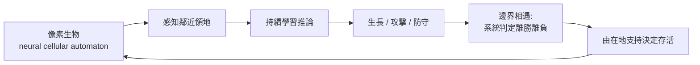
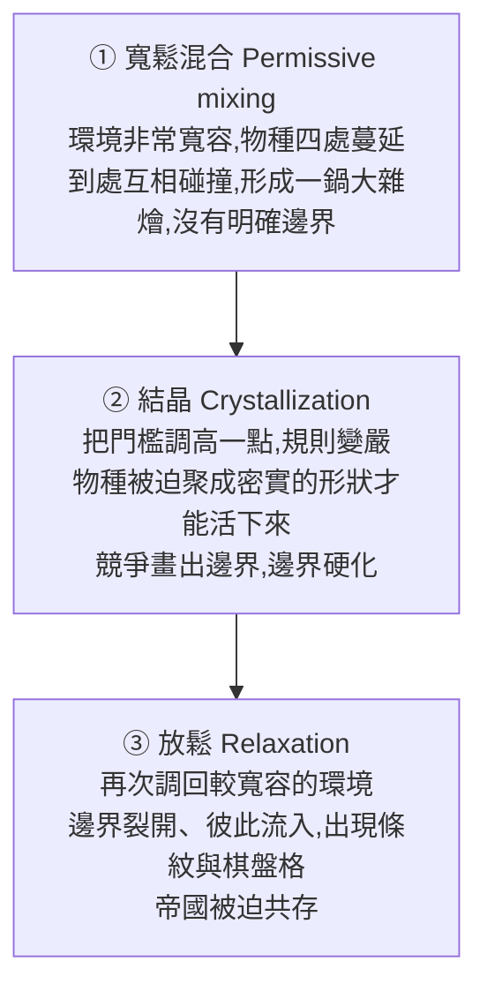

如果你能親手調整「活下去的條件」，一個世界會長成什麼樣子？來自東京 Sakana AI 實驗室的這個作品，把這個問題做成了可以在瀏覽器裡親手玩的東西。它不是遊戲，而是一個讓你在一個微型數位宇宙裡**扮演神**的研究展示——你不操控任何一隻生物，你操控的是它們賴以生存的整套規則。

## 一開始：一個太殘酷的世界

打開模擬器，畫面上是一個培養皿，裡面有 5 個 AI 物種在搶地盤——結果什麼都沒發生。為什麼？因為這個世界太殘酷了：我們把「生存門檻」設得太高，環境直接把它們碾死。你可以讓模擬跑再久也沒用，沒有任何一個物種能站穩腳跟。

這很像 App Store：成千上萬個新 app 上架，幾乎沒幾個能跑出聲量，多數無聲無息地消失。AI wrapper 公司、想爆紅的社群 app，也是同樣的劇本——光是活著就已經太難了。

## 把規則放鬆：暴起，然後暴落

那就當個仁慈一點的神，把日子調得好過一些。就像市場突然湧入大把資金灌向 AI 新創——爛點子？沒有 demo？沒有商業模式？沒關係，這裡有十億美元，衝啊。

結果呢?帝國開始瘋狂擴張……但是擴張得太快了。這些帝國從無到有迅速長大，又同樣迅速崩塌。為什麼?因為**生存門檻被設得太低**,沒有任何篩選壓力。

於是我們再把螺絲鎖緊：熱錢退潮、經濟變嚴苛。那些靠著熱錢上癮的公司,瞬間瓦解、消失。然後緊接著發生什麼?**更能適應新環境的新物種冒了出來**。繼續調動這些變數,你甚至可以製造出一個醜陋的壟斷局面,或是一個搖搖欲墜的生態系。

## 它怎麼運作:neural cellular automata

論文把這些物種稱為 **neural cellular automata（神經細胞自動機）**——一個活的、可訓練的「像素世界」,存在於一張 2D 格子上。細節相當複雜,但核心是這樣:

- 每個生物都在爭奪這些像素,它們可以從鄰近的領地往外生長,並且必須靠**在地的支持**才能存活。
- 關鍵在於:它們是**持續在學習的**。
- 它們還會**打架**:可以指定要往哪個方向攻擊、往哪個方向防守,就像手上拿著一把劍和一面盾,各自朝著某個方向。(實際研究是在更高的維度裡進行,模擬器上看到的是簡化版。)
- 當兩個物種在邊界相遇,系統會計算哪個細胞能擊敗哪個細胞。

這個作品最迷人的地方在於:無論你做出一個徹底混亂的世界,還是一個穩定健康的生態系——**這完全取決於你**。改變環境,你就改變了贏家;由環境決定誰崛起、誰衰落、誰連機會都沒有。

大自然是這樣運作的,市場是這樣運作的,幾乎一切都是這樣運作的。這也說明了為什麼一個國家擁有好的政策如此重要:多數時候你讓競爭自己去篩出贏家,但有時候,一個微小的推力,就能讓整個系統變得更健康。

## 更美的部分:競爭之外,還能合作嗎?

前面講的都是競爭。但合作有沒有可能?直覺上會說不可能——因為每個生物都只有**一個目標:生長**。單一目標應該只會催生極端競爭,而不是合作,對吧?

結果是完全錯了。透過三個階段的環境操作,合作真的浮現了:

**第一步,寬鬆混合**:環境非常寬容,數位物種四處奔放、蔓延到每個角落,不斷彼此碰撞,變成一鍋沒有明確邊界的大雜燴。

**第二步,結晶**:稍微把門檻拉高、規則變嚴。為了在這個更艱困的世界活下去,物種必須抱團、聚成密實堅固的形狀。競爭在這個過程中畫出了邊界,而邊界逐漸硬化。

**第三步,放鬆**:再把環境調回比較寬容的狀態。這時奇妙的事發生了——帝國之間冒出**條紋**和**小棋盤格**。為什麼?在前一個階段裡,脆弱的邊界細胞會立刻死掉,就像兩種顏色的油漆中間隔著一條遮蔽膠帶,顏色被乾淨地分開。而到了第三階段,我們等於把這條遮蔽膠帶撕掉了:邊界裂開、彼此流入,形成這些小小的條紋。

這些帝國因此被迫共存——因為這時的規則**沒辦法再那麼輕易地殺掉脆弱的邊界細胞**,於是雙方都能在交界處保住一小塊地,而不是一方把另一方徹底抹除。簡單、優雅、漂亮。

## 一個關於規則的啟示

這套動力學其實是一堂很好的人生課,也是系統設計的縮影:

- 永遠太寬鬆,你的世界會變成一鍋糊掉的湯。
- 永遠太嚴格,你的世界會變成一座監獄。
- 比較好的路徑是:**先寬鬆**,給自己空間摸索方向;**再建立紀律**,硬起來、長出自己的形狀、立下邊界;最後,為了不要永遠凍結在原地,**再適度放鬆**——成長、適應、讓新的東西進來。

無論對象是生態系、市場、組織,還是任何一個複雜系統,真正決定命運的往往不是裡面的個體有多強,而是**它們所處的規則(也就是激勵結構)長什麼樣子**。Sakana AI 這個作品厲害的地方,就是把這個抽象到不行的道理,變成一個你可以親手把玩、半小時就能玩出直覺的東西。

## 參考資料

- [Sakana AI's God Simulator Is Brilliant — Two Minute Papers (YouTube)](https://www.youtube.com/watch?v=QzZ4VwDHAT4)
- [Sakana AI 官方網站](https://sakana.ai)
