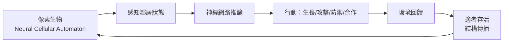

如果你可以調整生存的規則，世界會長什麼樣子？Sakana AI 把這個問題做成了一個可以在瀏覽器裡玩的模擬器。它不是遊戲，而是一個讓你親手操作演化環境、觀察數位生態系動態的研究工具。有趣的是，這個「神明模擬器」（God Simulator）所揭示的洞察，跟 Sakana AI 一直以來研究的核心主題高度一致：演化、集體智慧、以及 AI 系統如何在沒有頂層設計的前提下，自發湧現出複雜行為。

## TL;DR

- Sakana AI 的 God Simulator 是基於**神經細胞自動機（Neural Cellular Automata, NCA）**的互動模擬平台
- 使用者扮演規則制定者：調整生存門檻、混合規則，觀察數位物種的興衰
- 核心洞察：嚴苛的規則會消滅生命；過鬆的規則製造脆弱繁榮；交替嚴寬則可能催生合作與穩定邊界
- 這是 Sakana AI「演化優先」研究路線的具象呈現，連結到他們的 AI Scientist 與 Evolutionary Model Merge 工作
- 免費開放使用：[sakana.ai](https://sakana.ai)

## 是什麼

### 神經細胞自動機（NCA）

傳統細胞自動機（Cellular Automata）你可能聽過：最有名的是 Conway 的「生命遊戲（Game of Life）」——一個格子世界，每個細胞根據鄰居的狀態決定下一步是生還是死，複雜的圖案從簡單規則中浮現。

Sakana AI 的模擬器把這個概念升級：每個「像素生物」不是遵從固定規則，而是一個小型神經網路。它可以感知鄰居、學習、成長、攻擊、防禦。在這個框架下，「演化」不是隱喻，而是字面上的：每個個體的神經網路在環境壓力下被篩選，適者的結構被保留並傳播。

### 使用者的角色：神明

你不控制個別生物，你控制的是**規則本身**：

- **生存門檻**：多嚴苛的環境才能存活？
- **混合規則**：不同物種相遇時，誰吃誰？合作是否可能？
- **資源密度**：食物（能量）的豐沛程度

這個設計讓你扮演的不是玩家，而是演化壓力的制定者——有點像一個低解析度版的「上帝」。

## 為什麼重要

### 實驗結果揭示的演化動力學

Sakana AI 在發布文章中分享了幾個反直覺的觀察：

**嚴苛規則 → 滅絕**：把生存門檻設太高，任何物種都無法立足，整個格子世界在幾百個時間步後歸於空寂。

**過鬆規則 → 脆弱繁榮**：條件太好，種群爆炸式成長，但因為沒有任何選擇壓力，個體的神經網路沒有機會演化出健壯性。一旦稍微調緊規則，立刻崩潰。

**交替嚴寬（最有趣的情境）**：先設定寬鬆條件讓種群站穩腳跟，然後加嚴規則。這個過程會促使「邊界結晶」——不同物種形成穩定的勢力範圍，甚至在某些參數組合下，出現合作行為：兩個原本互相競爭的物種開始相互庇護，因為合作的代價比繼續消耗更低。

這個動態跟真實生態系的演化邏輯高度吻合，也跟賽局理論的合作演化（evolution of cooperation）研究結果一致。

### 不只是玩具

對工程師和研究者來說，這個模擬器提供的不只是視覺上的享受。它是一個**直覺泵（intuition pump）**：幫助你建立關於「激勵機制如何塑造系統行為」的直覺。

這個洞察直接適用於 AI 系統設計：一個訓練環境太容易，模型不學；太難，模型什麼也學不到。在強化學習的 curriculum design、多智能體系統的競爭與合作平衡設計中，God Simulator 展示的動力學是同一個問題的縮影。

## 跟 Sakana AI 更大研究圖景的關係

Sakana AI 由前 Google Brain 研究員 David Ha 和 Llion Jones（Transformer 論文原始作者之一）創立，總部在東京。他們的研究路線是：**演化與集體智慧優先，而不是暴力擴張參數規模**。

這個哲學在幾個主要項目中都有體現：

**Evolutionary Model Merge（2024）**：不用梯度下降訓練，而是透過演化演算法把現有開源模型合併，自動生成新的基礎模型。這個方法成本極低，但可以產出在特定任務上表現出色的模型。

**The AI Scientist**：一個完全自動化科學研究流程的系統，從想法生成、文獻搜尋、實驗設計、結果分析，到論文撰寫，全程由 AI 主導。2025 年，AI Scientist v2 產出的一篇論文通過了同行評審，相關成果刊登於 Nature。

**Darwin Gödel Machine**：更激進的自我修改 AI，可以重寫自己的程式碼來提升性能，靈感來自 Jürgen Schmidhuber 的理論框架。

God Simulator 在這個脈絡下，是一個**公眾溝通工具**：它把「演化動力學如何形塑複雜系統」這個抽象概念，轉化成任何人都可以親手把玩的互動體驗。

## 跟傳統 AI 研究的差別

| 維度 | 主流大模型路線 | Sakana AI 路線 |
|------|--------------|----------------|
| 核心策略 | 擴大參數規模、更多資料 | 演化算法、集體智慧 |
| 訓練成本 | 極高（數億美元） | 相對低 |
| 可解釋性 | 低（黑箱） | 部分較高（規則可觀察） |
| 創新路徑 | 工程規模驅動 | 生物啟發驅動 |
| 代表成果 | GPT-4, Claude, Gemini | Evolutionary Merge, AI Scientist |

這不是說哪條路更好，而是在目前大型模型主導的研究生態中，Sakana AI 選擇了一條明顯不同的道路，而 God Simulator 是這條路上的一個有趣路標。

## 小結

Sakana AI 的神明模擬器之所以值得關注，不只是因為它好玩，而是因為它把一個深刻的研究問題變得可觸摸：**規則（incentive structure）如何決定系統的命運**。無論是生態系、AI 訓練環境，還是組織文化，背後的動力學驚人地相似。

如果你對演化算法、多智能體系統，或者只是想直觀感受一下「激勵機制設計」對系統的影響，這個免費模擬器值得花半小時玩一玩。

## 參考資料

- [Sakana AI 官方網站](https://sakana.ai)
- [The AI Scientist: Towards Fully Automated AI Research (Sakana AI)](https://sakana.ai/ai-scientist/)
- [The AI Scientist — Published in Nature](https://sakana.ai/ai-scientist-nature/)
- [Evolutionary Model Merge (Sakana AI)](https://sakana.ai/evolutionary-model-merge/)
- [The Darwin Gödel Machine (Sakana AI)](https://sakana.ai/dgm/)
- [Sakana AI's God Simulator Is Brilliant (YouTube)](https://www.youtube.com/watch?v=QzZ4VwDHAT4)
