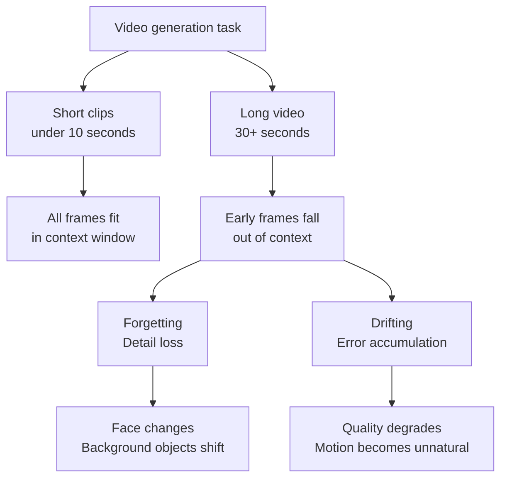

If you've used Sora, Kling, Runway, or any AI video generation tool, you've probably noticed the same failure mode: the first few seconds look good, then something starts to drift. A character's face changes subtly between frames. Background details shift. Motion becomes unnatural. By thirty seconds in, the video barely resembles what you asked for. This is **temporal drift** — and it's been the defining unsolved problem in AI video generation since these tools emerged. In 2025, several research groups converged on systematic solutions. Here's what they found.

## TL;DR

- Core problem: **forgetting** (early frames fall out of context window, details lost) and **drifting** (autoregressive error accumulation) — two problems that trade off against each other
- Root cause: video diffusion models have finite temporal context windows; beyond that, only compressed representations survive
- 2025 solutions:
  - **FramePack**: inverted temporal generation + fixed context length — enables hour-long video in theory
  - **Mixture of Contexts (MoC)**: sparse attention with learned routing selects the most relevant historical frames
  - **A2RD**: multimodal memory + closed-loop self-correction for story-consistent long video
  - **Direct Forcing**: closes the training-inference distribution gap to reduce error accumulation
- Key insight: forgetting and drifting are a fundamental trade-off; every solution attacks this differently

## Why AI Video Generation Is Structurally Hard

Still image generation models only need spatial consistency within one frame. Video generation adds temporal consistency across potentially hundreds of frames. The same character's face must match at frame 1 and frame 300. Moving objects must follow plausible physics. Lighting and shadows must evolve coherently.

Modern video generation models handle this through diffusion models with 3D spatiotemporal attention — the denoising network processes spatial and temporal tokens together, enabling it to model frame-to-frame relationships. The constraint: **context windows are finite**.

### The Trade-off That Makes This Hard

**Forgetting**: The longer the video, the sooner early frames fall out of the context window. The model is left working with compressed embeddings instead of pixel-level detail. Character faces "drift" toward a different face. Background objects change shape or disappear.

**Drifting**: Autoregressive generation means each step depends on the previous step's output. During training, the model sees real frames; during inference, it sees its own generated frames. Errors accumulate and amplify across steps (exposure bias / observation bias).

Here's the dilemma: strengthening memory to address forgetting can worsen drifting, because erroneous early frames get amplified. Reducing memory dependency to address drifting accelerates forgetting. Every solution in 2025 attacks this trade-off from a different angle.

## The 2025 Solutions

### FramePack: Inverted Generation Order

FramePack's core idea is counterintuitive: don't generate from the beginning forward. Instead, **generate anchor frames at key points first, then fill gaps working backward from each endpoint**.

When the model generates any given frame, it can see both the start and end of its local segment — two high-quality anchors. Error accumulation paths are shortened because every generation step has bounded bidirectional distance to reference frames.

More importantly: FramePack maintains a **fixed-length context window regardless of total video length**. Per-step compute cost stays constant. This is what makes hour-long video generation theoretically tractable (demonstrated in lab settings on H100 hardware for 60-minute outputs).

### Mixture of Contexts (MoC): Sparse Memory Retrieval

MoC reframes long video generation as an **internal information retrieval problem**. Rather than attending to all historical frames (computationally explosive), the model learns a sparse routing module that dynamically selects the most relevant historical frames for each new generation step.

**Mandatory anchors** — certain key frames like scene beginnings and first character appearances — are always included in the attention window regardless of video length. This directly addresses forgetting without requiring full attention over the entire history. Compute scales sub-quadratically.

### A2RD: Agentic Self-Correction

Agentic Autoregressive Diffusion (A2RD) introduces three mechanisms working together:

1. **Segment-based autoregressive generation**: long videos are divided into manageable segments with clean memory reset points between them
2. **Multimodal memory**: memory includes not just visual frames but text descriptions, object states, and scene summaries — richer conditioning for long-range coherence
3. **Closed-loop self-correction**: after generating each segment, the model evaluates consistency and revises before proceeding

This approach is particularly suited for narrative-heavy content where character state tracking matters across scenes.

### Direct Forcing: Closing the Training-Inference Gap

A complementary solution to drifting: during training, expose the model to its own generated frames (not only ground truth frames). This trains the model to remain consistent even when starting from imperfect inputs, reducing the distributional shift that causes cascading errors during inference. It's a single-step approximation strategy with modest compute overhead and measurable improvement in autoregressive stability.

## What Changed in Practice

**Video length**: From the previous practical ceiling of 10-30 seconds to several minutes of coherent generation. Seedance 2.0 (early 2026) generates 120-second continuous video; FramePack research has demonstrated much longer.

**Character consistency**: Consistent character appearance across scenes is now viable for real production workflows — advertising, short films, educational content.

**Open-source integration**: MoC and FramePack techniques are being integrated into ComfyUI and Hugging Face Diffusers, making long-form video accessible to engineers without custom infrastructure.

## What's Still Open

- **Face detail in close-ups**: Micro-level facial consistency in extreme close-ups remains a hard problem
- **Physics consistency**: Object motion that reliably respects physics is still research territory (DiffPhy and related approaches are promising but not broadly deployed)
- **Evaluation metrics**: FVD and LPIPS don't fully capture human perception of temporal consistency; the field lacks a definitive benchmark
- **Compute at training time**: FramePack's inference efficiency doesn't eliminate the training cost; these models require significant infrastructure to train

## References

- [Temporal Drift in AI-Generated Video: Causes, Evaluation, and Production Strategies (iMerit)](https://imerit.ai/resources/blog/solving-temporal-drift-in-ai-generated-video/)
- [Frame Context Packing and Drift Prevention (arxiv 2504.12626)](https://arxiv.org/pdf/2504.12626)
- [A2RD: Agentic Autoregressive Diffusion for Long Video Consistency (arxiv)](https://arxiv.org/html/2605.06924)
- [Mixture of Contexts for Long Video Generation (arxiv 2508.21058)](https://arxiv.org/pdf/2508.21058)
- [Pack and Force Your Memory: Long-form and Consistent Video Generation (arxiv)](https://arxiv.org/html/2510.01784v1)
- [State of open video generation models in Diffusers (Hugging Face)](https://huggingface.co/blog/video_gen)
- [Solved: The Bug That Haunted AI Video For Years (YouTube)](https://www.youtube.com/watch?v=yzajLZXh9JU)
