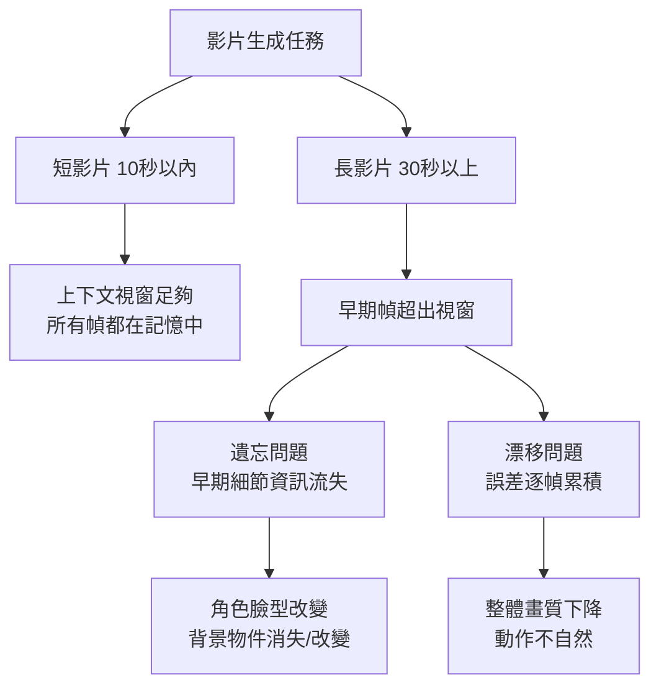

如果你用過 Sora、Kling、Runway，或者任何一個 AI 影片生成工具，你可能都注意到一個共同的毛病：影片在前幾秒看起來很好，但過了某個長度之後，畫面開始漂移——角色的臉在不同幀之間長得不一樣，背景的細節悄悄改變，整體質感越來越模糊。這個問題有個名字：**時序漂移（Temporal Drift）**，它困擾 AI 影片生成超過三年，直到 2025 年才有了幾個系統性的解法。

## TL;DR

- AI 影片生成的核心問題：**遺忘（forgetting）** 和 **漂移（drifting）** 兩個互相制衡的難題
- 根源：擴散模型的時序上下文視窗有限，早期幀超出視窗後只剩壓縮表示，資訊流失
- 2025 年主要解法：
  - **FramePack**：倒序生成 + 固定上下文長度，讓小時級別影片成為可能
  - **Mixture of Contexts (MoC)**：稀疏注意力動態選取關鍵歷史幀
  - **A2RD (Agentic Autoregressive Diffusion)**：多模態記憶 + 自我修正
- 核心洞察：遺忘與漂移是 trade-off，解法都在用不同方式打破這個困境

## 研究背景

### 為什麼 AI 影片生成本質上更難

靜態圖片生成模型（DALL-E、Stable Diffusion）只需要在空間維度上保持一致性。影片生成模型還需要在時間維度上保持一致性——同一個角色的臉，在第 1 幀和第 300 幀必須是同一張臉；一個移動的物體，在連續幀之間的位置必須符合物理規律；光線和陰影必須隨時間合理演變。

現代影片生成模型的架構通常是基於擴散模型（Diffusion Model）加上 3D 時空注意力（3D Spatiotemporal Attention）。去噪網路同時處理空間和時間維度的 token，這讓模型能夠建立幀與幀之間的關聯。

問題在於：**上下文視窗有限**。

### 遺忘與漂移的 Trade-off

這兩個問題互相制衡，讓解法設計格外棘手：

**遺忘（Forgetting）**：影片越長，早期幀越快從上下文視窗中掉出去。模型只剩下壓縮的表示（embeddings），無法取得原始像素級別的細節。結果是角色的臉會「漂移」成另一張臉，背景物件消失或改變形狀。

**漂移（Drifting）**：自回歸生成（autoregressive generation）的每一步都依賴前一步的輸出。訓練時模型看到的是真實幀，推論時看到的是自己生成的幀——一旦某一幀有誤差，後續幀會把這個誤差放大（exposure bias / observation bias）。

增強記憶可以緩解遺忘，但可能讓漂移更嚴重（因為把有誤差的早期幀放大影響）。反之，加強對當前幀的重視可以控制漂移，但會加速遺忘。

## 關鍵發現：2025 年的解法

### FramePack：倒序生成的反直覺解

FramePack 的核心想法極為反直覺：**不要從第一幀開始往後生成，而是先生成高品質的關鍵幀，再從結尾往前填充中間幀**。

關鍵洞察：當模型在生成某一幀時，它同時可以看到「這一段的開頭」和「這一段的結尾」，兩端都有高品質的錨點。誤差累積的路徑被縮短，因為每個生成步驟的雙向距離都很短。

更重要的是：FramePack 維持固定長度的上下文視窗，無論影片多長，每次推論的計算成本不變。這讓小時級別的影片生成在理論上成為可能（實驗室版本已在 H100 上做到 60 分鐘影片）。

### Mixture of Contexts（MoC）：稀疏注意力的記憶選擇

MoC 把長影片生成重新定義為一個**內部資訊檢索問題**：模型有一個「歷史記憶庫」，生成每個新幀時，不是對所有歷史幀做全注意力（計算量爆炸），而是學習一個稀疏路由模組，動態選出對當前幀最相關的幾個歷史幀來注意。

強制性錨點（mandatory anchors）確保某些關鍵幀（例如場景開頭、角色首次出現的幀）永遠被包含在注意力範圍內，無論影片多長。這解決了遺忘問題，同時保持計算成本可控。

### A2RD：自我修正的代理式生成

Agentic Autoregressive Diffusion（A2RD）引入了三個機制：

1. **分段式自回歸生成**：把長影片切成可管理的片段，每段有清晰的記憶起始點
2. **多模態記憶**：記憶不只是視覺幀，還包含文字描述、物件狀態、場景摘要
3. **閉環自我修正**：模型生成一段後，先評估一致性，發現問題則回頭修正再繼續

這個方法特別適合故事性強、需要精確追蹤角色狀態的長影片。

### Direct Forcing：訓練-推論對齊

解決漂移問題的另一個角度：縮小訓練和推論的分布差距。

Direct Forcing 在訓練時讓模型看到自己生成的幀（而不只是真實幀），讓它學會在不完美的輸入下仍然生成一致的輸出。這是一個單步近似策略，計算成本不高，但顯著減少了推論時的誤差累積。

## 影響與意義

這些解法的出現，改變了 AI 影片生成的可能性邊界：

**長影片生成**：從過去的 10-30 秒到現在的數分鐘，理論上可以延伸到更長。Seedance 2.0（2026 年初）已能生成 120 秒連貫影片，這在一年前是難以想像的。

**角色一致性**：對於需要同一角色跨多個場景的創作（廣告、短片、教育影片），一致性的大幅提升讓實際生產工作流成為可能。

**工具整合**：這些技術已開始整合進 ComfyUI、Diffusers 等開源框架，降低了普通開發者實作長影片生成的門檻。

## 限制與注意事項

- **計算成本**：FramePack 雖然在推論時成本可控，但訓練仍需要大量計算資源
- **角色細節**：臉部細節的一致性問題仍然沒有完全解決，在特寫鏡頭中尤其明顯
- **物理一致性**：物件運動符合物理規律的問題仍是開放問題，DiffPhy 等方法在研究中但尚未廣泛部署
- **評估困難**：衡量「時序一致性」的指標（FVD、LPIPS 等）與人類感知的對應關係仍有爭議

## 參考資料

- [Temporal Drift in AI-Generated Video: Causes, Evaluation, and Production Strategies (iMerit)](https://imerit.ai/resources/blog/solving-temporal-drift-in-ai-generated-video/)
- [Frame Context Packing and Drift Prevention (arxiv 2504.12626)](https://arxiv.org/pdf/2504.12626)
- [A2RD: Agentic Autoregressive Diffusion for Long Video Consistency (arxiv)](https://arxiv.org/html/2605.06924)
- [Mixture of Contexts for Long Video Generation (arxiv 2508.21058)](https://arxiv.org/pdf/2508.21058)
- [Pack and Force Your Memory: Long-form and Consistent Video Generation (arxiv 2510.01784)](https://arxiv.org/html/2510.01784v1)
- [State of open video generation models in Diffusers (Hugging Face)](https://huggingface.co/blog/video_gen)
- [Solved: The Bug That Haunted AI Video For Years (YouTube)](https://www.youtube.com/watch?v=yzajLZXh9JU)
