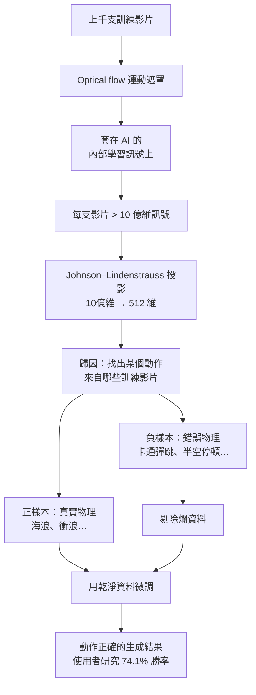

現在只要寫一段文字 prompt，就能生成畫質驚人的影片，而且可控性也好得嚇人——你可以生成三段看起來完全不同、卻收在同一個結局的短片。幾乎任何你想得到的畫面，都變得唾手可得、又便宜。

但這些系統幾乎都藏著同一個大問題。問題出在哪？是擬真度（photorealism）嗎？

不是。論擬真，這些 AI 已經是頂尖水準。從事光線傳輸（light transport）研究、靠寫程式生成擬真影像的人會告訴你：這些模型的成果幾乎無可挑剔。人類得花十幾年磨練的手藝，AI 正以驚人的速度學會。

真正破功的是**動作（motion）**。

## 畫面對了，動起來卻不對

問題可以濃縮成一句話：**The frame looks right, but the movement feels wrong.** 單看一幀，它很完美；但讓它動起來，物理就垮了。

面對這個現象，多數研究者的直覺反應是：沒問題，給它更多訓練資料、更多算力就好。

那就來實測一下「算力萬能論」。以兩年前 OpenAI Sora 的基準算力（base compute）生成的影片為例：

- **基準算力**：慘不忍睹，細看根本是惡夢素材。
- **4 倍算力**：還是稱不上完美，但趨勢已經在對你大喊。
- **32 倍算力**：到這裡，結果開始「唱起來」了，動作明顯變好。

所以算力確實有用、趨勢也很明確。那如果沒有更多算力（誰現在還有閒置算力？），是不是再多塞點訓練資料就行？

**這恰恰是錯的。** 這篇研究要講的，正是為什麼。

## 反問模型：這個動作你是從哪學來的？

研究者開發出一種技術，能在 AI 生成某個動作時反問它：「小 AI，這招你是跟誰學的？」——也就是把生成結果**歸因（attribution）**回它看過的訓練影片。

舉個例子：給它「一塊泡棉方塊漂在水上」。技術會指出這個動作的知識來源——海浪拍打碼頭、衝浪、海浪飛濺。這些就是讓它學會這種水面運動的**正樣本**。

那反過來，最糟的學習素材長什麼樣？答案很合理：**卡通**。卡通教的是互相矛盾的物理——角色會在半空中停住、甚至撐把小傘才掉下來；身體像橡膠一樣彈跳，下一刻又彈回原狀。對人類來說很有趣，對想學真實物理的模型來說卻是災難。

於是有了那個反直覺的點子：**不要塞更多資料，而是塞更少——把這些壞影響剔除掉。**

實測結果：

- **基準模型**：生成一枚旋轉的硬幣，但它繞錯了旋轉軸。
- **剔除壞影響、再用好樣本微調後**：一枚漂亮、物理正確的旋轉硬幣。

當然，幾個 cherry-pick 的例子不算數。看使用者研究才算數：他們用 50 段影片、17 位受測者，總共 850 次比較，請人判斷新方法和舊方法哪個比較好。結果——新方法對原始模型拿下 **74.1% 的勝率**。

## 怎麼做到的：兩個關鍵步驟

### 一、把「怎麼動」從「長怎樣」分離出來

要做歸因，得先把運動資訊和外觀資訊拆開。他們用的是一個老技術——**optical flow（光流）**，很擅長追蹤點在影片中的移動軌跡，拿來做運動遮罩（motion masking）正合適。

但真正的巧思在這裡：他們**不是把這個遮罩套在影片上**，而是套在 **AI 的內部學習訊號**上。這樣才能看出模型的決策究竟是從哪裡冒出來的。

### 二、把十億個數字壓成 512 個

點子很棒，但有個大麻煩：現代模型動輒超過 **10 億個參數**。要為「上千支影片」儲存並比對完整的學習訊號，記憶體和時間都吃不消，根本不可行。

解法是把這超過十億個數字，壓縮成——**512 個**。而且結果幾乎不變。

用的技術叫 **Johnson–Lindenstrauss projection（JL 投影）**，Google 的 **TurboQuant** 壓縮演算法也用到它（用來緩解 LLM 在 GPU 上的記憶體壓力）。它的作用是把高維資料投影到極小的空間，同時**保留資料點之間的相對距離**。

打個比方：一張木椅活在 3D 空間，它在地板上的影子活在 2D——影子需要的資料少得多，而只要場景擺對，椅子四隻腳之間的距離在影子裡依然保持不變。JL 投影就是這樣：砍掉大量冗餘，卻留住重要性質。

兜起來，整套流程只為了做一件事：**找出哪些影片影響了 AI 的決策，然後把垃圾知識切掉。**

## 不只是技術，也是一堂方法論

這個結論其實超出影片生成本身。我們常以為「讀得越多就越聰明、越睿智」，但這在很多領域並不成立——當資訊品質低落時，讀得越多反而越笨。低品質的資訊不會教育你，它會扭曲你的思考。

解法是：你需要的不是「更多」，而是「更少、更好」。**真相才是最好的老師，而且你不需要太多。** 這篇論文展示的正是同一件事：一點點乾淨的訊號，勝過一整座垃圾山。慢下來、別照單全收、盡量去驗證你聽到的、刻意攝取得更少。

研究者並承諾會免費釋出程式碼。

## 參考資料

- [Solved: The Bug That Haunted AI Video For Years — Two Minute Papers (YouTube)](https://www.youtube.com/watch?v=yzajLZXh9JU)
