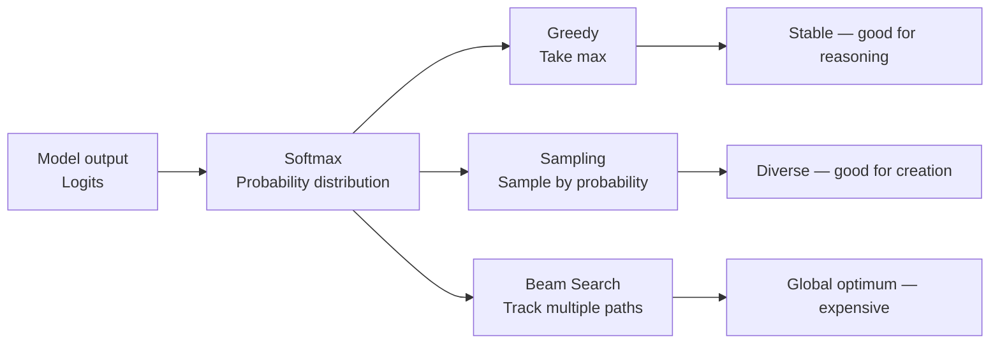

When your LLM application underperforms, the problem usually lives at one of three distinct layers: how the model selects tokens during generation (decoding), how you've structured the task into steps (workflow), or whether the model has enough reasoning capability for the problem at hand (reasoning). These three layers are routinely conflated in discussions, but they solve different problems and are optimized differently.

## TL;DR

- **Decoding**: token-level. Controls how the model samples from its probability distribution. Greedy is stable, sampling is creative, beam search finds global optima. For reasoning tasks, temperature=0 usually wins.
- **Workflow**: task-level. How you decompose a problem into steps, tool calls, and agent coordination. Chain-of-thought, ReAct, multi-agent patterns live here.
- **Reasoning**: model capability level. Whether the model can self-correct, explore multiple paths, and think longer. Inference-time scaling, ES-CoT, Coconut all apply here.
- Optimize each layer separately. Don't mix tools across layers.

## Layer 1: Decoding Strategies

Decoding is how the model picks each next token from the vocabulary's probability distribution. It's the most overlooked optimization lever.

**Greedy decoding**: always pick the highest-probability token. Fast, deterministic, reproducible. Prone to local optima — one wrong choice can't be corrected.

**Sampling with temperature**: sample from the distribution. Low temperature → approaches greedy; high temperature → more random and creative. Good for generation tasks, poor for reasoning.

**Beam search**: maintain multiple candidate sequences in parallel, select the globally highest-probability sequence. Better for reasoning-heavy tasks; compute cost scales linearly with beam width.

**Top-k / Top-p (Nucleus Sampling)**: restrict sampling to the top-k tokens or the smallest set of tokens whose probability mass exceeds p. Balances quality and diversity.

A key 2025 finding: **for RL-trained reasoning models, temperature=0 (greedy) significantly outperforms temperature>0**. This is the opposite of best practice for creative generation tasks.

## Layer 2: Workflow Design

Workflow is how you decompose a problem at the application layer — independent of which model you use. Good workflow design can significantly improve output quality even with a weaker base model.

**Chain-of-Thought (CoT) Prompting**: instead of asking for the answer directly, ask the model to write out its reasoning steps. This gives the model a chance to catch and correct errors as it writes. Simple and highly effective for math and logic problems.

**ReAct (Reason + Act)**: interleave reasoning and tool calls. The model reasons about what to do → calls a tool (search, calculation, database query) → continues reasoning from the tool's output. Best for tasks requiring external information.

**Multi-step / Multi-agent Workflows**: decompose complex tasks across specialized agents, each handling a subtask, with results aggregated. Good for tasks requiring parallel processing or distinct domain knowledge.

**Self-consistency**: generate multiple answers to the same question (with high temperature) and take the majority vote. Improves reasoning accuracy by leveraging sampling diversity; cost multiplies by the number of samples.

## Layer 3: Reasoning Capability

Reasoning is the model's intrinsic capability to self-explore, self-correct, and transcend the ceiling of what workflow design alone can achieve.

**Inference-time Scaling**: give the model more "thinking time" via longer chains of thought or explicit budget tokens. OpenAI o1/o3, Gemini Thinking, and Claude's extended thinking all use this approach. Returns are approximately log-linear — doubling compute doesn't double accuracy, but meaningful improvements continue well past the point where larger models stop helping.

**ES-CoT (Early Stopping Chain-of-Thought)**: stop the reasoning chain when the answer has been stable for several consecutive steps. Research shows ~41% token reduction while maintaining accuracy comparable to full CoT. Drop-in, no retraining required.

**Coconut (Chain of Continuous Thought)**: instead of expressing reasoning steps as natural language tokens, the model uses its last hidden state (a "continuous thought") directly as the next input embedding. Reasoning happens in continuous latent space rather than the discrete vocabulary. Theoretically enables breadth-first search across reasoning paths rather than committing to one path as in standard CoT.

## Comparison

| Technique | Layer | Extra Cost | Best For |
|-----------|-------|-----------|----------|
| Greedy decoding | Decoding | None | Reasoning, reproducible output |
| Sampling + temperature | Decoding | None | Creative generation, diversity |
| Chain-of-Thought | Workflow | Low (prompt) | Math, logic problems |
| ReAct | Workflow | Medium (tool calls) | Tasks needing external info |
| Self-consistency | Workflow + Decoding | High (3-10x inference) | High-accuracy reasoning |
| Inference-time scaling | Reasoning | High (longer output) | Difficult reasoning, cost-insensitive |
| ES-CoT | Reasoning | Negative (saves tokens) | Cost/latency-constrained scenarios |
| Coconut | Reasoning | Requires special training | Research stage, not yet deployed widely |

## Summary

The most common mistake when optimizing LLM applications is conflating layers. If your reasoning accuracy is low, you don't necessarily need a bigger model — you might just have temperature set too high, or you're not using CoT. If your costs are too high, you don't need to downgrade models — ES-CoT might cut token usage by 40%.

Identify which layer the problem lives in first. Then pick the right tool.

## References

- [Demystifying Long Chain-of-Thought Reasoning in LLMs (arxiv 2502.03373)](https://arxiv.org/abs/2502.03373)
- [Early Stopping Chain-of-thoughts in Large Language Models (arxiv 2509.14004)](https://arxiv.org/html/2509.14004)
- [Training LLMs to Reason in a Continuous Latent Space / Coconut (arxiv 2412.06769)](https://arxiv.org/abs/2412.06769)
- [RL of Thoughts: Navigating LLM Reasoning with Inference-time RL (arxiv)](https://arxiv.org/html/2505.14140)
- [AI 能自我修正嗎？從 decoding、workflow 到 reasoning 的技術發展整理 (YouTube)](https://www.youtube.com/watch?v=m3i2mk5hs8U)
