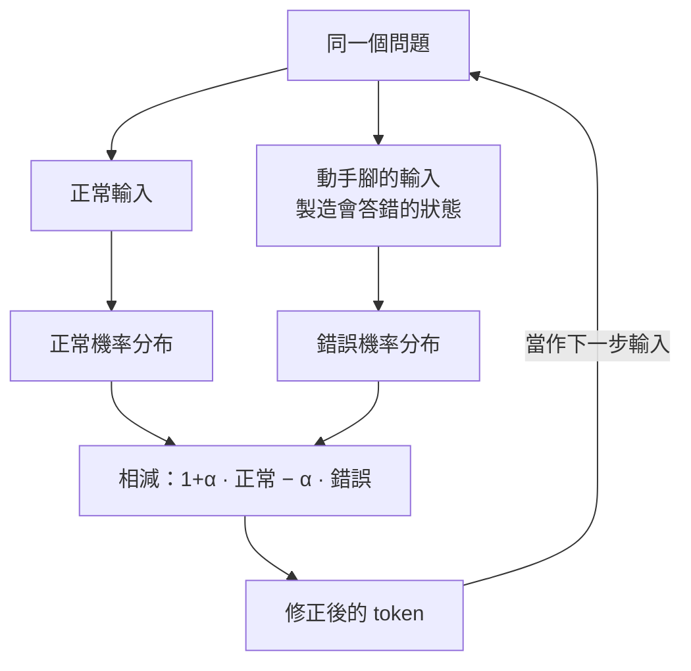

我們都知道現在的語言模型很強：給它一個輸入、它給你輸出，你再告訴它「你錯了、錯在哪裡」，它通常有能力修正原本的錯誤行為。但這裡有一個更難的問題——**能不能在完全沒有人力介入的情況下，模型輸出一個答案之後，自己發覺自己是錯的、自己把它改對？** 這就是「self-correction」要探討的主題。

讓模型自我反省、自我修正並不是全新的想法，早在 2023 年 ChatGPT 剛出現時，就已經有人發現語言模型某種程度上具備自我反省的能力。這篇整理聚焦在近一兩年的新進展。

## 自我修正的三個方向

要讓模型做到自我修正，大致有三個不同的方向：

1. **改 inference 的過程**：不動參數，在生成的當下去偵測與修正錯誤。
2. **改 Harness（工作流程）**：改變模型的工作流程、外部工具與互動方式。
3. **直接改模型參數**：也就是現在大家很熟悉的 reasoning／推理技術。

這篇主要深入第一個方向——**在 inference 階段做自我修正**，因為這一層最容易被忽略，卻可以在不重新訓練模型的前提下直接套用。

## 從 error detection 到 error correction

語言模型的生成流程大家都不陌生：一排 token 丟進 Transformer，變成一排 representation，最後變成一個機率分布，從分布裡 sample 出一個 token，再當作下一個時間點的輸入，如此反覆。

要在這個過程裡自我修正，可以拆成兩件事：**能不能從生成過程中的 representation／機率分布，自動看出模型現在可能講錯了（error detection）？看出來之後，能不能自動把它改對（error correction）？** 這兩步都假設是自動的、不需要人介入。

**偵測是可行的。** 一篇 2023 年的論文收集了模型答對與答錯時的 representation，訓練一個 binary classifier 去分辨「這個 representation 會導向正確還是錯誤的答案」。結果顯示這個 classifier 真的訓得起來，而且能 generalize——在一批問題上訓練，換到另一批問題上仍能某種程度預測答案會不會對。這代表「答案是對是錯」的訊號，確實藏在 representation 裡，只是要知道怎麼抽出來。

**修正也是可行的。** 2024 年一篇叫 True Facts 的論文進一步展示可以把錯的改成對的：把大量「答錯時的 representation」取平均、「答對時的 representation」取平均，兩者相減得到一個代表「對與錯之差距」的向量；接著把這個向量直接加回模型原本會答錯的 representation 上，模型就有機會給出正確答案。

不過這類方法有個明顯缺點：**需要額外收集資料**——你得先問模型一堆問題、記錄它答對答錯時 representation 各長什麼樣。有沒有辦法不收集額外資料，就完成偵測與修正？

## Contrastive Decoding：不用收集資料的自我修正

Contrastive decoding 等於把 error detection 與 error correction 結合，但不需要額外資料。它的概念是：

- 用正常輸入問模型，得到一個你不確定對錯的輸出。
- 對同一個問題**動點手腳，刻意製造一個「模型幾乎一定會答錯」的狀態**，得到錯誤時的輸出。
- 把正常輸出減掉錯誤輸出，得到兩者的差距，再把這個差距加回正常輸出——把答案往「遠離錯誤」的方向推。

實務上常見的寫法是引入一個小於 1 的參數 α：

```
最終輸出 = (1 + α) × 正常輸出 − α × 錯誤輸出
```

也就是把「正常成分」稍微放大、再減掉一些「錯誤成分」。這個操作要在**每一個 token 的生成步驟**上都做一次：修正出第一個 token 後，把它當成下一步輸入，再製造正常／錯誤兩種狀態、再相減，如此反覆。

文獻上相減的對象通常不是中間的 hidden layer，而是**模型最終輸出的 logit 或機率分布**。



Contrastive decoding 的優點是**完全不動模型參數**，訓練完之後在 inference 階段直接套用即可；缺點是**要多花一次運算**——為了產生「錯誤的那份輸出」，你得額外多做一次 inference，等於用算力換取比較正確的結果。

這其實是很老的技術。最早提到「contrastive decoding」這個名詞的論文可以追溯到 2022 年（ChatGPT 都還沒出現）。它的設定是文字接龍：「歐巴馬生在檀香山……」要接他出生的年份。當時較強的 GPT-2 large 認為機率最大的下一個字是 Hawaii（錯的，前面已經講過檀香山了），正確答案應該是 1961。作法是拿一個較小的 **GPT-2 small** 產生的輸出當作「錯誤」的一份，兩個機率分布相減後，1961 就浮上來了。關鍵洞見是：**該被 decode 出來的，不是好模型覺得機率最大的 token，而是好模型與壞模型「差距最大」的那個 token。**（因為兩個模型層數不同、沒有對應的 representation，所以當時直接在最終輸出的分布上相減。）

## 核心難題：怎麼製造「一定會答錯」的狀態

Contrastive decoding 成敗的關鍵，在於怎麼可靠地製造出那個「錯誤」的參照。而且有個隱藏陷阱：像用小模型當錯誤來源時，小模型有時候其實也會答對——**如何只在它真的答錯時才相減**，是這類方法都要處理的議題。以下是幾個主要流派。

### 流派一：用不同 layer 製造錯誤

**DoLa（Decoding by Contrasting Layers）** 是 2023 年一個用得較廣的方法，甚至已經直接寫進 Hugging Face Transformers，用一個 flag 就能在 inference 時啟用，套用門檻很低。

它背後靠的是 **logit lens** 這個概念：把最終才會用的 LM head 接到中間的每一層 representation 上，也能 decode 出結果。文獻發現，要 Llama 2 把法文翻成中文時，中間層 decode 出來的往往是英文——代表它內心其實是先翻成英文再翻成中文。DoLa 的想法就是：**用 logit lens 從較前面的 layer decode，比較可能得到錯誤答案**；於是拿最後一層的分布，減掉某個前面 layer 用 logit lens 產生的分布，當作最終答案。（要選哪一層來相減，論文用了較複雜的方法挑選。）

DoLa 的好處是不像原始 contrastive decoding 那樣要再引入一個小模型、多花記憶體與計算——**前面的 layer 本來就要跑**，所以額外 overhead 很小。

（補一段有趣的背景：logit lens 沒有正式論文，多數人引用一篇 blog，但更早在 2020 年就已有實驗室的論文記載了同樣的技術，當時只覺得是個奇妙發現、放在 arXiv 上沒去投稿；DoLa 的第一作者正是該實驗室以前的專題生，畢業後去 MIT，這篇是他在 Microsoft 實習時做的，並回頭引用了學長那篇。）

同樣「靠不同 layer 製造錯誤」的還有 **Layer Contrastive Decoding（Layer CD）**，2025 年、用在影像模型上。例子是問「機車騎士衣服上的字是什麼顏色」：衣服是黑的，但字是白的，正確答案是白色。vision encoder 最後一層夠聰明、知道該是白色，但沒聰明到把白色排第一；較淺的 shallow layer 只抓得到表象，直覺回一堆奇怪顏色、把黑色排前面。兩者相減後，白色的機率就成為最高，得到正確答案。

### 流派二：降智咒語（ICD）

**Instruction Contrastive Decoding（ICD）** 這一系列的作法更直白：在模型輸入後面多加一句「降智咒語」，例如「你都給錯誤的答案」「你是一個很糟糕的模型」，模型就真的變笨、更可能答錯；再把這個錯誤輸出跟正常輸出相減。

### 流派三：抽掉該給的資訊（CAD）

**Context-Aware Decoding（CAD）** 最早（2023 年）用在 RAG 上。RAG 的痛點是：你把問題連同查到的相關文章一起丟給模型，但比較強的模型常常自恃參數裡已有知識，**根本不去讀那些文章**（例如美國總統一直換，它卻用舊知識回答）。CAD 的想法是：乾脆先「不給文章」讓模型憑自身知識作答，得到可能過時／錯誤的答案，再拿它跟「有讀文章時的答案」相減，得到更可能正確的結果。

CAD 用在影像上是最能說服人的例子。給模型一張**黑色的香蕉**問它是什麼顏色，模型會猶豫：影像的語言模型多半是從文字模型微調來的，帶有大量文字 prior（「香蕉就該是黃色」），常常不細看圖片就憑直覺回答。作法是**故意不給圖片、或把圖片加上很強的雜訊**，模型看不清就純憑先入為主答「黃色」（剛好是錯的），再與正常答案相減，就能壓掉錯誤。另一個經典例子是海灘照片：模型先入為主覺得海灘該有衝浪板，於是幻覺出根本不存在的衝浪板；給它一張很模糊的圖，它同樣憑成見給衝浪板高機率，相減後衝浪板機率被壓得很低。

原始 CAD 只是在圖片上加一般雜訊，後續研究則探討「加什麼雜訊才有效」：有的把圖片切塊再打亂（比一般雜訊更好），也有 2025 年的論文先分析模型作答時到底看圖片的哪些位置、把最重要的物件抹掉後再做 contrastive decoding。

這套思路也能搬到**語音**上：**Audio-Aware Decoding** 是一位普渡大學學生到實驗室 visit 時的成果——正常給音訊得到一份輸出，再把音訊拿掉或換成 silence 得到另一份，兩者相減。實驗顯示這招在語音語言模型上同樣有效。

## 成本問題：MTI

Contrastive decoding 的老問題是「用算力換表現」，每個 token 都要多跑一次 inference。**MTI（Minimum Test-Time Intervention）** 想減少這筆額外運算，它的假設是：decode 過程中可能只有少數 token 是真正關鍵的轉折點，選錯就滿盤皆輸，其他多數 token 選什麼都不太影響結果（就像人生大多數決定不會改變結局，只有少數關鍵抉擇會）。因此不必每個 token 都修改機率，只在那些特別重要的 token 上介入，就能用更少算力保留 contrastive decoding 的好處。

## 小結

「語言模型能不能自我修正」在 inference 這一層有相當成熟的答案：**偵測與修正都能自動進行**。從早期需要額外收集資料的 classifier / True Facts，到不需資料的 contrastive decoding，主軸都是同一句話——**刻意製造一個會答錯的狀態，把答案往遠離錯誤的方向推**。差別只在於「錯誤怎麼製造」：小模型、淺層 layer（DoLa / Layer CD）、降智咒語（ICD）、抽掉該有的資訊（CAD，可跨文字／影像／語音）。這些方法多半不動參數、可直接在 inference 階段套上，代價是額外運算——而 MTI 這類方法正試著把這筆成本再壓下來。

## 參考資料

- [AI 能自我修正嗎？從 decoding、workflow 到 reasoning 的技術發展整理（YouTube 原始講座）](https://www.youtube.com/watch?v=m3i2mk5hs8U)
