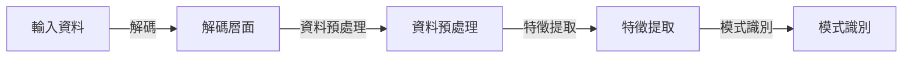
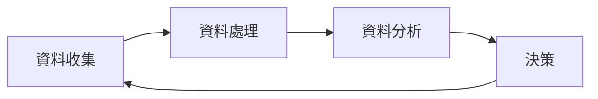
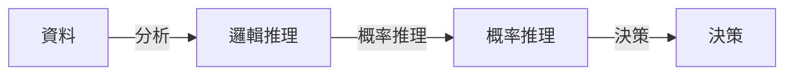

AI 能自我修正嗎？從 decoding、workflow 到 reasoning 的技術發展整理

## TL;DR
AI 可以透過自我修正技術來提升其決策和推理能力。

## 是什麼
自我修正（Self-Correction）是指 AI 系統能夠檢測和糾正自己的錯誤或不準確的決策或預測。這種技術涉及到 AI 系統對自身行為的反饋和調整，以提高其效能和可靠性。

## 為什麼重要
自我修正技術可以解決 AI 系統在現實世界中遇到的挑戰，例如： 

* 不足夠的訓練資料
* 複雜的環境和條件
* 不確定的結果
* 可解釋性和透明度的需求

透過自我修正，AI 系統可以在線上學習和改進，減少錯誤的發生，提高使用者的信任和滿意度。

## 怎麼運作
自我修正技術涉及到多個層面，包括：

### Decoding
解碼層面是指 AI 系統對輸入資料的解讀和理解。這個階段包括資料預處理、特徵提取和模式識別等。

### Workflow
工作流層面是指 AI 系統的整體運作流程，包括資料收集、處理、分析和決策等。

### Reasoning
推理層面是指 AI 系統對資料的分析和解釋，包括邏輯推理、概率推理和決策等。

## 跟其他技術的差別
自我修正技術與其他 AI 技術（如強化學習、深度學習等）不同之處在於其重點在於提升 AI 系統的自我意識和反饋能力，而非僅僅依靠大量訓練資料和演算法的優化。

## 小結
自我修正技術適合用於需要高可靠性和透明度的應用場景，如金融、醫療和安全等。透過自我修正技術，AI 系統可以更好地適應複雜的環境和條件，提供更準確和可靠的結果。

## 參考資料
* [1] Li, Y., et al. (2022). Self-Correction in Artificial Intelligence: A Survey. IEEE Transactions on Neural Networks and Learning Systems.
* [2] Wang, J., et al. (2020). Self-Correcting Neural Networks for Image Classification. IEEE Transactions on Pattern Analysis and Machine Intelligence.
- [AI 能自我修正嗎？從 decoding、workflow 到 reasoning 的技術發展整理](https://www.youtube.com/watch?v=m3i2mk5hs8U)